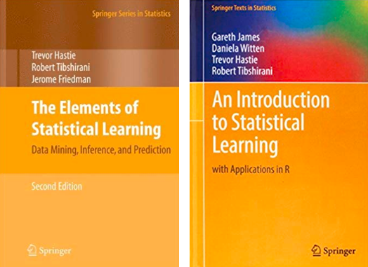
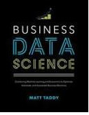
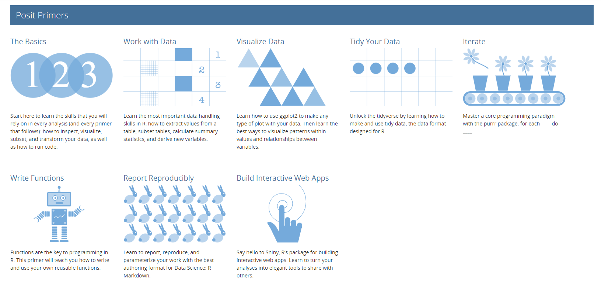

```{r setup, include=FALSE}
options(htmltools.dir.version = FALSE)

knitr::opts_chunk$set(eval = TRUE,
               echo = TRUE,
               warning = FALSE,
               message = FALSE,
               cache = FALSE)

htmltools::tagList(rmarkdown::html_dependency_font_awesome())
```

```{r plots_and_figures, include=FALSE}
library(ggplot2)
library(kableExtra)

theme_set(theme_gray(15))
```

```{r, references, echo=FALSE, cache=FALSE}
library(RefManageR)
BibOptions(check.entries = FALSE, 
           bib.style = "numeric", 
           cite.style = "authoryear", 
           style = "markdown",
           hyperlink = FALSE, 
           dashed = FALSE)
bib <- ReadBib("refs/refs.bib", check = FALSE)
```


# An aside: about the structure of these slides

- The course's slide decks are created using the [xaringan](https://slides.yihui.name/xaringan/#44) (/ʃæ.'riŋ.ɡæn/) R package and [Rmarkdown](https://rmarkdown.rstudio.com/).

- Some slides include hidden comments. To view them, press __p__ on your keyboard

```{r, echo=FALSE, out.width = "80%", fig.align='center'}

knitr::include_graphics("figs/comments.gif")

```

???

Here is a comment


---

class: title-slide-section-gray

# Outline

1. [Logistics](#logistics)  

2. [About the Course](#about)

3. [To Do List](#todo)


---
class: title-slide-section-blue, center, middle
name: logistics

# Logistics


---
# ml4econ GitHub repository

The class's GitHub repository: [https://github.com/ml4econ](https://github.com/ml4econ)

```{r, echo=FALSE, out.width = "80%", fig.align='center'}

knitr::include_graphics("figs/repo.gif")

```

---
# Posit Cloud workspace

[Posit Cloud](https://posit.cloud/) is a hosted version of RStudio in the cloud that will make it easy for R and Python novices to learn data science and machine learning using R and Python.

```{r, echo=FALSE, out.width = "80%", fig.align='center'}


```


---

# People


- __Itamar Caspi__  
  - Head of Monetary Analysis Unit, Research Department, Bank of Israel.
  - email: [caspi.itamar@gmail.com](mailto:caspi.itamat@gmail.com) 
  - homepage: [itamarcaspi.rbind.io](https://itamarcaspi.rbind.io/)
  
- __Ariel Karlinsky__  
  - Ariel Karlinsky is a PHD student in economics at Hebrew University who researches various economic fields and maintains the World Mortality Dataset.
  - email: [karlinsky@gmail.com](mailto:karlinsky@gmail.com)


* Meeting hours: after class/zoom, on demand.


---

# Feedback


This is the fourth time we run this course $\Rightarrow$ your continuous feedback is important!


Please feel free to contact us by

  - email  

  - in person  

  - or open an issue in our discussion forum


---
class: title-slide-section-blue, center, middle
name: about


---
class: title-slide-section-blue, center, middle
name: about


# About the Course

---

# Prerequisites

- Advanced course in econometrics.


- Some early experience with R (or another programming language) are a plus.


---

# This course is


.pull-left[

.big[__About__]

How and when to apply ML methods in economics

  - estimate treatment effects.
  - prediction policy.
  - work with new types of data (e.g., text).

To do that we will need to understand

  - what is ML?
  - how it relates to stuff you already know?
  - how it differs?

]

.pull-right[

.big[__Not about__]

- Cutting-edge ML techniques (e.g., generative AI)

- Computational aspects (e.g., gradient descent)

- Data wrangling (a.k.a. "feature engineering")

- Distributed file systems (e.g., Hadoop, Spark) 


]

---

# Tentative schedule

| Week                  | Topic                                      |
|:----------------------|:-------------------------------------------|
| [**1**](#week-1)      | Course Overview & ML Basics
|
| [**2**](#week-2)      | Reproducibility and ML Workflow                          |
| [**3**](#week-3)      | Regression and Regularization              |
| [**4**](#week-4)      | Classification                             |
| [**5**](#week-5)      | Non-parametrics                            |
| [**6**](#week-6)      | Unsupervised Learning                      | 
| [**7**](#week-7)      | Text analysis                              |
| [**8**](#week-7)      | Causal Inference                           |
| [**9**](#week-8)      | Lasso and Average Treatment Effects        |
| [**10**](#week-9)     | Trees and Heterogeneous Treatment Effects  |
| [**11**](#week-10)    | Prediction Policy Problems                 |
| [**12**](#week-11)    | The Economics of AI                        |


> __NOTE__: This schedule can (and probably will) go through changes!


---

# Readings on ML for economists

> All materials and lecture notes will be available on the [class website](https://ml4econ.github.io/course-spring2023/lectures.html).

.pull-left[

Please read the following excellent surveys:

- [The impact of machine learning on economics](https://www.nber.org/chapters/c14009.pdf) `r Citet(bib, "athey2018the")`  
In _The Economics of Artificial Intelligence: An Agenda_.  
University of Chicago Press.   

- [Machine learning: an applied econometric approach](https://www.aeaweb.org/articles?id=10.1257/jep.31.2.87) `r Citet(bib, "mullainathan2017machine")`  
_Journal of Economic Perspectives_, 31(2), 87-106.  

]

.pull-right[

```{r susan_sendhil, echo=FALSE, out.width = "100%", fig.align='center'}


```
]

---

# Readings on ML

> All materials and lecture notes will be available on the [course repo](https://ml4econ.github.io/course-spring2023/lectures.html).

.pull-left[

There are __no__ required textbooks.  

A couple of suggestions:

- [An Introduction to Statistical Learning with Applications in R (ISLR), 2 ed.](https://www.statlearning.com/)  
`r Citet(bib, "james2013introduction")`  
__PDF available online__ 

- [The Elements of Statistical Learning (ELS)](https://hastie.su.domains/ElemStatLearn/download.html)  
`r Citet(bib, "hastie2009elements")`  
__PDF available online__  

]

.pull-right[

```{r books, echo=FALSE, out.width = "100%", fig.align='center'}



```

]


---

# Textbooks (optional)

> All materials and lecture notes will be available on the [course repo](https://ml4econ.github.io/course-spring2023/lectures.html).

.pull-left[

There are __no__ required textbooks.  

A couple of suggestions:

- [Business Data Science by Matt Taddy](http://taddylab.com/BDS.html)  
__No free version available__ 

- [Econometrics by Bruce Hansen, Ch. 29](https://www.ssc.wisc.edu/~bhansen/econometrics/)  
__PDF available online__  

]

.pull-right[

```{r bds, echo=FALSE, out.width = "50%", fig.align='center'}



```

]


---

# More resources

Can be found at our GitHub repo:

[https://github.com/ml4econ/lecture-notes-2023/blob/master/resources.md](https://github.com/ml4econ/lecture-notes-2020/blob/master/resources.md)


---

# Programming


* Two of the most popular open-source programming languages for data science:  

  - [<i class="fab fa-r-project"></i>](https://www.r-project.org/)  
  
  - [<i class="fab fa-python"></i> Python](https://www.python.org/)  

* This course: R.  

* Why R? See presentation notes and the [FAQ section](https://ml4econ.github.io/course-spring2019/faq.html) of our class website.  

*  We do encourage you to try out Python. However, we will only be able to provide limited support for Python users. 


---

# Catching up with R

[Posit Primers](https://posit.cloud/learn/primers)

```{r catch, echo=FALSE, out.width = "80%", fig.align='center'}



```


---

# Econometrics with R

[Introduction to Econometrics with R (Hanck, Arnold, Gerber, and Schmelzer)](https://www.econometrics-with-r.org/index.html)

```{r introR, echo=FALSE, out.width = "25%", fig.align='center'}

knitr::include_graphics("figs/introR.png")

```


---

# Large Language Models (LLMs)

We encourage you to use [ChatGPT](https://openai.com/blog/chatgpt), [BingAI](https://www.bing.com/), or any other LLM in this course, as it is an **essential skill to acquire**.

It is important you understand the (current) limitations of LLMs:

- Prompt engineering is necessary for quality outcomes.
- Always assume that it is wrong.
- Acknowledge its use in assignments and explain what prompts were used.


A couple of useful resources:

- Follow [@emollick](https://twitter.com/emollick) (Ethan Mollick)
- Read ["Language Models and Cognitive Automation for Economic Research"](nber.org/papers/w30957) by `r Citet(bib, "korinek2023language")`.


**Share your discoveries with us and your classmates!**


---

# Grading

Assignments:

- Submit 4 out of a total of 6 Problem sets.


Projects: 

- Kaggle prediction competition.

- Conduct a replication study based on one of the datasets included in the [experimentdatar](https://itamarcaspi.github.io/experimentdatar/) package, or a paper of your choice.

.center[
__GRADING:__ Assingments __20%__, kaggle __40%__, project __40%__.
]

???

* One of your tasks in this course will be a [Kaggle](https://www.kaggle.com) competition. In this competition, you will rely on the “Boston Housing Data” to train and test machine learning models learned in the course. In particular, you will be required to apply the tools introduced in the course in order to predict ... [website](https://www.kaggle.com/t/97eb0edcbe7c406882c7c067076bedd3).
  

---

# Kaggle

```{r kaggle, echo=FALSE, out.width = "100%", fig.align='center'}

knitr::include_graphics("figs/kaggle.gif")

```

---

# experimentdatar

We will also  make use of he [`experimentdatar`](https://itamarcaspi.github.io/experimentdatar/) data package that contains publicly available datasets that were used in Susan Athey and Guido Imbens' course ["Machine Learning and Econometrics"](https://www.aeaweb.org/conference/cont-ed/2018-webcasts) (AEA continuing Education, 2018).

- You can install the **development** version from
[GitHub](https://github.com/itamarcaspi/experimentdatar/)
```r
# install.packages("devtools")
devtools::install_github("itamarcaspi/experimentdatar")
```

- __EXAMPLE:__ Load the [`experimentdatar`](https://itamarcaspi.github.io/experimentdatar/) package and the `social` dataset:
```r
library(experimentdatar)
data(social)  
```
- Tips:  
  1. Runnig `?social` privides variable definitions.
  2. Running `dataDetails("social")` will open a link to the paper associated with `social`.

---
class: title-slide-section-blue, center, middle
name: todo

# To Do List

---

# Homework<sup>*</sup>

<i class="fas fa-check-square"></i> Download and install [Git](https://git-scm.com/downloads).  

<i class="fas fa-check-square"></i> Download and install [R and RStudio](https://posit.co/download/rstudio-desktop/).  

<i class="fas fa-check-square"></i> Create an account on [GitHub](http://github.com/)

<i class="fas fa-check-square"></i> Download and install [GitHub Desktop](https://desktop.github.com/).


.footnote[
[*] Feel free consult the [Guides](https://ml4econ.github.io/course-spring2019/RnRStudio.html) section in the course's old website.
]


---
class: .title-slide-final, center, inverse, middle

# `slides %>% end()`

[<i class="fa fa-github"></i> Source code](https://github.com/ml4econ/lecture-notes-2023/blob/master/01-overview/01-overview.Rmd)  

---
# References

```{r, 'refs', results='asis', echo=FALSE, eval=TRUE}
PrintBibliography(bib)
```

