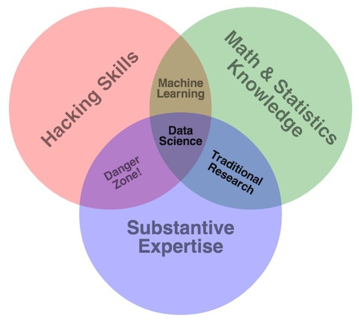
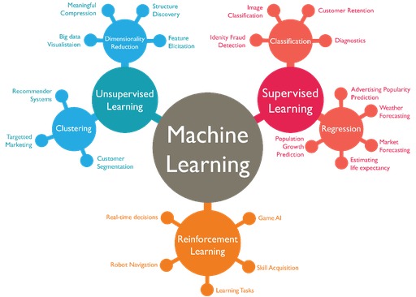
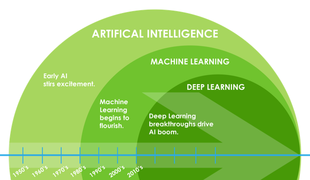
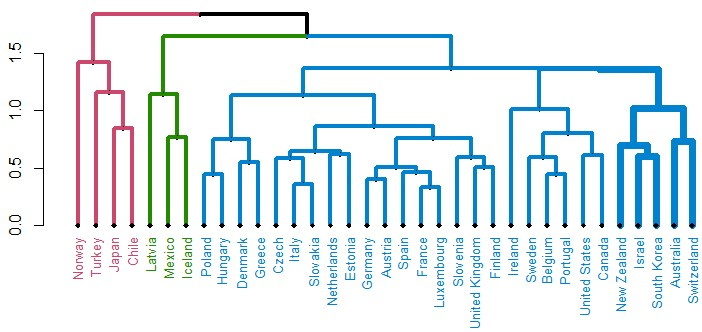
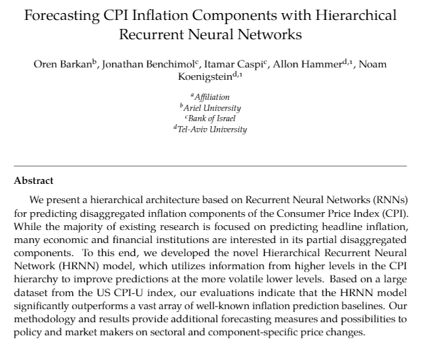
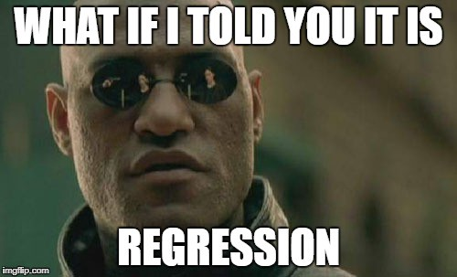
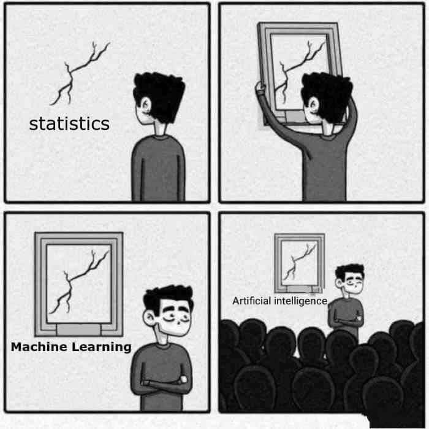
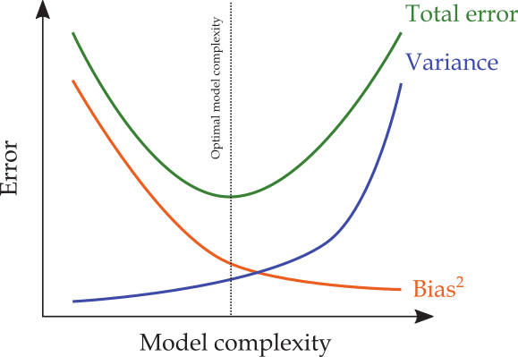
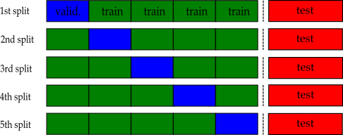

```{r setup, include=FALSE}
options(htmltools.dir.version = FALSE)
knitr::opts_chunk$set(eval = TRUE,
               echo = TRUE,
               warning = FALSE,
               message = FALSE,
               cache = FALSE,
               dev = "svglite",
               fig.ext = ".svg")

htmltools::tagList(rmarkdown::html_dependency_font_awesome())
```

# Replicating this Presentation

R packages used to produce this presentation:

```{r pacman, message=FALSE, warning=FALSE}
library(tidyverse)    # for data wrangling and visualization
library(tidymodels)   # for data modeling
library(RefManageR)   # for bibliography
library(truncnorm)    # for drawing from truncated normal
library(dagitty)      # for drawing DAGs
library(knitr)        # for including graphics
```


```{r ggplot_theme, include=FALSE}
theme_set(theme_gray(20))
```


```{r references, eval=TRUE, echo=FALSE, cache=FALSE}
BibOptions(check.entries = FALSE, 
           bib.style = "numeric", 
           cite.style = "authoryear", 
           style = "markdown",
           hyperlink = TRUE, 
           dashed = FALSE)
bib <- ReadBib("refs/refs.bib", check = FALSE)
```

???

Hat tip to Grant McDermott who introduced me the awesome __pacman__ package.

---
# First Things First: "Big Data"

<midd-blockquote>"_A billion years ago modern homo sapiens emerged. A billion minutes ago, Christianity began. A billion seconds ago, the IBM PC was released.
A billion Google searches ago ... was this morning._"  
.right[Hal Varian (2013)]</midd-blockquote>

The 4 Vs of big data:  

+ Volume - Scale of data.  
+ Velocity - Analysis of streaming data.  
+ Variety - Different forms of data.  
+ Veracity - Uncertainty of data.  

---

# "Data Science"

```{r, echo=FALSE, out.width = "50%", fig.align='center'}




```
[*] Hacking $\approx$ coding


---
# Outline

1. [What is ML?](#concepts)  

2. [The problem of overfitting](#overfitting)  

3. [Too complext? Regularize!](#regularization)  

4. [ML and Econometrics](#economics)  


---
class: title-slide-section-blue, center, middle
name: concepts

# What is ML?


---
# So, what is ML?

A concise definition by `r Citet(bib, "athey2018the")`:

<midd-blockquote>
"...[M]achine learning is a field
that develops algorithms designed to be applied to datasets, with the main areas of focus being prediction (regression), classification, and clustering or grouping tasks."
</midd-blockquote>

Specifically, there are three broad classifications of ML problems:  

  + supervised learning.  
  + unsupervised learning.  
  + reinforcement learning.  
  

> Most of the hype you hear about in recent years relates to supervised learning, and in particular, deep learning.


---


```{r, echo=FALSE, out.width = "80%", fig.align='center'}



```


???

Source: [https://wordstream-files-prod.s3.amazonaws.com/s3fs-public/machine-learning.png](https://wordstream-files-prod.s3.amazonaws.com/s3fs-public/machine-learning.png)


---
# An Aside: ML and Artificial Intelligence (AI)


```{r, echo=FALSE, out.width = "70%", fig.align='center'}



```


???

Source: [https://www.magnetic.com/blog/explaining-ai-machine-learning-vs-deep-learning-post/](https://www.magnetic.com/blog/explaining-ai-machine-learning-vs-deep-learning-post/)


---
# Unsupervised Learning

In _unsupervised_ learning, the goal is to divide high-dimensional data into clusters that are __similar__ in their set of features $(X)$.

Examples of algorithms:  
  - principal component analysis
  - $k$-means clustering
  - Latent Dirichlet Allocation (LDA) 
  
Applications:  
  - image recognition
  - cluster analysis
  - topic modelling


---
# Example: Clustering OECD Inflation Rates

```{r, echo=FALSE, out.width = "80%", fig.align='center'}



```

.footnote[_Source_: [Baudot-Trajtenberg and Caspi (2018)](https://www.bis.org/publ/bppdf/bispap100_l.pdf).]


---
# Reinforcement Learning (RL)
 
A definition by `r Citet(bib, "sutton2018rli")`:

<midd-blockquote>
_"Reinforcement learning is learning what to do—how to map situations to actions—so as to maximize a numerical reward signal. The learner is not told which actions to take, but instead must discover which actions yield the most reward by trying them."_
</midd-blockquote>


Prominent examples:

- Game AI (e.g., chess, AlphaGo).

- Robotics (e.g., autonomous cars).

- LLMs (e.g., ChatGPT)

---
# Supervised Learning

Consider the following data generating process (DGP):

$$Y=f(\boldsymbol{X})+\epsilon$$
where $Y$ is the outcome variable, $\boldsymbol{X}$ is a $1\times p$ vector of "features", and $\epsilon$ is the irreducible error.  

- __Training set__ ("in-sample"): $\{(x_i,y_i)\}_{i=1}^{n}$
- __Test set__ ("out-of-sample"): $\{(x_i,y_i)\}_{i=n+1}^{m}$

```{r, echo=FALSE, out.width = "50%", fig.align='center'}


```

<midd-blockquote>
Typical assumptions: (1) independent observations; (2) stable DGP across training _and_ test sets.
</midd-blockquote>

---

# The Goal of Supervised Learning

Use a labelled test set ( $X$ and $Y$ are known) to construct $\hat{f}(X)$ such that it _generalizes_ to unseen test set (only $X$ is known).

__EXAMPLE:__ Consider the task of spam detection:

```{r, echo=FALSE, out.width = "100%", fig.align='center'}


```

In this case, $Y=\{spam, ham\}$, and $X$ is the email text.

---

# Traditional vs. Modern Approach to Supervised Learning

<iframe width="100%" height="400" src="https://www.youtube.com/embed/xl3yQBhI6vY?start=405" frameborder="0" allow="accelerometer; autoplay; encrypted-media; gyroscope; picture-in-picture" allowfullscreen></iframe>


---

# Traditional vs. Modern Approach to Supervised Learning

- Traditional: rules based, e.g., define dictionaries of "good" and "bad" words, and use it to classify text.

- Modern: learn from data, e.g., label text as "good" or "bad" and let the model estimate rules from (training) data.


---
# More Real World Applications of ML

| task               | outcome $(Y)$   | features $(X)$                          |
|--------------------|-------------------|-------------------------------------------|
| credit score    | probability of default  | loan history, payment record... |
| fraud detection    | fraud / no fraud  | transaction history, timing, amount... |
| voice recognition  | word              | recordings                                |
| sentiment analysis | good / bad review | text                                      |
| image classification   | cat / not cat     | image                                     |
| overdraft prediction   | yes / no     | bank-account history 
| customer churn prediction   | churn / no churn     | customer features 

> A rather mind blowing example: Amazon's ["Anticipatory Package Shipping"](https://pdfpiw.uspto.gov/.piw?docid=08615473&SectionNum=1&IDKey=28097F792F1E&HomeUrl=http://patft.uspto.gov/netacgi/nph-Parser?Sect1=PTO2%2526Sect2=HITOFF%2526p=1%2526u%2025252Fnetahtml%2025252FPTO%20=%25%25%25%25%2025252Fsearch%20bool.html%202526r-2526f%20=%20G%20=%201%25%20=%2050%25%202526l%25%202526d%25%20AND%202526co1%20=%20=%20=%20PTXT%202526s1%25%25%25%20252522anticipatory%20252Bpackage%25%20=%25%20252522%25%202526OS%20252522anticipatory%20252Bpackage%25%25%20252%20522%25%202526RS%20252522anticipatory%25%20=%25%20252522%25%20252Bpackage) patent (December 2013): Imagine Amazon's algorithms reaching such levels of accuracy, casing it to change its business model from shopping-then-shipping to shipping-then-shopping!

???

A fascinating discussion on Amazon's shipping-then-shopping business model appears in the book ["Prediction Machines: The Simple Economics of Artificial Intelligence"](https://books.google.com/books/about/Prediction_Machines.html?id=wJY4DwAAQBAJ) `r Citep(bib, "agrawal2018prediction")`.
---
# Supervised Learning Algorithms

ML comes with a rich set of parametric and non-parametric prediction algorithms (approximate year of discovery in parenthesis):

- Linear and logistic regression (1805, 1958).
- Decision and regression trees (1984).  
- K-Nearest neighbors (1967).  
- Support vector machines (1990s).  
- Neural networks (1940s, 1970s, 1980s, 1990s).  
- Simulation methods (Random forests (2001), bagging (2001), boosting (1990)).  
- etc.

---
# Recent Application

```{r, echo=FALSE, out.width = "50%", fig.align='center'}



```

Source: [Barkan et al. (2021)](https://arxiv.org/abs/2011.07920)

---
# So, Why Now?

- ML methods are data-hungry and computationally expensive. Hence,

$$ \text{big data} + \text{computational advancements} = \text{the rise of ML}$$
--

- Nevertheless, 

<midd-blockquote> "_[S]upervised learning [...] may involve high dimensions, non-linearities, binary variables, etc., but at the end of the day it’s still just regression._" .right[&mdash; [__Francis X. Diebold__](https://fxdiebold.blogspot.com/2018/06/machines-learning-finance.html)]</midd-blockqoute>


```{r, echo=FALSE, out.width = "25%", fig.align='center'}



```

---
# Wait, is ML Just Glorified Statistics?

.pull-left[
```{r, echo=FALSE, out.width = "100%", fig.align='center'}



```
]

.pull-right[
The "two cultures" `r Citep(bib, "breiman2001statistical")`:

- Statisticians assume a data generating process and try to learn  about it using data (parameters, confidence intervals, assumptions.) 

- Computer scientists treat the data mechanism as unknown and try to predict or classify with the most accuracy.

]


???

See further discussions here:

- [https://towardsdatascience.com/no-machine-learning-is-not-just-glorified-statistics-26d3952234e3](https://towardsdatascience.com/no-machine-learning-is-not-just-glorified-statistics-26d3952234e3)  

- [https://www.quora.com/Is-Machine-Learning-just-glorified-statistics](https://www.quora.com/Is-Machine-Learning-just-glorified-statistics)


---
class: title-slide-section-blue, center, middle
name: overfitting

# Overfitting


---
# Prediction Accuracy

Before we define overfitting, we need to be more explicit about what we mean by "good prediction."

- Let $(x^0,y^0)$ denote a single realization from the (unseen) test set.

- Define a __loss function__ $L$ in terms of predictions $\hat{y}^0=\hat{f}(x^0)$ and the "ground truth" $y^0$, where $\hat{f}$ is estimated using the _training_ set.

- Examples

  - squared error (SE): $L(\hat{y}^0, y^0)=(y^0-\hat{f}(x^0))^2$   
  - absolute error (AE): $L(\hat{y}^0, y^0)=|y^0-\hat{f}(x^0)|$


- There are other possible forms of loss function (e.g., in classification, as the probability of misclassifying a case, or in terms of economic costs.)

---
# The Bias-Variance Decomposition

Under a __squared error loss function__, an optimal predictive model is one that minimizes the _expected_ squared prediction error.  

It can be shown that if the true model is $Y=f(X)+\epsilon$, then

$$\begin{aligned}[t]
\mathbb{E}\left[\text{SE}^0\right] &= \mathbb{E}\left[(y^0 - \hat{f}(x^0))^2\right] \\ &= \underbrace{\left(\mathbb{E}(\hat{f}(x^0)) - f(x^0)\right)^{2}}_{\text{bias}^2} + \underbrace{\mathbb{E}\left[\hat{f}(x^0) - \mathbb{E}(\hat{f}(x^0))\right]^2}_{\text{variance}} + \underbrace{\mathbb{E}\left[y^0 - f(x^0)\right]^{2}}_{\text{irreducible error}} \\ &= \underbrace{\mathrm{Bias}^2 + \mathbb{V}[\hat{f}(x^0)]}_{\text{reducible error}} + \sigma^2_{\epsilon}
\end{aligned}$$

where the expectation is over the training set _and_ $(x^0,y^0)$.


---
# Intuition Behind the Bias Variance Trade-off

Imagine you are a teaching assistant grading exams. You grade the first exam. What is your best prediction of the next exam's grade?

+ the first test score is an unbiased estimator of the mean grade.  

+ but it is extremely variable.   

+ any solution?


Lets simulate it!


???

This example is taken from Susan Athey's AEA 2018 lecture, ["Machine Learning and Econometrics"](https://www.aeaweb.org/conference/cont-ed/2018-webcasts) (Athey and
Imbens).

---
# Exam Grade Prediction Simulation

Let's Draw 1000 grade duplets from the following truncated normal distribution

$$g_i \sim truncN(\mu = 75, \sigma = 15, a=0, b=100),\quad i=1,2$$

Next, calculate two types of predictions
  - `unbiased_pred` is the first exam's grade.
  - `shrinked_pred` is an average of the previous grade and a _prior_ mean grade of 70.

```{r, echo=FALSE}

n <- 1000 # number of replications

test_df <- tibble(attempt = 1:n,
                  grade1  = rtruncnorm(n, a = 0, b = 100, mean = 80, sd = 15),
                  grade2  = rtruncnorm(n, a = 0, b = 100, mean = 80, sd = 15)) %>% 
  mutate_if(is.numeric, round, 0) %>% 
  mutate(unbiased_pred = grade1,
         shrinked_pred = 0.5*70 + 0.5*grade1)
  
```

Here a small sample from our simulated table:
```{r, echo=FALSE}
kable(sample_n(test_df, 5), format = "html")
```

---
# The Distribution of Predictions

```{r, echo=FALSE, fig.width=11, fig.height=5, fig.align='center'}

test_df %>% 
  select(attempt, unbiased_pred, shrinked_pred) %>% 
  gather(guess_type, guess_value, -attempt) %>% 
  ggplot(aes(x = guess_value, fill = guess_type)) +
  geom_histogram(binwidth = 5, show.legend = FALSE) +
  facet_wrap(~ guess_type) +
  labs(x = "Test Score", y = "Count")
  
```

---

# The MSE of Grade Predictions

```{r, echo=FALSE}
test_df %>% 
  mutate(unbiased_SE = (unbiased_pred - grade2)^2,
         shrinked_SE = (shrinked_pred - grade2)^2) %>% 
  summarise(unbiased_MSE = mean(unbiased_SE),
            shrinked_MSE = mean(shrinked_SE)) %>% 
  kable(format = "html")
```


Hence, the shrunk prediction turns out to be better (in the sense of MSE) then the unbiased one!

__QUESTION:__ Is this a general result? Why?


---
# Regressions and the Bias-Variance Trade-off

Consider the following hypothetical DGP:

$$consumption_i=\beta_0+\beta_1 \times income_i+\varepsilon_i$$

```{r cons_data}

set.seed(1505) # for replicating the simulation

df <- crossing(economist = c("A", "B", "C"),
         obs = 1:20) %>% 
  mutate(economist = as.factor(economist)) %>% 
  mutate(income = rnorm(n(), mean = 100, sd = 10)) %>% 
  mutate(consumption = 10 + 0.5 * income + rnorm(n(), sd = 10))
```

---
# Scatterplot of the Data

.pull-left[
```{r scatter, fig.show='hide', fig.retina=3}

df %>% 
  ggplot(aes(y = consumption,
             x = income)) +
  geom_point()
  
```
]
.pull-right[
```{r, ref.label = 'scatter', echo=FALSE}

```
]
---
# Split the Sample Between Three Economists

.pull-left[
```{r scatter_split, fig.show='hide', fig.retina=3}

df %>% 
  ggplot(aes(x = consumption,
             y = income,
             color = economist)) +
  geom_point()
  
```

```{r cons_table}

knitr::kable(sample_n(df,6), format = "html")

```
]
.pull-right[
```{r, ref.label = 'scatter_split', echo=FALSE}

```
]

---
# Underffiting: High Bias, Low Variance


.pull-left[
The model: unconditional mean

$$Y_i = \beta_0+\varepsilon_i$$
```{r underfit, fig.width=6, fig.show='hide', fig.retina=3}

df %>% 
  ggplot(aes(y = consumption,
             x = income,
             color = economist)) +
  geom_point() +
  geom_smooth(method = lm,
              formula = y ~ 1, #<<
              se = FALSE,
              color = "black") +
  facet_wrap(~ economist) +
  geom_vline(xintercept = 70, linetype = "dashed") +
  theme(legend.position = "bottom")
  
```
]
.pull-right[
```{r, ref.label = 'underfit', echo=FALSE}

```
]
---
# Overfitting: Low Bias, High Variance

.pull-left[
The model: high-degree polynomial

$$Y_i = \beta_0+\sum_{j=1}^{\lambda}\beta_jX_i^{\lambda}+\varepsilon_i$$

```{r overfit, fig.width=6, fig.show='hide', fig.retina=3}

df %>% 
  ggplot(aes(y = consumption,
             x = income,
             color = economist)) +
  geom_point() +
  geom_smooth(method = lm,
              formula = y ~ poly(x,5), #<<
              se = FALSE,
              color = "black") +
  facet_wrap(~ economist) +
  geom_vline(xintercept = 70, linetype = "dashed") +
  theme(legend.position = "bottom")
  
```
]
.pull-right[
```{r, ref.label = 'overfit', echo=FALSE}

```
]

---
# "Justfitting": Bias and Variance are Just Right

.pull-left[
The model: linear regression

$$Y_i = \beta_0+\beta_1 X_i + \varepsilon_i$$

```{r justfit, fig.width=6, fig.show='hide', fig.retina=3}

df %>% 
  ggplot(aes(y = consumption,
             x = income,
             color = economist)) +
  geom_point() +
  geom_smooth(method = lm,
              formula = y ~ x, #<<
              se = FALSE,
              color = "black") +
  facet_wrap(~ economist) +
  geom_vline(xintercept = 70, linetype = "dashed") +
  theme(legend.position = "bottom")
  
```
]
.pull-right[
```{r, ref.label = 'justfit', echo=FALSE}

```
]
---
# The Typical Bias-Variance Trade-off in ML


Typically, ML models strive to find levels of bias and variance that are "just right":

```{r, echo=FALSE, out.width = "60%", fig.align='center'}



```


---
# When is the Bias-Variance Trade-off Important?

In low-dimensional settings ( $n\gg p$ )  
  + overfitting is highly __unlikely__  
  + training MSE closely approximates test MSE  
  + conventional tools (e.g., OLS) will perform well on a test set

INTUITION: As $n\rightarrow\infty$, insignificant terms will converge to their true value (zero).

In high-dimensional settings ( $n\ll p$ )  
  + overfitting is highly __likely__  
  + training MSE poorly approximates test MSE  
  + conventional tools tend to overfit  
  
<midd-blockquote> $n\ll p$ is prevalent in big-data </midd-blockquote>

---
# Bias-Variance Trade-off in Low-dimensional Settings

.pull-left[
The model is a 3rd degree polynomial

$$Y_i = \beta_0+\beta_1X_i+\beta_2X^2_i+\beta_3X_i^3+\varepsilon_i$$

only now, the sample size for each economist increases to $N=500$.

> __INTUITION:__ as $n\rightarrow\infty$, $\hat{\beta}_2$ and $\hat{\beta}_3$ converge to their true value, zero.

```{r big_n_data, echo=FALSE}
set.seed(1505)
df <- crossing(economist = c("A", "B", "C"),
         obs = 1:500) %>% 
  mutate(economist = as.factor(economist)) %>% 
  mutate(income = rnorm(n(), mean = 100, sd = 10)) %>% 
  mutate(consumption = 10 + 0.5 * income + rnorm(n(), sd = 10))
```

```{r big_n_plot, echo=FALSE, fig.width=6, fig.height=3, fig.show='hide', fig.retina=3}
df %>% ggplot(aes(y = consumption,
             x = income,
             color = economist)) +
  geom_point() +
  geom_smooth(method = lm,
              formula = y ~ poly(x,3), #<<
              se = FALSE,
              color = "black") +
  facet_wrap(~ economist) +
  geom_vline(xintercept = 70, linetype = "dashed") +
  theme(legend.position = "bottom")


```
]
.pull-right[
```{r, ref.label = 'big_n_plot', echo=FALSE}

```
]


---
class: title-slide-section-blue, center, middle
name: regularization

# Regularization


---

# Regularization


- As the _complexity_ of our model goes up, it will tend to overfit.

- __Regularization__ is the act of penalizing models for their complexity level.

<midd-blockquote>
Regularization typically results in simpler and more accurate (though “wrong”) models.
</midd-blockquote>


---

# How to Penalize Overfit?

The test set MSE is _unobservable_. How can we tell if a model overfits?  

- Main idea in machine learning: use _less_ data!  

- Key point: fit the model to a subset of the training set, and __validate__ the model using the subset that was _not_ used to fit the model.  

- How can this "magic" work? Recall the stable DGP assumption.  


---

# Validation

Split the sample to three folds: a training set, a validation set and a test set:

```{r, echo=FALSE, out.width = "50%", fig.align='center'}


```

The algorithm:

1. Fit a model to the training set.

2. Use the model to predict outcomes from the validation set.

3. Use the mean of the squared prediction errors to approximate the test-MSE.


__CONCERNS__: (1) the algorithm might be sensitive to the choice of training and validation set; (2) the algorithm does not use all of the available information.


---

# k-fold Cross-validation

Split the training set into $k$ roughly equal-sized parts ( $k=5$ in this example):

```{r, echo=FALSE, out.width = "50%", fig.align='center'}



```

Approximate the test-MSE using the mean of $k$ split-MSEs

$$\text{CV-MSE} = \frac{1}{k}\sum_{j=1}^{k}\text{MSE}_j$$

---

# Which Model to Choose?


- Recall that the test-MSE is unobservable.

- CV-MSE is our best guess.

- CV-MSE is also a function of model complexity.

- Hence, model selection amounts to choosing the complexity level that minimizes CV-MSE.

---

# Sounds Familiar?

- In a way, you probably already know this:  

  - Adjusted R2.  

  - AIC, BIC (time series models).  

  The above two measures indirectly take into account the overfitting that may occur due to the complexity of the model (i.e., adding too many covariates or lags).

- In ML we use the data to tune the level of complexity such that it maximizes prediction accuracy.  

---
class: title-slide-section-blue, center, middle
name: economics

# ML and Causality


---
# ML vs. econometrics

Apart from jargon (Training set vs. in-sample, test-set vs. out of sample, learn vs. estimate, etc.) here is a summary of some of the key differences between ML and econometrics:


|   Machine Learning | Econometrics |
| :----------------- | :---------------------- |
| prediction | causal inference |
| $\hat{Y}$ | $\hat{\beta}$ |
| minimize prediction error | unbiasedness, consistency, efficiency |
| --- | statistical inference |
| stable environment | counterfactual analysis |
| black-box | structural |


---
# ML and causal inference

<midd-blockquote> _”Data are profoundly dumb about causal relationships.”_   
.right[&mdash; [__Pearl and Mackenzie, _The Book of Why___](http://bayes.cs.ucla.edu/WHY/)]
</midd-blockquote> 


Intervention violates the stable DGP assumption:

$$P(Y|X=x) \neq P(Y|do(X=x)),$$
where

- $P(Y|X=x)$ is the the probability of $Y$ given that we _observe_ $X=x$.  

- $P(Y|do(X=x))$ is the the probability of $Y$ given that we _intervene_ to set $X=x$


---
# "A new study shows that..."

.pull-left[

__TOY PROBLEM:__ Say that we find in the data that `coffee` is a good predictor of `dementia`. Is avoiding `coffee` a good idea?


```{r dag1, fig.length=1, fig.show='hide', echo = FALSE}

library(ggdag)

coffee_dag <- dagify(
       dementia ~ coffee,
       exposure = "dementia",
       outcome = "coffee",
       labels = c("dementia" = "Dementia", "coffee" = "Coffee")
       ) %>% 
  tidy_dagitty(layout = "tree")

ggdag(coffee_dag, text = FALSE,
      text_size = 8, use_labels = "label")

```
]
.pull-right[
```{r, ref.label = 'dag1', echo=FALSE}

```
]

???


---
# To explain or to predict? 

.pull-left[

- In this example `coffee` is a good _predictor_ of `dementia`, despite not having any causal link to it.

- Controlling for `smoking` will give us the causal effect of `coffee` on `dementia`, which is zero.

> In general, causal inference always and everywhere dependes on _assumptions_ about the DGP (i.e., the data never "speaks for itself").


```{r dag2, fig.length=1, fig.show='hide', echo = FALSE}

library(ggdag)

coffee_dag <- dagify(dementia ~ smoking,
       smoking ~ addictive,
       coffee ~ addictive,
       exposure = "coffee",
       outcome = "dementia",
       labels = c("coffee" = "Coffee", "dementia" = "Dementia", 
                  "smoking" = "Smoking", "addictive" = "Addictive \n behavior")) %>% 
  tidy_dagitty(layout = "tree")

ggdag(coffee_dag, text = FALSE,
      text_size = 8, use_labels = "label")

```
]
.pull-right[
```{r, ref.label = 'dag2', echo=FALSE}

```
]

???

The title of this slide "To Explain or to Predict?" is the name of a must-read [paper](https://projecteuclid.org/euclid.ss/1294167961) by `r Citet(bib, "shmueli2010explain")` that clarifies the distinction between predicting and explaining.

---
# ML in aid of econometrics

Consider the standard "treatment effect regression":

$$Y_i=\alpha+\underbrace{\tau D_i}_{\text{low dimensional}} +\underbrace{\sum_{j=1}^{p}\beta_{j}X_{ij}}_{\text{high dimensional}}+\varepsilon_i,\quad\text{for }i=1,\dots,n$$
where
+ An outcome $Y_i$  
+ A treatment assignment $D_i\in\{0,1\}$  
+ A vector of $p$ control variables $X_i$  

Our object of interest is often $\hat{\tau}$, the average treatment effect (ATE).


---
class: .title-slide-final, center, inverse, middle

# `slides::end()`

[<i class="fa fa-github"></i> Source code](https://github.com/ml4econ/lecture-notes-2021/blob/master/02-basic-ml-concepts/02-basic-ml-concepts.Rmd)  

---
# References

```{r, 'refs1', results='asis', echo=FALSE, eval=TRUE}
PrintBibliography(bib, start = 1, end = 6)
```

---
# References

```{r, 'refs2', results='asis', echo=FALSE, eval=TRUE}
PrintBibliography(bib, start = 6, end = 7)
```

