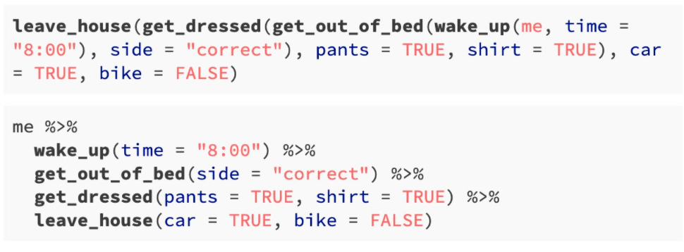
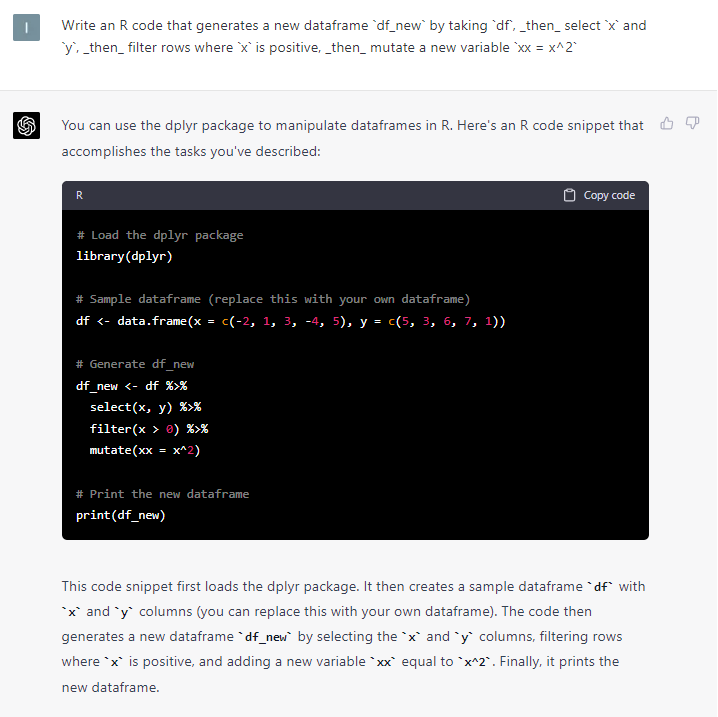
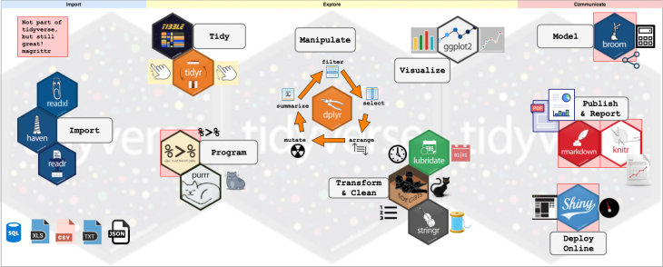

# Replicating this Presentation

R packages used to produce this presentation

```{r load packages, message=FALSE, warning=FALSE}
library(tidyverse)  # for data wrangling and plotting
library(tidymodels) # for modeling the tidy way
library(knitr)      # for presenting tables
library(xaringan)   # for rendering xaringan presentations
```


```{r setup, include=FALSE}
options(htmltools.dir.version = FALSE)

knitr::opts_chunk$set(
  eval    = TRUE,
  echo    = TRUE,
  warning = FALSE,
  message = FALSE
)

htmltools::tagList(rmarkdown::html_dependency_font_awesome())
```

```{r plots_and_figures, include=FALSE}
theme_set(theme_gray(15))
```


---

# From Best Practices to Methodology

|  Best Practice                 | Methodology                           |
|:-------------------------------|:--------------------------------------|
| High dimensional statistics    | Machine learning                      |
|  `# code annotation`           | Notebooks (R Markdown, Jupyter)       |
|  `mydoc_1_3_new_final_23.docx` | Version control                       |
| Ready to use tables (xlsx)     | Generate tables (SQL, dplyr, pandas)  |
|  ??                            | Reproducibility                       |
| Stata, SAS, EViews             | R, Python, Julia                      |
| work solo                      | Interdisciplinary teams               |

---

# Outline

1. [Reproducibility](#projects)

2. [The Tidyverse](#tidyverse)

3. [Version Control](#git)

4. [GitHub](#github)


---
class: title-slide-section-blue, center, middle
name: projects

# RStudio Projects


---

# Reproducibility

- **Reproducible research:** Enables others to replicate your results

- **Project requirements:**
  - Document your work (code and explanations)
  - List used packages (including version numbers)
  - Detail your R environment (R version, OS, etc.)
  
- **Reproducible mindset:** Focus on code consumers, including your future self


---

# An Aside: `renv`

.pull-left[
```{r, echo=FALSE, out.width = "80%", fig.align='center'}
knitr::include_graphics("https://rstudio.github.io/renv/logo.svg")
```
]

.pull-right[

- **[`renv` package](https://rstudio.github.io/renv/index.html):** Create reproducible environments for R projects

- **Key benefits:**

  - *Isolated:* Private package library for each project
  - *Portable:* Easily transfer projects across computers and platforms
  - *Reproducible:* Records exact package versions for consistent installations
  
- **Learn more:** [Introduction to `renv`](https://rstudio.github.io/renv/articles/renv.html)

]


---

# RStudio Project Oriented Workflow


- **Avoid `setwd()` and `rm(list=ls())`:** [Improper R script practices](https://www.tidyverse.org/articles/2017/12/workflow-vs-script/)

- **Recommended alternatives:**

  1. Utilize RStudio's project environment
  
  2. Modify settings:
     - Go to `Tools -> Global Options -> General`
     - Set "Save workspace to .RData on exit" to **NEVER**


---

# R Markdown


- **R Markdown notebooks:** Premier tool for reproducible research in R

- **Knitting process:** Starts with a clean slate

- **R Markdown file:** Integrates text, code, links, figures, tables, etc.

- **Ideal for communication:** Export .Rmd file as:
  - Document (Word, PDF, HTML, Markdown)
  - Presentation (HTML, Beamer, Xaringan, PowerPoint)
  - Website ([`blogdown`](https://bookdown.org/yihui/blogdown/))
  - Book ([`bookdown`](https://bookdown.org/home/))
  - Journal article ([`pagedown`](https://github.com/rstudio/pagedown))
  - Dashboard ([`flexdashboards`](https://rmarkdown.rstudio.com/flexdashboard/))


---
class: title-slide-section-blue, center, middle
name: tidyverse

# The Tidyverse


---
# This is Not a Pipe

```{r pipe, echo=FALSE, out.width = "50%", fig.align='center'}

knitr::include_graphics("figs/pipe.jpg")

```


---

# Prerequisite: `%>%` is a pipe

- **Pipe operator `%>%`:** From [`magrittr`](https://cran.r-project.org/web/packages/magrittr/vignettes/magrittr.html) package, integral to `tidyverse`

- **Understanding `%>%`:** Associate it with "then"

- **Example:**
  - Traditional: `y <- h(g(f(x), z))`
  
  - With pipe: `y <- x %>% f() %>% g(z) %>% h()`
  
  - Read as: Take `x`, _then_ apply `f()`, _then_ apply `g(. , z)`, _then_ apply `h()`, and store result in `y`


---
# Morning Routine

```{r pipe2, echo=FALSE, out.width = "80%", fig.align='center'}



```

Source: [https://twitter.com/andrewheiss/status/1359583543509348356?s=20](https://twitter.com/andrewheiss/status/1359583543509348356?s=20)
---

# Base R vs. the Tidyverse

- Consider the following data frame:
```{r }
df <- data.frame(
        x = rnorm(10),
        y = rnorm(10),
        z = rnorm(10)
      )
```

- Can you guess what the following code chunk does?
```{r }
df_new <- df[df$x > 0, c("x", "y")]
df_new$xx <- df_new$x^2
```

--


---

# "Piped" code?

- How about this one?

```{r }
df_new <- df %>% 
  select(x, y) %>% 
  filter(x > 0) %>% 
  mutate(xx = x^2)
```


The above code chunk should be read as:

>"generate a new dataframe `df_new` by taking `df`, _then_ select `x` and `y`, _then_ filter rows where `x` is positive, _then_ mutate a new variable `xx = x^2`"


---

# Enter ChatGPT...

```{r chat, echo=FALSE, out.width = "50%", fig.align='center'}

```


---

# Pros & cons

- Following a "tidy" approach makes your code more readable $\Rightarrow$ more reproducible.

- I believe that there is a growing consensus in the #rstats community that we should [learn the tidyverse first](http://varianceexplained.org/r/teach-tidyverse/).

- Nevertheless, note that the tidyverse is "Utopian" in the sense that it strives toward _perfection_, and thus keeps changing. By contrast, base R was built to last.

- As usual, being proficient in both (base R and the tidyverse) will get you far...


---
# The Tidyverse

```{r tidyverse_pic, echo=FALSE, out.width = "100%", fig.align='center'}



```

---

# Tidyverse Packages

Which packages come with `tidyverse`?

```{r }

tidyverse_packages()

```

Note that not all these packages are loaded by default.

We now briefly introduce the tidyverse's flagship: `dplyr`.

---

# `dplyr`: The grammar of data manipulation

- **`dplyr`:** Essential tool for data manipulation

- **Key verbs:**
  - `filter()` - Select observations (rows)
  - `select()` - Select variables (columns)
  - `mutate()` - Generate new variables (columns)
  - `arrange()` - Sort observations (rows)
  - `summarise()` - Summary statistics (by groups)
  
- **Some additional verbs:**
  - `group_by()` - Group observations by variables
  - `sample_n()` - Sample rows from a table
  
- **Learn more:** [`dplyr` documentation](https://dplyr.tidyverse.org/reference/index.html)


---

# The `tidymodels` package

- Tidymodels extends the tidyverse's "grammar" philosophy to modeling tasks.

```{r tidymodels}
tidymodels::tidymodels_packages()
```


For more information, visit the [tidymodels GitHub repo](https://github.com/tidymodels/tidymodels).


---

# Resources

1. [R for Data Science (r4ds)](http://r4ds.had.co.nz/) by Garrett Grolemund and Hadley Wickham.

2. [Data wrangling and tidying with the “Tidyverse”](https://raw.githack.com/uo-ec607/lectures/master/05-tidyverse/05-tidyverse.html) by Grant McDerrmot.

3. [Getting used to R, RStudio, and R Markdown](https://rbasics.netlify.com/index.html) by Chester Ismay and Patrick C. Kennedy.

4. [Data Visualiztion: A practical introduction](https://socviz.co/) by Kieran Healy.


---
class: title-slide-section-blue, center, middle
name: git

# Version Control


---

# Version Control

.pull-left[
```{r, echo=FALSE, out.width = "90%", fig.align='center'}


```
]

.pull-right[

What's wrong with the "*.X_FINAL_FINAL" method?

- What changed?

- Where??

- When???

- By who????

You get the picture...
]

---

# Git

.pull-left[
```{r, echo=FALSE, out.width = "80%", fig.align='center'}

knitr::include_graphics("https://git-scm.com/images/logos/downloads/Git-Icon-1788C.png")

```
]

.pull-right[

- Git is a distributed version control system.

- Huh?!

- Sorry. Think of "track changes" for code projects.

- Git has established itself as the de-facto standard for version control and software collaboration.


]


---

# GitHub

.pull-left[
```{r, echo=FALSE, out.width = "90%", fig.align='center'}

knitr::include_graphics("https://github.githubassets.com/images/modules/logos_page/GitHub-Mark.png")

```
]

.pull-right[

- GitHub is a web-based hosting service for version control that uses Git.

- It can be thought of as "Dropbox" for Git projects, offering advanced features beyond basic version control.

- GitHub is a popular platform for developing open-source projects, including popular R packages and other software libraries. 


]


???

The source for the definition of GitHub is [Wikipedia](https://en.wikipedia.org/wiki/GitHub).


---

# GitHub Desktp

.pull-left[
```{r, echo=FALSE, out.width = "90%", fig.align='center'}

knitr::include_graphics("https://carldesouza.com/wp-content/uploads/2020/03/img_5e72a64e32003.png")

```
]

.pull-right[

- [GitHub Desktop](https://desktop.github.com/) is a user-friendly graphical interface that allows developers to interact with Git repositories.

- It provides an intuitive way to manage changes to code, create and switch branches, and synchronize local and remote repositories.

- GitHub Desktop also simplifies collaboration by making it easy to create and review pull requests, resolve merge conflicts, and manage code reviews.


]


???

The source for the definition of GitHub is [Wikipedia](https://en.wikipedia.org/wiki/GitHub).


---

# Resources

1. [Happy Git and GitHub for the useR](https://happygitwithr.com/) by Jenny Bryan.

2. [Version Control with Git(Hub)](https://raw.githack.com/uo-ec607/lectures/master/02-git/02-Git.html) by Grant McDerrmot.

3. [Pro Git](https://git-scm.com/book/en/v2).


---
class: title-slide-section-blue, center, middle
name: practice

# Let's Practice!


---

# Suggested workflow for starting a new (desktop) R project

- **RStudio:**
  1. Open RStudio.
  2. Navigate to File -> New Project -> New Directory -> New Project.
  3. Name your project in the "Directory name:" field and check "Create git repository".

- **GitHub Desktop:**
  1. Open GitHub Desktop.
  2. Navigate to File -> Add local repository.
  3. Set the "Local path" to your RStudio project's folder.
  4. Publish the local git repo on GitHub (choose private or public repo).


---

# Suggested Git Workflow (Optional)

- **Pull, Stage, Commit, Push Workflow:**

  1. Open GitHub Desktop.
  2. Set "Current repository" to the cloned repo.
  3. Click "Fetch origin" and __pull__ any changes from the GitHub repo.
  4. Open your project.
  5. Make changes to one or more files.
  6. Save the changes.
  7. __Stage__ or unstage changed files.
  8. Write a summary (and description) of your changes.
  9. Click "__Commit__ to master".
  10. Update remote by clicking "__Push__ origin" (Ctrl + P).


---
# Clone and Sync a Remote GitHub Repository (Optional)

- **Cloning a Repository:**
  1. Launch GitHub Desktop.
  2. Navigate to the remote repository.
  3. Select "Clone or download".
  4. Define the local path for your cloned repo (e.g., "C:/Documents/CLONED_REPO").

- **Synchronizing a Repository:**
  1. Launch GitHub Desktop.
  2. Switch "Current repository" to the cloned repo.
  3. Press the "Fetch origin" button.
  4. __Pull__ any updates made on the remote repo.


---
# Your Homework

- **Getting Started with R and Git:**
  1. Open RStudio.
  2. Create your first R project.
  3. Initiate Git.<sup>1</sup>
  4. Create a new RMarkdown file.
  5. Commit your changes.

  .footnote[
  <sup>1</sup> RStudio automatically generates a `.gitignore` file that tells Git which files to ignore. Click [here](https://raw.githack.com/uo-ec607/lectures/master/02-git/02-Git.html#57) for more details on configuring what to ignore.
  ]


---
class: .title-slide-final, center, inverse, middle

# `slides %>% end()`


[<i class="fa fa-github"></i> Source code](https://github.com/ml4econ/lecture-notes-2021/tree/master/03-reprod-vc)  
