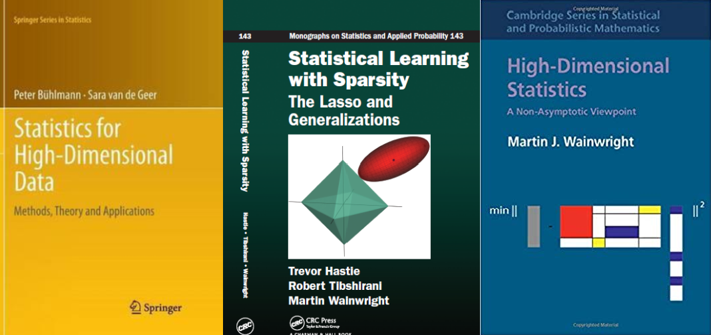
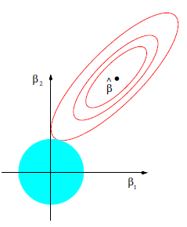
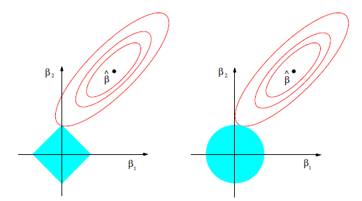
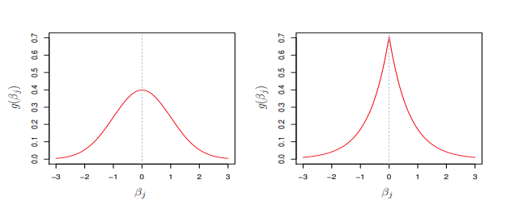
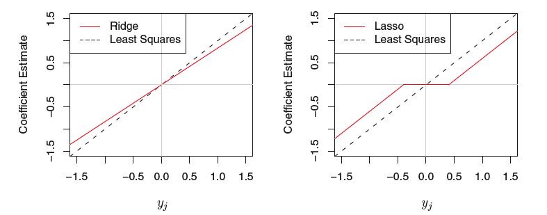

```{r setup, include=FALSE}
options(htmltools.dir.version = FALSE)
knitr::opts_chunk$set(
  eval = TRUE,
  echo = TRUE,
  warning = FALSE,
  message = FALSE,
  cache = FALSE,
  dev = "svglite",
  fig.ext = ".svg")

htmltools::tagList(rmarkdown::html_dependency_font_awesome())
```


# Packages and setup

Use the [{`pacman`}](https://cran.r-project.org/web/packages/pacman/vignettes/Introduction_to_pacman.html) package that automatically loads and installs packages if necessary:

```{r pacman, message=FALSE, warning=FALSE, eval=TRUE}
if (!require("pacman")) install.packages("pacman")

pacman::p_load(
  tidyverse,   # for data wrangling and visualization
  knitr,       # for displaying nice tables
  broom,       # for tidying estimation output
  here,        # for referencing folders and files
  glmnet,      # for estimating lasso and ridge
  gamlr,       # for forward stepwise selection
  pls,         # for estimating PCR and PLS
  elasticnet,  # for estimating PCR and PLS
  ggfortify    # for enhancing data visualization
)
```

Set a theme for `ggplot` (Relevant only for the presentation)
```{r ggplot_theme}
theme_set(theme_grey(20))
```

And set a seed for replication
```{r}
set.seed(1203)
```

---

# Resources on hige-dimensional statsitics

.pull-left[
- [_Statistical Learning with Sparsity - The Lasso and Generalizations_](https://web.stanford.edu/~hastie/StatLearnSparsity/)  (Hastie, Tibshirani, and Wainwright),
(PDF available online)

- [_Statistics for High-Dimensional Data - Methods, Theory and Applications_](https://www.springer.com/gp/book/9783642201912) (Buhlmann and van de Geer)

- [_High Dimensional Statistics - A Non-Asymptotic Viewpoint_](https://www.cambridge.org/core/books/highdimensional-statistics/8A91ECEEC38F46DAB53E9FF8757C7A4E) (Wainwright)
]

.pull-right[
```{r, echo=FALSE, out.width = "100%", fig.align='center'}

```
]


---
# Outline

 - [Linear regression](#linear)  
 
 - [Penalized regression](#penalized)

 - [Subset selection](#subset)  

 - [Shrinkage](#shrink)  

 - [Dimension Reduction](#dim)  


---
class: title-slide-section-blue, center, middle
name: linear

# Linear Regression

---

# Econometrics

In econometrics, we typically assume a "true" linear data generating process (DGP):

$$y_{i}=\beta_{0}+\sum_{j=1}^{p} x_{i j} \beta_{j}+\varepsilon_{i}$$

where $y_i$ is the outcome variable, $x_{ij},\ldots,x_{ip}$ represent explanatory or control variables (including interactions, polynomials, etc.), and $\varepsilon_i$ is the regression error.

**Sample**: $\{(x_1,\ldots,x_p,y_i)\}_{i=1}^{n}$

---

# Estimation

Ordinary least squares minimizes:

$$\underset{\beta_{0}, \beta}{\operatorname{min}} \sum_{i=1}^{N}\left(y_{i}-\beta_{0}-\sum_{j=1}^{p} x_{i j} \beta_{j}\right)^{2}$$

The emphasis is on in-sample fit (minimizing residual sum of squares).

Typical workflow:
- Impose identifying assumptions (causal claims).
- Estimate $\beta_0,\ldots,\beta_p$ using the entire sample.
- Assume a random sample from a larger population.
- Perform hypothesis testing.


---
# Supervised Learning

Consider the following linear data generating process (DGP):

$$y_{i}=\beta_{0}+\sum_{j=1}^{p} x_{i j} \beta_{j}+\varepsilon_{i}$$

where $y_i$ is the predicted (response) variable, $x_{i1},\ldots,x_{ip}$ are the features, and $\varepsilon_i$ is the irreducible error.

- **Training set**: $\{(x_{1i},\ldots,x_{ip},y_i)\}_{i=1}^{n}$
- **Test set**: $\{(x_{1i},\ldots,x_{ip},y_i)\}_{i=n+1}^{m}$

> Typical assumptions: (1) independent observations; (2) stable DGP across both training and test sets.

Our objective is to predict unseen data, $\widehat{y}_i$.


---

# Dffierent objective, different approach

To illustrate how these two approaches (estimation vs. prediction) differ, consider the following data generating process<sup>1</sup>:

$$y_i = \beta_0 + \beta_1 x_i + \varepsilon_i,\qquad \varepsilon_i\sim N(0,\sigma^2)$$
where $\beta_0=0$ and $\beta_1=2$.

Next, suppose you get a sample of size $n$ and use it to estimate the model and get (standard errors in parentheses):

$$\begin{aligned}
&y_{i}=0.0\hspace{0.35cm}+\hspace{0.35cm}2.0\times x_{i}+\widehat{\varepsilon}_{i}\\
&\hspace{1.4cm}(0.2)\hspace{0.85cm}(10.0)
\end{aligned}$$

Given a new unseen $x^0$ and the output above, how would you predict $y^0$?

.footnote[
[1] Adapted from Susan Athey's lecture.
]

---

# Standard Errors and Prediction Accuracy

- OLS prioritizes unbiasedness first, followed by efficiency.

- OLS is unbiased, providing accurate predictions on average. But is that our goal?

- A noisy estimated coefficient (high standard error) leads to a variable prediction (high variability).

- The bias-variance trade-off comes into play.

- Prediction involves balancing bias and variance.


**Note:** In multivariate regression, the complexity increases due to the correlation structure of the $x$'s.


---

# Illustration: Browser Data

In this lecture, we will use Matt Taddy's **browser dataset** (available in our repo), which contains web browsing logs for 10,000 people. Taddy extracted a year's worth of browser logs for the 1,000 most heavily trafficked websites. Each browser in the sample spent at least $1 online during the same year.

The goal of estimation is to predict spending based on browser history:

$$\log(spend_i) = \beta_0 + \beta'visits_i + \varepsilon_i,\qquad \text{for }i=1,\ldots,n$$

where $visits_i$ is a vector of site-visit percentages. This model can be used to segment expected user budget as a function of browser history.


---

# Loading Data

Specifically, we will use a sample from the browser dataset, consisting of 250 websites and 1,000 users.

```{r}
browser <- here("05-regression-regularization/data", "browser-all.csv") %>% 
  read_csv()
```

The log spending by the first user and the fraction of times she visited the first 4 websites are as follows:
```{r}
browser[6, 1:5]
```

__NOTE:__ The design matrix in this case is sparse.


---

# Transforming Data to Matrices

It is useful to transform the data into response and feature vectors/matrices:

```{r}
browser_mat <- browser %>% 
  as.matrix()

Y_browser <- browser_mat[, 1]     # response
X_browser <- browser_mat[, 2:201] # features
```


---

# OLS Results

Estimate the model using `lm()`:
```{r}
lm_fit <- lm(log_spend ~ ., data = browser)
```

Display the estimation output, sorted by $p$-values:
```{r}
lm_fit %>% 
  tidy() %>% 
  arrange(p.value) %>% 
  head(3) %>% 
  kable(format = "html", digits = 2)
```


---

# Model Performance

What is the training-set MSE?

```{r}
lm_fit %>% 
  augment() %>%
  summarise(mse = mean((log_spend - .fitted)^2)) %>% 
  kable(format = "html", digits = 3)
```

This is clearly an _underestimate_ of the test set MSE.


---
class: title-slide-section-blue, center, middle
name: penalized

# Penalized Linear Regression

---

# Estimation with Penalization

Penalized (or regularized) sum of squares solves:

$$\underset{\beta_{0}, \beta}{\operatorname{min}} \sum_{i=1}^{N}\left(y_{i}-\beta_{0}-\sum_{j=1}^{p} x_{i j} \beta_{j}\right)^{2} \text { subject to }R(\beta) \leq t$$

where $R(\cdot)$ is a penalty function that measures the **expressiveness** of the model.

As the number of features grows, linear models become *more* expressive.


---

# Notation: Norms

Suppose $\boldsymbol{\beta}$ is a $p\times 1$ vector with a typical element $\beta_i$.

- The $\ell_0$-norm is defined as $||\boldsymbol{\beta}||_0=\sum_{j=1}^{p}\boldsymbol{1}_{\{\beta_j\neq0\}}$, i.e., the number of non-zero elements in $\boldsymbol{\beta}$.

- The $\ell_1$-norm is defined as $||\boldsymbol{\beta}||_1=\sum_{j=1}^{p}|\beta_j|$.

- The $\ell_2$-norm is defined as $||\boldsymbol{\beta}||_2=\left(\sum_{j=1}^{p}|\beta_j|^2\right)^{\frac{1}{2}}$, i.e., Euclidean norm.


---
# Commonly Used Penalty Functions

It is often convenient to rewrite the regularization problem in the Lagrangian form:

$$\underset{\beta_{0}, \beta}{\operatorname{min}} \sum_{i=1}^{N}\left(y_{i}-\beta_{0}-\sum_{j=1}^{p} x_{i j} \beta_{j}\right)^{2}+\lambda R(\beta)$$

**Note:** There is a one-to-one correspondence between $\lambda$ and $t$.

|  Method          |  $R(\boldsymbol{\beta})$             |
|:-----------------|:-------------------------------------|
| OLS              | 0                                    |
| Subset selection | $\lVert\boldsymbol{\beta}\rVert_0$   |
| Lasso            | $\lVert\boldsymbol{\beta}\rVert_1$   |
| Ridge            | $\lVert\boldsymbol{\beta}\rVert_2^2$ |
| Elastic Net<sup>*</sup>      | $\alpha\lVert\boldsymbol{\beta}\rVert_1 + (1-\alpha)\lVert\boldsymbol{\beta}\rVert_2^2$ |

.footnote[
[*] Elastic Net will not be covered in this lecture. It is essentially a combination of ridge and lasso.
]


---
class: title-slide-section-blue, center, middle
name: subset

# Best Subset Selection


---

# Our Goal

$$\underset{\beta_{0}, \beta}{\operatorname{min}} \sum_{i=1}^{N}\left(y_{i}-\beta_{0}-\sum_{j=1}^{p} x_{i j} \beta_{j}\right)^{2} \text { subject to }\lVert\boldsymbol{\beta}\rVert_0 \leq t$$

**In words**: Select the best model according to some statistical criteria, among all possible combinations of $t$ features or fewer.


---

# Best Subset Selection Algorithm

1. For $k=0,1, \ldots ,p$

  1.1 Fit all models that contain exactly $k$ predictors. If $k=0$, the forecast is the unconditional mean.
  
  1.2 Pick the best (e.g., highest $R^2$) among these models, and denote it by $\mathcal{M}_{k}$.
  
2. Optimize over $\{\mathcal{M}_{0}, \ldots, \mathcal{M}_{p}\}$ using cross-validation (or other criteria)

Issues:

1. The algorithm is very slow: at each step, we deal with $p \choose k$ models ("N-P complete").
2. The prediction is highly unstable: the subsets of variables in $\mathcal{M}_{10}$ and $\mathcal{M}_{11}$ can be very different from each other, leading to high variance (the best subset of $\mathcal{M}_3$ need not include any of the variables in the best subset of $\mathcal{M}_2$).


---

# Faster Subset Selection Algorithms

Instead of estimating all possible combinations, follow a particular path of models:

- Forward stepwise selection: Start simple and expand (feasible even if $p>n$)

- Backward stepwise selection: Start with the full model and drop features (not recommended)


---

# Forward Stepwise Algorithm

1. Let $\mathcal{M}_{0}$ denote the null model, which contains just an intercept.

2. For $k=0, \ldots, p-1:$

  2.1 Consider all $p-k$ models that augment the predictors in $\mathcal{M}_{k}$ with one additional predictor.
  
  2.2 Choose the best among these $p-k$ models and call it $\mathcal{M}_{k+1}$. Here, "best" is defined as having the highest $R^{2}$
  
3. Select a single best model from among $\mathcal{M}_{0}, \ldots, \mathcal{M}_{p}$ using cross-validation.

<midd-blockquote>This is our first example of a **greedy algorithm**: making the locally optimal selection at each stage with the intent of finding a global optimum.</midd-blockquote>

---

# Stepwise Using `gamlr`

.pull-left[
[`{gamlr}`](https://github.com/TaddyLab/gamlr) is an R package that enables you, among other things, to estimate a forward stepwise regression model.

```{r step, fig.show='hide'}
fit_step <- gamlr(X_browser, Y_browser, gamma=Inf, lmr=.1)
plot(fit_step, df=FALSE, select=FALSE)
```
The figure on the right shows the value of the coefficients along the forward stepwise selection path. Notice how jagged the solution paths are. This discontinuity is the cause for instability in subset selection algorithms.
]
.pull-right[
```{r, ref.label = 'step', echo=FALSE}

```
]


---
class: title-slide-section-blue, center, middle
name: shrink

# Shrinkage


---

# Prerequisite: Centering and Scaling

In what follows, we assume that each feature is centered and scaled to have mean zero and unit variance:

$$\frac{x_{ij} - \widehat\mu_i}{\widehat\sigma_{i}}, \qquad\text{for }j=1,2, \ldots, p$$

where $\widehat\mu_i$ and $\widehat\sigma_i$ are the estimated mean and standard deviation of $x_i$ estimated over the _training_ set.

__NOTE:__ Centering and scaling are not important when using OLS. Can you think of why?


---
# Ridge Regression

Ridge regression was introduced into the statistics literature by Hoerl and Kennard (1970). 

The optimization problem:
$$\underset{\beta_{0}, \beta}{\operatorname{min}} \sum_{i=1}^{N}\left(y_{i}-\beta_{0}-\sum_{j=1}^{p} x_{i j} \beta_{j}\right)^{2}+\lambda \lVert\boldsymbol{\beta}\rVert_2^2$$

or in a budget constraint form:
$$\underset{\beta_{0}, \beta}{\operatorname{min}} \sum_{i=1}^{N}\left(y_{i}-\beta_{0}-\sum_{j=1}^{p} x_{i j} \beta_{j}\right)^{2} \text { subject to }\lVert\boldsymbol{\beta}\rVert_2^2 \leq t$$

Ridge regression places a "budget constraint" on the sum of squared betas. This constraint incorporates the cost of being "too far away" from the null hypothesis of $\beta_j=0$ (what if this assumption is wrong?).


---

# Illistration of Ridge in 2-D

.pull-left[

The solid blue area represents the constraint region, $\beta_{1}^{2}+\beta_{2}^{2} \leq t$, while the red ellipses are the contours of the RSS. $\widehat\beta$ is the OLS estimator.


]

.pull-right[

```{r, echo=FALSE, out.width = "70%", fig.align='center'}



```

Source: [James et al. (2017) ](http://faculty.marshall.usc.edu/gareth-james/ISL/index.html) 

]


---

# Ridge Regression Solution

The problem in matrix notation:

$$\underset{\boldsymbol{\beta}}{\operatorname{min}}\:\:(\mathbf{y}-\mathbf{X} \boldsymbol{\beta})^{\prime}(\mathbf{y}-\mathbf{X} \boldsymbol{\beta})+\lambda \boldsymbol{\beta}^{\prime} \boldsymbol{\beta}$$

The ridge estimator is given by:

$$\widehat{\boldsymbol{\beta}}^{\text {R}}=\left(\mathbf{X}^{\prime} \mathbf{X}+\lambda \mathbf{I}\right)^{-1} \mathbf{X}^{\prime} \mathbf{y}$$

__NOTE:__ We can have a solution even if $\mathrm{X}$ is not of full rank (e.g., due to multicollinearity) since $\mathbf{X}^{\prime} \mathbf{X}+\lambda \mathbf{I}$ is non-singular (since $\lambda>0$.)


---

# Bayesian Interpretation of Ridge Regression

- Consider the regression model:

$$y_{i}\sim N\left(\mathbf{x}_i^{\prime}\boldsymbol{\beta} , \sigma^2\right)$$

where we assume that $\sigma$ is known.

- Suppose we put an independent prior on each $\beta_{j}$:

$$\beta_{j} \sim {N}\left(0, \tau^{2}\right)$$

- The posterior mean for $\boldsymbol{\beta}$ is:

$$\widehat{\boldsymbol{\beta}}_{\text {posterior}}=\left(\mathbf{X}^{\prime} \mathbf{X}+\frac{\sigma^{2}}{\tau^{2}} \mathbf{1}\right)^{-1} \mathbf{X}^{\prime} \mathbf{y}$$

- Therefore, $\lambda = \frac{\sigma^{2}}{\tau^{2}}$.

---

# Ridge Regression using `glmnet`

.pull-left[
[`{glmnet}`](https://web.stanford.edu/~hastie/glmnet/glmnet_alpha.html) enables you to estimate ridge regression, along with its path for $\lambda$. 

(Note that we need to set `alpha` to 0.)

```{r ridge, fig.show='hide'}
fit_ridge <- glmnet(
  x = X_browser,
  y = Y_browser,
  alpha = 0
)
plot(fit_ridge, xvar = "lambda")
```
The figure on the right shows the ridge *regularization path*, i.e., the values of the (standardized) coefficients for different values of (log) $\lambda$.
]
.pull-right[
```{r, ref.label = 'ridge', echo=FALSE}

```
]

---

# Tuning $\lambda$

.pull-left[
The `cv.glmnet()` function streamlines cross-validation for ridge regression.

You can modify the default number of folds (10) by adjusting the `nfolds` parameter.

```{r cv_ridge, fig.show='hide'}
cv_ridge <- cv.glmnet(x = X_browser, y = Y_browser, alpha = 0)
plot(cv_ridge)
```

- _Left_ dotted vertical line: Optimal $\lambda$ with minimum MSE
- _Right_ dotted vertical line: Largest $\lambda$ with MSE not exceeding one SE from the minimum

]
.pull-right[
```{r, ref.label = 'cv_ridge', echo=FALSE}

```
]


# Pros and cons of ridge

__PROS:__

- For large $p$, ridge regression significantly reduces variance (by introducing bias).
- Operates effectively even when $p > n$.

__CONS:__

- Although ridge regression shrinks all coefficients towards zero, it does not set any to exactly zero. Thus, interpreting results can be challenging when $p$ is large.


---

# Lasso Regression

Lasso (Least Absolute Shrinkage and Selection Operator) was introduced by Tibshirani (1996). The optimization problem is:
$$\underset{\beta_{0}, \beta}{\operatorname{min}} \sum_{i=1}^{N}\left(y_{i}-\beta_{0}-\sum_{j=1}^{p} x_{i j} \beta_{j}\right)^{2}+\lambda \lVert\boldsymbol{\beta}\rVert_1$$

Lasso imposes a "budget constraint" on the sum of _absolute_ $\beta$ values. 

In contrast to ridge regression, the lasso penalty is linear (shifting from 1 to 2 is equivalent to shifting from 101 to 102).

A significant advantage of lasso is that it performs model selection by zeroing out most of the $\beta$ values in the model (resulting in a _sparse_ solution).

Any penalty involving the $\ell_1$ norm exhibits this behavior.


---

# Lasso vs. ridge

.pull-left[

Contours of error and constraint functions for lasso (left) and ridge (right):

- The solid blue areas represent constraint regions: $\beta_{1}^{2}+\beta_{2}^{2} \leq t$ for ridge and $|\beta_{1}|+|\beta_{2}| \leq t$ for lasso.
- The red ellipses depict the contours of the residual sum of squares (RSS).
- $\widehat\beta$ denotes the ordinary least squares (OLS) estimator.


]

.pull-right[

```{r, echo=FALSE, out.width = "100%", fig.align='center'}

```

Source: [James et al. (2017) ](http://faculty.marshall.usc.edu/gareth-james/ISL/index.html) 

]

---

<blockquote class="twitter-tweet" data-lang="he"><p lang="en" dir="ltr">Illustration of the Lasso and its path in 2D: for t small enough, the solution is sparse! <a href="https://t.co/0JV23e32DF">pic.twitter.com/0JV23e32DF</a></p>&mdash; Pierre Ablin (@PierreAblin) <a href="https://twitter.com/PierreAblin/status/1107625298936451073?ref_src=twsrc%5Etfw">March 18 2019</a></blockquote>
<script async src="https://platform.twitter.com/widgets.js" charset="utf-8"></script>

---

# Bayesian Interpretation of Lasso

Under lasso, the prior distribution of $\boldsymbol{\beta}$ is the double exponential (Laplace) distribution with density $\frac{1}{2\tau} \exp (-|\boldsymbol{\beta}| / \tau)$, where $\tau = \frac{1}{\lambda}$. The posterior mode corresponds to the lasso solution.

- Left: Normal prior (ridge)
- Right: Laplace prior (lasso)


```{r, echo=FALSE, out.width = "70%", fig.align='center'}

```

Source: [James et al. (2017) ](http://faculty.marshall.usc.edu/gareth-james/ISL/index.html) 

---
# Estimating Lasso with `glmnet`

.pull-left[
Use the `glmnet()` function with `alpha = 1` (default setting) to estimate the entire lasso regularization path.
```{r lasso, fig.show='hide'}
fit_lasso <- glmnet(
  x = X_browser,
  y = Y_browser,
  alpha = 1
)
plot(fit_lasso, xvar = "lambda")
```
]
.pull-right[
```{r, ref.label = 'lasso', echo=FALSE}

```
]


---

# Tuning $\lambda$

.pull-left[
```{r cv_lasso, fig.show='hide'}
cv_lasso <- cv.glmnet(x = X_browser, y = Y_browser, alpha = 1, nfolds = 10)
plot(cv_lasso, xvar = "lambda")
```
]
.pull-right[
```{r, ref.label = 'cv_lasso', echo=FALSE}

```
]

---

# Which features were selected?

.pull-left[
Using `s = lambda.min`:
```{r}
coef(cv_lasso, s = "lambda.min") %>%
  tidy() %>%
  as_tibble()
```
]
.pull-right[
Using `s = lamda.1se`:
```{r}
coef(cv_lasso, s = "lambda.1se") %>%
  tidy() %>%
  as_tibble()
```
]


---
# Understanding Shrinkage

Assume that $n = p$ and $\mathbf{X}$ is an $n \times p$ orthonormal matrix with unit vectors. We are estimating a regression without an intercept.

Under these assumptions, OLS finds $\beta_1,\ldots,\beta_p$ that minimize $\sum_{j=1}^{p}\left(y_{j}-\beta_{j}\right)^{2}$. The solution is $\hat{\beta}^{\text{OLS}}_{j}=y_{j}$ (i.e., a perfect fit, $R^2 = 1$).

Ridge and lasso estimates take the following forms:
$$\hat{\beta}_{j}^{Ridge}=\frac{\hat{\beta}^{\text{OLS}}}{(1+\lambda)},\qquad\qquad \hat{\beta}_{j}^{Lasso}=\left\{\begin{array}{ll}
\hat{\beta}^{\text{OLS}}-\lambda / 2 & \text { if } \hat{\beta}^{\text{OLS}}>\lambda / 2 \\
\hat{\beta}^{\text{OLS}}+\lambda / 2 & \text { if } \hat{\beta}^{\text{OLS}}<-\lambda / 2 \\
0 & \text { if }\left|\hat{\beta}^{\text{OLS}}\right| \leq \lambda / 2
\end{array}\right.$$

Best-subset selection eliminates all variables with coefficients smaller than the $t^\text{th}$ largest.

---

# Shrinkage and Implications for Econometric Analysis

Ridge regression shrinks coefficients proportionally, while lasso regression shrinks them by a similar amount, setting sufficiently small coefficients to zero. This type of shrinkage in lasso is referred to as "soft-thresholding."

```{r, echo=FALSE, out.width = "65%", fig.align='center'}

```
Source: [James et al. (2017) ](http://faculty.marshall.usc.edu/gareth-james/ISL/index.html) 

__Main takeaway:__ Ridge and lasso coefficients should not be directly used in subsequent econometric analysis, unless you adopt a Bayesian approach.


---
class: title-slide-section-blue, center, middle
name: dim

# Dimensionality Reduction

---

# Alternative Approach

__Main Idea:__ Instead of selecting and/or shrinking $\boldsymbol{\beta}$, aim to find $M$ linear combinations of the $x$ variables, where $M < p$, and use them to predict $y$.


---

# Motivating Example

Consider the following regression model:

$$y_i = \beta_1 x_{i1} + \beta_2 x_{i2} + \varepsilon_i$$

Next, define a new variable, $f_i$, as a linear combination of $x_{i1}, x_{i2}$:

$$f_{i} = \lambda_{1} x_{i1} + \lambda_{2} x_{i2}$$
for some constants $\lambda_1$ and $\lambda_2$. This "factor" represents a lower-dimension version of the feature space (one variable instead of two).

According to the dimension reduction approach, it is possible that

$$\hat{y}_i = \hat\alpha{f}_{i}$$
(estimated by, for example, OLS) could provide better predictions.

---

# Relation to Penalized Regression

Since:

$$\hat{y}_i = \hat{\alpha} f_i = \hat{\alpha}\lambda_{1}x_{i1} + \hat{\alpha}\lambda_{2}x_{i2},$$

dimension reduction can be viewed as a method that puts a constraint on the estimated $\beta$'s, i.e.,

$$y_i = \beta^{*}_1 x_{i1} + \beta_2^* x_{i2} + \varepsilon_i$$
where
$$\beta^{*}_1 = \alpha\lambda_{1}\qquad\text{and}\qquad \beta^*_2 = \alpha\lambda_2$$

The main challenges involved are:
1. How to choose (estimate) $\lambda_1$, $\lambda_2$?
2. How many factors to use? (In this case, since $p=2$, $M$ can be at most 2.)

---

# General Case

- Let $f_1, f_2, \ldots, f_p$ represent $p$ linear combinations of the features $x_1, x_2, \ldots, x_p$, such that:

$$f_{im} = \lambda_{m1} x_{1i} + \ldots + \lambda_{mp} x_{ip},\qquad \text{for } m = 1,\ldots,p$$

- The linear model is given by:
$$y_i = \alpha_0 + \sum_{m=1}^{M}\alpha_m f_{im} + \varepsilon_i,\qquad \text{for } i = 1,\ldots,N$$
where $M < p$, and the model is estimated by OLS.

- The main challenge lies in estimating and selecting the number of factors in a way that improves prediction accuracy (i.e., reducing variance compared to OLS).


---
# Principal components regression (PCR)

Let $\mathbf{x}=(x_1,\ldots,x_p)$ and $\boldsymbol{\lambda}_1=(\lambda_{k1},\ldots,\lambda_{kp})$ denote a vector of features and scalars, respectively. Principal component analysis (PCA) amounts to:

(1) Find a linear combinations $\boldsymbol{\lambda}_1$ of the elements of $\mathbf{x}$ that maximizes its variance.

(2) Next, find a linear combination $\boldsymbol{\lambda}_2$ of the elements of $\mathbf{x}$, uncorrelated with $\boldsymbol{\lambda_1}^{\prime}\mathbf{x}$ having maximum variance.
$$\vdots$$
$(p)$ Finally, find a linear combination $\boldsymbol{\lambda}_p$ of the elements of $\mathbf{x}$, uncorrelated with $\boldsymbol{\lambda_1}^{\prime}\mathbf{x},\ldots,\boldsymbol{\lambda_{p-11}}^{\prime}\mathbf{x}$ having maximum variance.

<midd-blockquote> $\boldsymbol{\lambda_k}^{\prime}\mathbf{x}$ is the $k^{\text{th}}$ __principal component__ (PC), and $\boldsymbol{\lambda_k}$ is the vector of coefficients or __loadings__ for the $k^{\text{th}}$ PC.
 </midd-blockqoute>

---
# Illustration in 2-D

```{r kaggle, echo=FALSE, out.width = "100%", fig.align='center'}

knitr::include_graphics("figs/pca.gif")

```

[Source](https://stats.stackexchange.com/questions/134282/relationship-between-svd-and-pca-how-to-use-svd-to-perform-pca)

---

# Illustration: NBC TV Pilots Data

- To illustrate, we will use Matt Taddy's NBC pilots dataset, which includes survey responses from focus groups on TV show pilots, as well as the first year of ratings results.

- Our objective: Predict viewer interest based on pilot surveys, thus helping studios make better programming decisions.

- The survey data includes 6241 views and 20 questions for 40 shows.

- `PE` is our outcome of interest. It measures viewer engagement with the show, which is reported on a 0 (no attention) to 100 (fully engaged) scale.


---
# Read `shows` Dataset

`shows` includes data on 40 TV shows.
```{r}
shows <- here("05-regression-regularization/data", "nbc_showdetails.csv") %>% 
  read_csv()

head(shows)
```

---
# Read `survey` results dataset

The `survey` dataset includes 6241 views and 20 questions for 40 shows.
```{r}
survey <- here("05-regression-regularization/data", "nbc_pilotsurvey.csv") %>% 
  read_csv()

head(survey)
```

---
# Aggregating Survey Data

We will now aggregate viewer answers by show using the `mean` function as the aggregating function.
```{r}
survey_mean <- survey %>% 
  select(-Viewer) %>% 
  group_by(Show) %>% 
  summarise_all(list(mean)) 

head(survey_mean)
```

---
# Joining `shows` and `survey` into a Single Tibble

We will now generate a tibble that holds `PE` and the mean survey answers, as well as `Genre` and `Show`.
```{r}
df_join <- shows %>% 
  left_join(survey_mean) %>% 
  select(PE, starts_with("Q"), Genre, Show)

head(df_join)
```

---
# Setting up the Data for PCR

The features matrix, i.e., the mean survey answers, is given by:
```{r}
X <- df_join %>% 
  select(starts_with("Q")) %>% 
  as.matrix()
```

Principal components based on `X` (scaled):
```{r}
PC <- X %>% 
  prcomp(scale. = TRUE) %>% 
  predict()   #<<
```
where we've used the `prcomp()` and `predict()` function to extract the PCs. Setting `scale.=TRUE` makes sure that `X` is scaled prior to running PCA.

Response variable (`PE`):
```{r}
Y <- df_join %>% 
  select(PE) %>% 
  as.matrix()
```

# Performing PCR with the `pls` package

.pull-left[
While there are several R packages that can be used to perform principal component regression (PCR), the `{pls}` package is often considered the most convenient option, aside from using `{tidymodels}`.
```{r pcr, fig.show='hide'}
cv_pcr <- pcr(
  Y ~ X,
  scale = TRUE,
  validation = "CV",
  segments = 10       
)
validationplot(cv_pcr)
```
]
.pull-right[
```{r, ref.label = 'pcr', echo=FALSE}

```
]

---
# Understanding Principal Components

.pull-left[
To better understand PCs, we can examine the loadings matrix (a.k.a, the "rotation matrix.")

First, we can apply `prcomp()` to the feature matrix and store the output in the `pca` object:
```{r}
pca <- X %>% prcomp(scale. = TRUE)
```
Next, we can access the rotation matrix using `$rotation`. In the example below, we'll look at the first two components:
```{r, eval=FALSE}
pca$rotation[, 1:2] %>% round(1)
```
]
.pull-right[
```{r, echo=FALSE}
pca$rotation[, 1:2] %>% round(1)
```
]

---
# Explained Variance (Scree Plot)

.pull-left[
And here is the cumulative variance explained by each PC ("scree plot")
```{r scree, fig.show='hide', eval=FALSE}
pca %>% 
  tidy("pcs") %>% 
  ggplot(aes(PC, percent)) +
  geom_line() +
  geom_point() +
  labs(
    y = "percent of explaind variance",
    x = "principal component number"
  )
```
]
.pull-right[
```{r, ref.label = 'scree', echo=FALSE}

```
]

---
# Plot data with PCs on axis

.pull-left[
The code below generates a scatter plot of the survey data using the first two principal components as the x and y axis.
```{r pca, fig.show='hide'}
pca %>% 
  autoplot(
    data = df_join,
    colour = "Genre",
    size = 3
  ) +
  theme(legend.position = "top")
```
]
.pull-right[
```{r, ref.label = 'pca', echo=FALSE}

```
]

---
# Notes about PCR, Ridge, and Lasso

Here are some important notes to keep in mind when working with PCR, Ridge, and Lasso:

- PCR is an unsupervised method that extracts PCs without using y. While it is possible to extract PCs first and then proceed to cross-validation, this may result in overfitting and biased estimates (why?).

- PCR assumes that the data is _dense_, whereas Lasso assumes that the data is _sparse._

- Ridge regression can be interpreted as an algorithm that shrinks the PCs of x that have small variance, while PCR leaves M PCs untouched and removes the rest.<sup>*</sup>

.footnote[
[*] For more information, please see Section 3.4.1 in Hastie et al. (2009).
]

---

# Sparse PCA (SPCA)

Sparse principal component analysis (SPCA) is a technique that employs lasso-type penalties to produce components with many loadings equal to zero (Zou, Hastie, and Tibshirani, 2006).

To estimate SPCA, we can use the `spca()` function from the [`{elasticnet}`](https://cran.r-project.org/web/packages/elasticnet/index.html) package, as shown below:

```{r}
spc <- spca(
  x = X,
  K = 2,
  type = "predictor",
  sparse = "varnum",
  para = c(4, 4)
)
```
In the code above, `type = "predictor"` indicates that the input is a feature matrix (rather than, for example, a covariance matrix), and the number of PCs K is limited to the first two.

Sparseness in the loadings is imposed by `sparse = "varnum"`, which limits the number of non-zero loading parameters, and `para = c(4, 4)` means that each component will have four non-zero loadings.

---
# SPCA results

.pull-left[
Here are the loadings of the first two sparse PCs based on the `spca()` algorithm:
```{r, eval=FALSE}
spc$loadings %>% round(1)
```
We can now proceeds to PCR by tuning `K` and or `para` using cross-validation (not in this lecture.)
]
.pull-right[
```{r, echo=FALSE}
spc$loadings %>% round(1)
```
]

---
# PCR-lasso

Taddy (2019) proposes an alternative approach to PCR, where instead of tuning the number of principal components, we tune their number using lasso:
$$\underset{\alpha_{0}, \alpha}{\operatorname{min}} \sum_{i=1}^{N}\left(y_{i}-\alpha_{0}-\sum_{j=1}^{p} 
\hat{f}_{i j} \alpha_{j}\right)^{2}+\lambda \lVert\boldsymbol{\alpha}\rVert_1$$


---
# Tuning each Method using Cross-Validation

In this example, we will compare three methods for predicting y:

1. PCR-lasso for predicting y on f.
2. Lasso for predicting y on x.
3. PCR-lasso for predicting y on both x and f.

```{r}
lasso_pcr <- cv.glmnet(x = PC, y = Y, nfold = 20)
lasso_x <- cv.glmnet(x = X , y = Y, nfold = 20)
lasso_pcrx <- cv.glmnet(x = cbind(X, PC) , y = Y, nfold = 20)
```

Note that the preferred method depends on the specific application.


---
# Plot cross-validation results

```{r, fig.height=2.5}
par(mfrow=c(1,3))
plot(lasso_pcr, sub = "PCR")  
plot(lasso_x, sub = "Lasso")  
plot(lasso_pcrx, sub = "PCR-LAsso")
```

---
# Partial Least Squares (PLS)

- Unlike PCR, which extracts PCs in an unsupervised way and doesn't use information on $y$ during the process, PLS extracts factors in a supervised way.

- In theory, PLS should have an advantage over PCR, as it may identify features that are highly correlated with $y$ that PCR would discard.

- However, in practice, there is usually little difference in terms of prediction performance between PLS and PCR in most applications.


---
# The PLS algorithm

(1) Regress $y$ onto each $x_j$ independently, i.e., 
$$y_i = \phi_{1j} x_{i,j} + \varepsilon_{ij},\qquad \text{for }j=1,\ldots,p$$
and store $\phi_{11},\ldots,\phi_{1p}$.

(2) Use the estimated vector of coefficients $\hat{\boldsymbol{\phi}_1}=(\phi_{11},\ldots,\phi_{1p})$ to construct a new component $v_{i1}$, which is a linear combination of the $x$s:
$$v_{i1}=\hat{\boldsymbol{\phi}_1}^{\prime}\mathbf{x}_i$$
(3) Define the residuals from (1) as a new set of features, and proceed to (2) and estimate the second component, $v_{i2}=\hat{\boldsymbol{\phi}_2}^{\prime}\mathbf{x}_i$.

(4) Continue until you reach the minimum of $p$ or $n$.


---
# Run PLS with the `pls` Package

.pull-left[
We're now ready to estimate PLS using, wait for it..., the [`{pls}`](https://cran.r-project.org/web/packages/pls/index.html) package!
```{r plsr, fig.show='hide'}
cv_pls <- plsr(
  Y ~ X,
  scale = TRUE,
  validation = "CV",
  segments = 10       
)
validationplot(cv_pls)
```
]
.pull-right[
```{r, ref.label = 'plsr', echo=FALSE}

```
]

---
# Summary

_"Despite its simplicity, the linear model has distinct advantages in terms of its interpretability and often shows good predictive performance."_ (Hastie and Tibshirani)

- Subset selection is slow, unstable, and infeasible when p is large.

- Ridge regression is fast, works when $p > n$, provides good predictions, but is hard to interpret (keeps all features in).

- Lasso is also fast, works when $p > n$, provides good predictions, and performs variable selection.

- However, ridge and lasso shrink the parameters of the model and cannot be used out-of-the-box for econometric analysis.

- Despite their advantages, linear models require a lot of bookkeeping (as well as memory and computing power) when it comes to explicitly adding non-linearities, interactions, and other complex features.
 

---
class: .title-slide-final, center, inverse, middle

# `slides::end()`

[<i class="fa fa-github"></i> Source code](https://github.com/ml4econ/notes-spring2023/tree/master/05-regression-regularization)  

---

# References

Hoerl, A. E., and Kennard, R. W. 1970. Ridge regression: Biased estimation for nonorthogonal problems. _Technometrics_, 12(1), 55-67.

Jolliffe, I. T. (2010). _Principal Component Analysis_. Springer.

Taddy, M. 2019. _Business Data Science: Combining Machine Learning and Economics to Optimize, Automate, and Accelerate Business Decisions_ . McGraw-Hill Education. Kindle Edition. 

Tibshirani, R. 1996. Regression shrinkage and selection via the lasso. _J . Roy. Statist. Soc. B_, 58(1), 267-288.

Zou, H., Hastie, T., & Tibshirani, R. (2006). Sparse principal component analysis. _Journal of computational and graphical statistic_s, 15(2), 265-286.