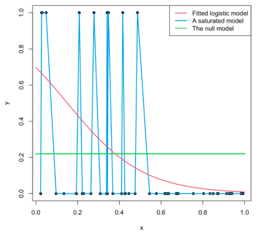
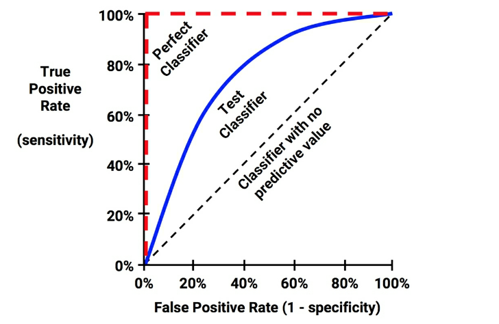
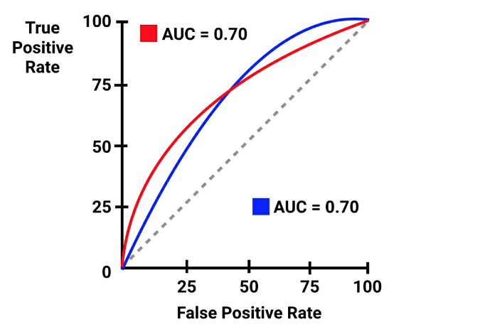

```{r setup, include=FALSE}
options(htmltools.dir.version = FALSE)
knitr::opts_chunk$set(
  eval = TRUE,
  echo = TRUE,
  warning = FALSE,
  message = FALSE,
  cache = FALSE,
  dev = "svglite",
  fig.ext = ".svg")

htmltools::tagList(rmarkdown::html_dependency_font_awesome())
```

---
# Managing Packages

Use the [{`pacman`}](https://cran.r-project.org/web/packages/pacman/vignettes/Introduction_to_pacman.html) package for *effortless loading and installation* of necessary packages. This happens automatically if they are not already in your system.
```{r pacman, message=FALSE, warning=FALSE, eval=TRUE}
if (!require("pacman")) install.packages("pacman")

pacman::p_load(
  tidyverse,   # for data wrangling and visualization
  tidymodels,  # for modeling
  knitr,       # for displaying nice tables
  here,        # for referencing folders and files
  glmnet,      # for estimating lasso and ridge
  ggmosaic     # for tidy mosaic plots
)
```


---
# Setting Up Themes and Seed

To maintain a consistent style for `ggplot` throughout the presentation, we set a theme as follows:
```{r ggplot_theme}
theme_set(theme_grey(20))
```

To ensure reproducibility of results, we also set a seed:
```{r}
set.seed(1203)
```


---
# Outline

 - [Binary Classification Problems](#bin)
 
 - [The Confusion Matrix](#con)  
 
 - [The Logistic Regression Model](#logit)
 
 - [Sensitivity Specificity Trade-off](#sens)
 
 - [Multiclass classification](#mult)
 
 


---
class: title-slide-section-blue, center, middle
name: bin

# Binary Classification Problems


---
# Bill Gates on Testing for COVID-19

<midd-blockquote>"Basically, there are two critical cases: anyone who is symptomatic, and anyone who has been in contact with someone who tested positive. Ideally both groups would be sent a test they can do at home without going into a medical center. Tests would still be available in medical centers, but the simplest is to have the majority done at home. __To make this work, a government would have to have a website that you go to and enter your circumstances, including your symptoms. You would get a priority ranking, and all of the test providers would be required to make sure they are providing quick results to the highest priority levels.__ Depending on how accurately symptoms predict infections, how many people test positive, and how many contacts a person typically has, you can figure out how much capacity is needed to handle these critical cases. For now, most countries will use all of their testing capacity for these cases."    - Bill Gates.</midd-blockquote>


Source: ["The first modern pandemic by Bill Gates"](https://www.gatesnotes.com/Health/Pandemic-Innovation?WT.mc_id=20200423060000_Pandemic-Innovation_MED-media_&WT.tsrc=MEDmedia)

---
# Binary Classification

Let $y_i$ represent the outcome of a COVID-19 test, defined as:

$$y_{i} = 
\begin{cases}
1 & \text{if the test result is positive,} \\
0 & \text{if the test result is negative.}
\end{cases}$$

Here, the values 1 and 0 are chosen for their simplicity.<sup>1</sup>

There are two types of questions that we might ask given this context:

1. What is the probability of a test returning a positive result?
2. Can we classify an individual's test result as positive or negative?

.footnote[
[*] It's common to encounter a $\{1, -1\}$ notation for binary outcomes in machine learning literature.
]

---
# Israeli COVID-19 Test Data

The [Israeli Ministry of Health](https://data.gov.il/dataset/covid-19/resource/d337959a-020a-4ed3-84f7-fca182292308) provides data on more than 9 million COVID-19 test results. Our objective in this context is to predict whether a person will be classified as "positive", i.e., infected by the virus, based on their symptoms and characteristics.

**Outcome variable:** `corona_result`

**Features include:**

- Symptoms: `cough`, `fever`, `sore_throat`, `shortness_of_breath`, and `head_ache`
  
- Characteristics: `age_60_and_above`, `gender`


---
# Read and examine the data

```{r}
covid_raw <- here("06-classification/data","covid_proc.csv") %>% 
  read_csv()
```


```{r}
covid_raw %>% glimpse()
```


Given that the total number of observations $n$ is 107,542 and the number of predictor variables $p$ is 7, we don't need to be overly concerned about overfitting.


---
# Preprocessing

Now, we will categorize all variables, including the outcome and features, as factors:
```{r}
covid <- covid_raw %>% 
  mutate_all(as_factor)
```

Additionally, we will extract the outcome and features as matrices for future use with the `glmnet` function:
```{r}
x <- covid %>% 
  select(-corona_result) %>%
  model.matrix(~ .-1, data = .) 

y <- covid %>% pull(corona_result) %>% as_factor()
```

---
# Raw Detection Frequencies

How are the test results distributed?

```{r}
covid %>% 
  group_by(corona_result) %>%
  count()
```


This distribution demonstrates an instance of __class imbalance__. This occurs when the distribution of examples across the known classes is skewed, a common feature in classification problems.


---
# Measuring Classification Accuracy

What does MSE (Mean Squared Error) imply in the context of classification problems?

$$MSE = \frac{1}{n}\sum_{i=1}^{n} (y_i - \hat{y}_i)^2 =\frac{1}{n}\sum_{i=1}^n \boldsymbol{1}_{\{y_i\neq \hat{y}_i\}}$$

To put it in words: In this context, MSE measures the __misclassification rate__, which is the ratio of the number of misclassifications to the total number of observations.


__Classification accuracy__ is the ratio of the total number of correct predictions to the total number of predictions made for a dataset.

Evidently,
$$\text{accuracy} = 1 - \text{misclassification rate}.$$

Is the misclassification rate or accuracy rate useful? Consider the context of imbalanced outcomes.


---
# A Naive Classifier

Our naive "model" strategy is to "classify everyone as being negative".

```{r}
covid %>% 
  mutate(corona_result = as_factor(corona_result)) %>% 
  mutate(.fitted_class = factor("negative", levels = c("negative", "positive"))) %>%
  conf_mat(corona_result, .fitted_class)
```

The accuracy of this model is $98,586/107,542 = 91.67%$!

This seems quite impressive! Or is it?

Despite its high accuracy, this naive classifier lacks the ability to distinguish between classes, and more crucially, it fails to identify infected individuals - the aspect we truly care about!


---
class: title-slide-section-blue, center, middle
name: con

# The Confusion Matrix


---
# Beyond Accuracy – Other Measures of Performance

The __confusion matrix__ is a table that categorizes predictions based on whether they align with the actual outcomes.

|                |          | __Actual__       |  __Actual__      |
|----------------|----------|------------------|------------------|
|                |          | Negative         | Positive         |
| __Predicted__  | Negative | _True Negative_ (TN)  | _False Negative_ (FN)|
| __Predicted__  | Positive | _False Positive_ (FP) | _True Positive_ (TP)  |
|                |          |                  |                   |

The total number of observations $N$ is the sum of all these categories, i.e., $TP + TN + FP + FN = N$. Accuracy in this context is defined as $(TN + TP) / N$.

__Note:__ The confusion matrix can be extended to include multiclass outcomes.


---
# Types of Classification Errors

__False Positive Rate:__ This is the proportion of negative examples that are incorrectly classified as positive. In our example, this is $0/98,586 = 0\%$.

__False Negative Rate:__ This is the proportion of positive examples that are incorrectly classified as negative. In our example, this is $8,956/8,956 = 100\%$.

The question then arises: Can we improve upon these rates?


---
# A Perfect Classifier

Consider a simple example. Let's say we have a sample of 100 test results, with exactly 20 of them labeled as "positive". If our classifier was perfect, the confusion matrix would look as follows:

|                |          | __Actual__       |  __Actual__      |
|----------------|----------|------------------|------------------|
|                |          | Negative         | Positive         |
| __Predicted__  | Negative | 80               | 0                |
| __Predicted__  | Positive | 0                | 20               |
|                |          |                  |                  |

In this scenario, our classifier achieves 100% accuracy with zero false positives and zero false negatives.


---
# The Realistic Classifier

Now, let's consider a classifier that makes some errors:

|                |          | __Actual__       |  __Actual__      |
|----------------|----------|------------------|------------------|
|                |          | Negative         | Positive         |
| __Predicted__  | Negative | 70               | 10               |
| __Predicted__  | Positive | 5                | 15               |
|                |          |                  |                  |

In this example, 10 individuals with the pathogen were incorrectly classified as Negative (not infected), and 5 individuals without the pathogen were incorrectly classified as Positive (infected).


---
class: title-slide-section-blue, center, middle
name: logit

# Logistic Regession Model


---
# First Things First: The Linear Probability Model

Consider a dependent variable $y_{i} \in\{0,1\}$. Given a vector of features $\mathbf{x}_{i}$, the aim is to predict $\operatorname{Pr}\left(y_{i}=1 | \mathbf{x}_{i}\right)$.

Let $p_i$ denote the probability of observing $y_i=1$ given $\mathbf{x}_i$, i.e., 
$$p_i\equiv\operatorname{Pr}\left(y_{i}=1 | \mathbf{x}_{i}\right)$$

The linear probability model specifies that
$$p_i=\mathbf{x}_{i}^{\prime} \boldsymbol{\beta}$$

However, an OLS (Ordinary Least Squares) regression of $y_{i}$ on $\mathbf{x}_{i}$ overlooks the discrete nature of the dependent variable and does not limit the predicted probabilities to the range between zero and one.


---
# Logistic Regression Model

A more appropriate model for this case is the __logit model__ or __logistic regression model__, which is specified as follows:

$$p=\Lambda(\mathbf{x}^{\prime} \boldsymbol{\beta})=\frac{\exp \left(\mathbf{x}^{\prime} \boldsymbol{\beta}\right)}{1+\exp \left(\mathbf{x}^{\prime} \boldsymbol{\beta}\right)}$$

Here, $\Lambda(\cdot)$ represents the logistic cumulative distribution function (CDF). Consequently, the model enforces the restriction that $0 \leq p_i \leq 1$.


---
# Odds-Ratio

Note that
$$\frac{p}{1-p}=\exp \left(\mathbf{x}^{\prime} \boldsymbol{\beta}\right)$$

Taking the natural logarithm of both sides yields
$$\ln\left(\frac{p}{1-p}\right) = \mathbf{x}^{\prime} \boldsymbol{\beta}$$

This equation provides a useful representation of the logistic regression model. The left-hand side (LHS) is known as the log __odds ratio__ (or relative risk).

Therefore, we can say that the logistic regression model is linear in terms of the log odds-ratio.


---
# The Likelihood Function

__Likelihood__ refers to the probability of observing the given data for certain parameter values.

$$\begin{aligned}
\mathrm{Likelihood} &=\prod_{i=1}^n \operatorname{Pr}\left(y_{i} | \mathbf{x}_{i}\right)\\
&=\prod_{i=1}^n p_{i}^{y_{i}}\left(1-p_{i}\right)^{1-y_{i}} \\
&=\prod_{i=1}^n\left(\frac{\exp \left(\mathbf{x}_{i}^{\prime} \beta\right)}{1+\exp \left(\mathbf{x}_{i}^{\prime} \beta\right)}\right)^{y_{i}}\left(\frac{1}{1+\exp \left(\mathbf{x}_{i}^{\prime} \beta\right)}\right)^{1-y_{i}}
\end{aligned}$$

Taking the natural logarithm of both sides results in the __log likelihood__:

$$\log(\mathrm{Likelihood})=\sum_{i=1}^N \left[\log \left(1+e^{\left(\beta_{0}+x_{i}^{\prime} \beta\right)}\right)-y_{i} \cdot\left(\beta_{0}+x_{i}^{\prime} \beta\right)\right]$$

During estimation we aim to maximize this value, hence maximum likelihood estimation (MLE).


---
# Deviance

Another useful concept is the __deviance__, which generalizes the concept of "least squares" to encompass general linear models like the logit model. 

It serves as a measure of the discrepancy between the observed data and the fitted model.

The relationship between deviance and likelihood is given by:
$$\mathrm{Deviance} = -2\times \log(\mathrm{Likelihood})+ \mathrm{Constant}$$

The constant term includes terms related to the likelihood of a "perfect" model and is usually not of major concern and can be disregarded for practical purposes.


---
# Illustration of the Deviance

```{r, echo=FALSE, fig.align='center', out.width = "50%"}

```

[Source](https://bookdown.org/egarpor/PM-UC3M/glm-deviance.html)


---
# Deviance and Estimation

In the estimation process, our goal is to minimize the deviance.
$$\begin{aligned}
\text{Deviance} &= -2\sum_{i=1}^{N} \left[\log \left(1+e^{\left(\beta_{0}+x_{i}^{\prime} \beta\right)}\right)-y_{i} \cdot\left(\beta_{0}+x_{i}^{\prime} \beta\right)\right] + \text{Constant} \\
&\propto \sum_{i=1}^{N} \left[\log \left(1+e^{\left(\beta_{0}+x_{i}^{\prime} \beta\right)}\right)-y_{i} \cdot\left(\beta_{0}+x_{i}^{\prime} \beta\right)\right]
\end{aligned}$$
This is what R's `glm` function minimizes when performing logistic regressions.

__NOTE:__ In linear models, the deviance is proportional to the Residual Sum of Squares (RSS).


---
# Penalized Logistic Regression

Alternatively, we can minimize the deviance with an $\ell_1$ norm penalty on $\beta$, known as a standard lasso-type penalty:

$$\min _{\left(\beta_{0}, \beta\right) \in \mathbb{R}^{p+1}} \left[\frac{1}{N} \sum_{i=1}^{N} \log \left(1+e^{\left(\beta_{0}+x_{i}^{\prime} \beta\right)}\right)-y_{i} \cdot\left(\beta_{0}+x_{i}^{\prime} \beta\right)\right]+\lambda \|\beta\|_{1}$$

Here, the penalty is applied to the sum of the absolute values of $\beta$ (excluding the intercept).


---
# Back to the Data: Can We Do Better Than Being "Naive"?

.pull-left[
There is some evidence suggesting that having a fever is associated with testing positive.
```{r fever, fig.show='hide'}
covid %>% 
  ggplot() +
  geom_mosaic(
    aes(x = product(corona_result, fever),
        fill = corona_result)
  ) + 
  labs(
    x = "Fever",
    y = "Result",
    fill = ""
  )
```
]
.pull-right[
```{r, ref.label = 'fever', echo=FALSE}

```
]

---
# Back to the data: can we do better than being "naive"?

.pull-left[
and some evidence for an association with age (above 60)
```{r age, fig.show='hide'}
covid %>% 
  ggplot() +
  geom_mosaic(
    aes(x = product(corona_result, age_60_and_above),
        fill = corona_result)
  ) + 
  labs(
    x = "Above 60 years old",
    y = "Result",
    fill = ""
  )
```
]
.pull-right[
```{r, ref.label = 'age', echo=FALSE}

```
]

---
# Estimating the Model using R

To estimate the model, we will use base R's `glm` function, which stands for generalized linear model:
```{r}
logit_model <- glm(
  corona_result ~ .,
  data = covid,
  family = "binomial"
)
```

Alternatively, we can estimate the regularized version of the model using `glmnet` with `family = "binomial"`:
```{r, eval=FALSE}
logit_model_lasso <- cv.glmnet(x, y, family = "binomial")
```

__SPOILER ALERT:__ `cv.glmnet` selects all features.

---
# Model Output

To obtain a tidy summary of the output from `glm` objects, we can use the `tidy()` and `glance()` functions from the `{broom}` package:
```{r}
logit_model %>% tidy()
```

```{r}
logit_model %>% glance()
```


---
# Generate Predictions

To generate predictions, we can use the `augment()` function from the `{broom}` package. It augments the original dataframe with fitted values and standard errors:
```{r}
covid_pred <- 
  logit_model %>% 
  augment(type.predict = "response")

covid_pred
```

---
# Model Predictions (In Sample)

.pull-left[
The figure on the right illustrates the resulting in-sample fit. It is evident that there is little overlap between the predicted probabilities for true positives and true negatives.
```{r box, fig.show='hide'}
covid_pred %>% 
  ggplot(aes(x = corona_result,
             y = .fitted,
             fill = corona_result)) +
  geom_boxplot() +
  labs(
    x = "Truth",
    y = "Prediction (y hat)",
    fill = ""
  )
```
]
.pull-right[
```{r, ref.label = 'box', echo=FALSE}

```
]

---
class: title-slide-section-blue, center, middle
name: sens

# Sensitivity Specifisity Trade-off

---
# Classification Rule

To classify individuals as positive or negative, we need to establish a __classification rule__ or cut-off. This rule involves setting a probability threshold $p^*$ above which we classify an individual as positive.

For illustration purposes, we will set $p^* = 0.8$:
```{r}
class_rule <- 0.8
```
This implies that whenever $\hat{y}_i > 0.8$, we classify individual $i$ as positive.

__QUESTION:__ Is this rule overly aggressive or passive?

---
# Classification under the rule

```{r}
covid_pred <- logit_model %>% 
  augment(type.predict = "response") %>% 
  mutate(                                                                 
    .fitted_class = if_else(.fitted < class_rule, "negative", "positive"), #<<
    .fitted_class = as_factor(.fitted_class)                              
  ) %>%                                                                    
  select(corona_result, .fitted, .fitted_class)

covid_pred
```

---
# Sensitivity-Specificity Trade-off

As we have observed, classifying everyone as "negative" $(p^* = 0)$ fails to achieve specificity, meaning it fails to correctly identify any positive results, which is what we truly care about!

__Sensitivity:__ the fraction of positive examples that are correctly classified as positive ("true positive rate"). In this example, it is $98,586/98,586 = 100\%$.

__Specificity:__ the fraction of negative examples that are correctly classified as negative ("true negative rate"). In this example, it is $0/8,956 = 0\%$.


Note that in general, 
$$\text{false negative rate} = 1 - \text{specificity}$$
$$\text{false positive rate} = 1 - \text{sensitivity}$$


---
# Our model's confusion matrix

.pull-left[
The `{yardstick}` package provides the `conf_mat()` function, which offers convenient access to a model's confusion matrix and the associated performance statistics.
```{r}
covid_conf_mat <- 
  covid_pred %>% 
  conf_mat(corona_result, .fitted_class) 

covid_conf_mat
```
]
.pull-right[
```{r}
covid_conf_mat%>% 
  summary() %>% 
  filter(.metric %in% c("accuracy", "sens", "spec")) %>% 
  mutate("1-.estimate" = 1 - .estimate)
```
As we can see, when `class_rule = 0.8`, the model exhibits high sensitivity but relatively lower specificity. It is evident that modifying the classification rule would alter the model's classification properties.
]


---
# Visualizing the Sens-Spec Trade-off with ROC Curves

.pull-left[
A __Receiver Operating Characteristic (ROC)__ curve plots sensitivity against 1-specificity. This graphical representation showcases the trade-off between false-positive and true-positive error rates as the classifier threshold is adjusted.
]
.pull-right[
```{r, echo=FALSE, fig.align='center'}

```
Source: ["Machine Learning with R: Expert techniques for predictive modeling"](https://www.amazon.com/Machine-Learning-techniques-predictive-modeling/dp/1784393908) 
]


---
# Our model's ROC curve

.pull-left[
On the left side, we can observe the ROC curve of our model, generated using the `roc_curve()` function. The red and blue dots represent two different cut-offs, namely 0.8 and 0.2, respectively.
```{r roc_curve, fig.height=2, fig.show='hide'}
covid_pred %>% 
  mutate(.fitted = 1-.fitted) %>% 
  roc_curve(corona_result, .fitted) %>% 
  autoplot() +
  geom_point(
    aes(x = 0.690, y = 0.999),
    color = "blue"
  ) + # 0.8 threshold
  geom_point(
    aes(x = 0.436, y = 0.950),
    color = "red"
  ) # 0.2 threshold
```
Note that we've used `.fitted` instead of `.fitted_class`.
]
.pull-right[
```{r, ref.label = 'roc_curve', echo=FALSE}

```
]

---
# Area under the Curve (AUC)

.pull-left[
- Classifiers can be ranked based on the area under the ROC curve (AUC).
- For instance, a perfect classifier has an `auc` of 1, while a classifier with no discriminative value has an `auc` of 0.5.
- However, it's important to note that two different ROC curves can yield identical `auc` values. Therefore, qualitative examination is warranted.
```{r}
covid_pred %>% roc_auc(corona_result, .fitted)
```
]
.pull-right[
```{r, echo=FALSE, fig.align='center'}

```
Source: ["Machine Learning with R: Expert techniques for predictive modeling"](https://www.amazon.com/Machine-Learning-techniques-predictive-modeling/dp/1784393908) 
]


---
# AUC and Cross-Validation

When dealing with classification tasks, it is often more reasonable to tune the penalty parameter based on classification performance metrics rather than, for example, deviance.

For instance, we can utilize the `cv.glmnet()` function and set `type.measure = "auc"` to perform tuning based on AUC values.
```{r, eval=FALSE}
logit_model <- cv.glmnet(
  x, y, 
  family = "binomial",
  type.measure = "auc"  #<<
)
```
or alternatively, you can set `type.measure = "class"` to perform tuning based on the misclassification rate.


---
class: title-slide-section-blue, center, middle
name: mult

# Multiclass Classification


---
# Multiclass Outcomes

- Each observation is assigned to one of $j=1,\ldots,G$ classes or groups.

- The outcome variable is represented as
$$y = (y_{1},\ldots,y_{G})$$ 
where $y_{j}=1$ if the outcome belongs to the $j^{\text{th}}$ class and zero otherwise.

- The conditional probability is defined as
$$p_{j}\equiv\operatorname{Pr}\left(y_{j}=1 | \mathbf{x}\right),\qquad \text{for } j=1,\ldots,G$$
In other words, $p_{g}$ represents the probability that $y$ belongs to class $g$, given the input $\mathbf{x}_i$.


---
# Multinomial Regression Model

For each class, the outcome is modeled as
$$p_{j}=\frac{\exp({\mathbf{x}^{\prime} \boldsymbol{\beta}_{j}})}{\sum_{g=1}^{G} \exp({\mathbf{x}^{\prime} \beta_{g}})},\qquad \text{for } j=1,\ldots,G$$
where $\sum_{j=1}^G p_j=1$.

__NOTE:__ In this case, there is no explicit base class since regularized solutions are not equivariant under base changes, and regularization automatically eliminates redundancy.


---
# Likelihood and Deviance

Given the probabilities $p_{ij}$ for $y_{ij}=1$, the probability of the observed data is proportional to
$$\prod_{i=1}^{N} \prod_{j=1}^{G} p_{ij}^{y_{ij}}$$
where $N$ represents the total number of observations.

By taking the logarithm and multiplying by -2, we obtain the multinomial deviance:
$$-2 \sum_{i=1}^N \sum_{j=1}^G y_{ij} \log(p_{ij})$$

---
# Regularization

Let $K$ represent the length of $\boldsymbol{\beta}$, i.e., the number of features in the model.

The coefficient matrix $\mathbf{B}=\left[\boldsymbol{\beta}_{1} \cdots \boldsymbol{\beta}_{G}\right]$ contains $K\times G$ elements: $G$ coefficients, one per class, multiplied by the number of features $K$.

Similar to the binomial case, we can minimize the deviance subject to a standard lasso-type ($\ell_1$ norm) penalty on $\beta$:

$$\min _{\mathbf{B} \in \mathbb{R}^{K\times G}} \left\{-\frac{2}{N} \sum_{i=1}^N \sum_{j=1}^G y_{ij} \log p_{ij}+\lambda \sum_{i=1}^{K-1} \sum_{j=1}^G \left|\beta_{ij}\right|\right\}$$
where $p_{ij} = \Lambda(\mathbf{x}_i^{\prime}\beta_{j})$, and the intercepts are unregularized.


---
# Illustration: Forensic Glass Data

The forensic glass (`fgl`) dataset consists of 214 rows and 10 columns.

The dataset includes measurements for each of the 214 glass shards, such as the refractive index (`RI`) and eight measurements of chemical composition by weight of oxide (percentage) for elements `Na`, `Mg`, `Al`, `Si`, `K`, `Ca`, `Ba`, and `Fe`.

The glass shards were originally classified into seven types:

- `WinF`: Window float glass
- `WinNF`: Window non-float glass
- `Veh`: Vehicle window glass
- `Con`: Containers
- `Tabl`: Tableware
- `Head`: Vehicle headlamps

Our objective is to classify new data into one of the six types mentioned above.


---
# Load and Inspect the `fgl` Data

The `fgl` dataset is included in the `{MASS}` library.
```{r}
fgl_wide <- 
  MASS::fgl %>% 
  as_tibble()
```

```{r}
head(fgl_wide)
```

---
# Tidying the Data with `pivot_longer`

The code chunk below uses the `pivot_longer()` function from the `{tidyr}` package. This function *transforms the data* from wide to long format, preparing it for later plotting:
```{r}
fgl_long <- 
  fgl_wide %>% 
  pivot_longer(-type, names_to = "feature", values_to = "value")

fgl_long
```


---
# Distribution of (some) feature values by glass type

.pull-left[
```{r box_fgl, fig.show='hide'}
fgl_long %>% 
  filter(feature != "RI") %>%
  ggplot(aes(x = type, y = value, fill = feature)) +
  geom_boxplot() +
  facet_wrap(~ feature, scales = "free") +
  theme_minimal() +
  scale_fill_viridis_d() +
  theme(legend.position = "none")
```
Some of the features serve as clear discriminators. For example, the element `Ba` is present in all glass types except for `Head`, where it is barely present.
]
.pull-right[
```{r, ref.label = 'box_fgl', echo=FALSE}

```
]

---
# Preprocess the Data (Including Interactions)

To make the feature set more "interesting," we add interactions with `RI`:

```{r}
fgl_interact <- 
  recipe(type ~ ., data = fgl_wide) %>% 
  step_interact(~ all_predictors() * RI) %>% 
  step_zv(all_predictors()) %>% 
  prep() %>% 
  juice()

head(fgl_interact)
```

---
# Prepare Input for `glmnet`

Before fitting the model, we need to transform the data into outcome and feature matrices.
```{r}
y <- 
  fgl_interact %>%
  pull(type)

x <- 
  fgl_interact %>%
  select(-type) %>% 
  as.matrix()
```
Note that `y` is a one-dimensional _factor_.

---
# Cross-Validation using `glmnet`

.pull-left[
We can estimate the regularized version of the model using `glmnet` with `family = "multinomial"`:
```{r}
fit <- cv.glmnet(
  x = x,
  y = y,
  family = "multinomial"
)
```
and plot the cross-validation results using `plot`
```{r cv_mult, fig.show='hide'}
plot(fit)
```
]
.pull-right[
```{r, ref.label = 'cv_mult', echo=FALSE}

```
]


---
# Multiclass Prediction

The following code chunk extracts the predicted class and predicted probabilities for each class:
```{r}
class <- 
  fit %>% 
  predict(newx = x, s = "lambda.1se", type = "class")

prob <-
  fit %>% 
  predict(newx = x, s = "lambda.1se", type = "response") %>% 
  as_tibble()
```

---
# Maximum Probability Rule

We can organize `class` and `prob` as a tidy `tibble` using the following code:
```{r}
fgl_pred <- 
  fgl_wide %>% 
  select(type) %>%
  mutate(
    class = class[,1],
    class = factor(class, levels = levels(type))
  ) %>% 
  bind_cols(prob)
```
Predicted class is determined using the _maximum probability rule_.
```{r}
fgl_pred %>% sample_n(5)
```


---
# Multiclass Confusion Matrix

We can generate the multiclass confusion matrix using the `conf_mat()` function from the `{yardstick}` package:
```{r}
fgl_pred %>% 
  conf_mat(type, class)
```

For example, our model correctly classified 53 observations as `WinF` out of all the predicted `WinF` samples, resulting in a precision rate of $53/80 = 66.3\%$.

Similarly, the model correctly predicted 58 `WinNF` samples out of the actual number of `WinNF` samples, which is 76, resulting in a recall rate of $58/76 = 76.3\%$.
 

---
# Multiclass ROC Curve(s)

.pull-left[
A common approach is to use a one-vs-all strategy to calculate multiple ROC curves.

We can plot multiclass ROC curves using the `roc_curve` function from the `{yardstick}` package:
```{r mult_roc, fig.show='hide'}
fgl_pred %>% 
  roc_curve(type, WinF.1:Head.1) %>% 
  autoplot()
```
where `WinF.1:Head.1` represents the model's fitted probabilities.

The model clearly struggles to differentiate between `Veh` and the other classes, while its classification for `Tabl` is nearly perfect.
]
.pull-right[
```{r, ref.label = 'mult_roc', echo=FALSE}

```
]

---
# Multiclass ROC-AUC

[Hand and Till (2001)](https://link.springer.com/article/10.1023/A:1010920819831) extended the definition of ROC-AUC to the case of more than two classes by averaging pairwise comparisons.

To calculate the multiclass AUC value, you can utilize the `roc_auc` function from the `{yardstick}` package:
```{r}
fgl_pred %>% 
  roc_auc(type, WinF.1:Head.1)
```


---
class: .title-slide-final, center, inverse, middle

# `slides::end()`

[<i class="fa fa-github"></i> Source code](https://github.com/ml4econ/lecture-notes-2023/tree/master/06-classification)  

---
# References

Hand, D. J., & Till, R. J. (2001). "A Simple Generalisation of the Area Under the ROC Curve for Multiple Class Classification Problems". _Machine Learning_, 45(2), 171-186.

Lantz, B. (2020). _Machine Learning with R: Expert techniques for predictive modeling_ (3rd ed.). Packt Publishing.

Taddy, M. (2020). _Business Data Science: Combining Machine Learning and Economics to Optimize, Automate, and Accelerate Business Decisions_. McGraw-Hill Education.
