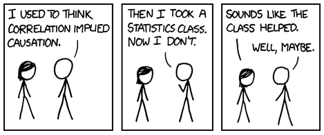
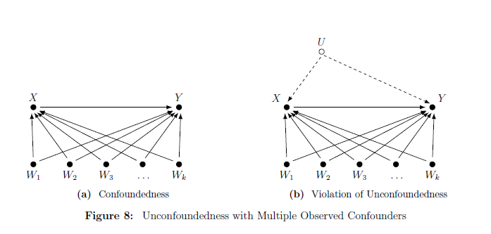
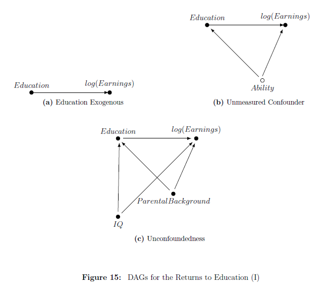
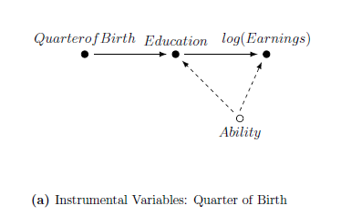
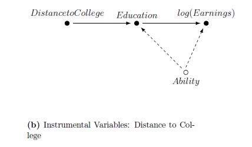
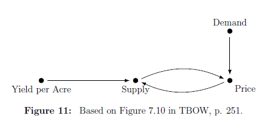

# Reproducing This Presentation

Use the [pacman](https://cran.r-project.org/web/packages/pacman/vignettes/Introduction_to_pacman.html) package to install and load necessary packages.


```{r packages, message=FALSE, warning=FALSE}
if (!require("pacman"))
  install.packages("pacman")

pacman::p_load(
  tidyverse,   # for data wrangling and visualization
  tidymodels,  # for modeling
  haven,       # for reading dta files
  here,        # for referencing folders
  dagitty,     # for generating DAGs
  ggdag,       # for drawing DAGs
  knitr        # for printing html tables
)
```

```{r setup, include=FALSE}
options(htmltools.dir.version = FALSE)

knitr::opts_chunk$set(eval = TRUE,
                      echo = TRUE,
                      warning = FALSE,
                      message = FALSE,
                      cache = FALSE)

htmltools::tagList(rmarkdown::html_dependency_font_awesome())

set.seed(1203)
```


---

# Outline

- [Causal Inference](#caus)

- [Potential Outcomes](#pot)

- [Directed Acyiclic Graphs](#pot)

- [Simulations](#sim)


---
class: title-slide-section-blue, center, middle
name: caus

# Causal Inference


---
# Predicting vs. Explaining

```{r, echo=FALSE, fig.align='center'}

```

Source: [XKCD](https://xkcd.com/552/)

---
# Shifting Gears: From Prediction to Causal Inference

- So far, our focus has centered on prediction.
  
- But as economists, we're primarily interested in *causal inference*, such as:
  - How does class size impact student performance?
  - How does education influence earnings?
  - What is the effect of government spending on GDP?
  - And so on.
  
- Before delving into how to modify and apply ML methods to causal inference issues, we need to clarify what we mean by causal inference.

- This lecture will cover two prevalent approaches to causal inference: the statistical/econometric approach and the computer science approach.


---
# Pearl and Rubin
```{r, echo=FALSE, fig.align='center'}

```

__Source__: The Book of Why (Pearl and Mackenzie)


---
# Spotlight on Identification

- This lecture mainly zeroes in on *identification*, rather than prediction, estimation, or inference.

- To put it briefly, identification refers to:

>_"Model parameters or features being uniquely determined from the observable population that generates the data."_ - (Lewbel, 2019)

- To be more specific, consider identifying the parameter of interest when you have access to unlimited data (the entire population).


---
class: title-slide-section-blue, center, middle
name: pot

# Potential Outcomes

---
# The Road Not Taken (Counterfactuals)

```{r, echo=FALSE, out.width = "100%", fig.align='center'}

```


Source: [https://mru.org/courses/mastering-econometrics/ceteris-paribus](https://mru.org/courses/mastering-econometrics/ceteris-paribus)

---
# Understanding Notation

- $Y$ represents a random variable.

- $X$ signifies a vector of attributes.

- $\mathbf{X}$ stands for a design matrix.


---
# Treatment and potential outcomes (Rubin, 1974, 1977)

- Treatment

$$D_i=\begin{cases}
    1, & \text{if unit } i \text{ received the treatment} \\
    0, & \text{otherwise.}
\end{cases}$$

--

- Treatment and potential outcomes

$$\begin{matrix}
    Y_{i0} & \text{is the potential outcome for unit } i \text{ with } D_i = 0\\
    Y_{i1} & \text{is the potential outcome for unit } i \text{ with }D_i = 1
\end{matrix}$$

--

- Observed Outcome: Under the Stable Unit Treatment Value Assumption (SUTVA), the realization of unit $i$'s outcome is

$$Y_i = Y_{1i}D_i + Y_{0i}(1-D_i)$$

__Fundamental problem of causal inference__ (Holland, 1986): We cannot observe _both_ $Y_{1i}$ and $Y_{0i}$.


---
# Exploring Treatment Effect and Observed Outcomes

- Individual Treatment Effect: This is the difference between unit $i$'s potential outcomes:

$$\tau_i = Y_{1i} - Y_{0i}$$


--

- _Average treatment effect_ (ATE)

$$\mathbb{E}[\tau_i] = \mathbb{E}[Y_{1i}-Y_{0i}] = \mathbb{E}[Y_{1i}]-\mathbb{E}[Y_{0i}]$$

--


- _Average treatment effect for the treatment group_ (ATT)

$$\mathbb{E}[\tau_i | D_i=1] = \mathbb{E}[Y_{1i}-Y_{0i}| D_i=1] = \mathbb{E}[Y_{1i}| D_i=1]-\mathbb{E}[Y_{0i}| D_i=1]$$

**NOTE:** The complement of the treatment group forms the _control_ group.

---
# Guarding Against Selection Bias

A straightforward estimand for ATE is the difference between average outcomes based on treatment status.

However, tread carefully as this approach might lead you astray:


$$\begin{aligned} \mathbb{E}\left[Y_{i} | D_{i}=1\right]-\mathbb{E}\left[Y_{i} | D_{i}=0\right] &=\underbrace{\mathbb{E}\left[Y_{1 i} | D_{i}=1\right]-\mathbb{E}\left[Y_{0i} | D_{i}=1\right]}_{\text{ATT}} +
\underbrace{\mathbb{E}\left[Y_{0 i} | D_{i}=1\right]-\mathbb{E}\left[Y_{0i} | D_{i}=0\right]}_{\text{selection bias}}
\end{aligned}$$


> **Most of causal inference is about eradicating selection bias.**

**EXAMPLE:** Individuals choosing private universities likely possess distinct characteristics compared to those opting for public universities.


---
# How Randomized Control Trials (RCTs) Solve Selection Bias

In an RCT, treatments get assigned randomly. Consequently, $D_i$ is _independent_ of potential outcomes, namely:

$$\{Y_{1i}, Y_{0i}\}  \perp D_i$$

RCTs allow us to estimate ATE using the average difference in outcomes by treatment status:

$$\begin{aligned} 
\mathbb{E}\left[Y_{i} | D_{i}=1\right]-\mathbb{E}\left[Y_{i} | D_{i}=0\right] &=\mathbb{E}\left[Y_{1 i} | D_{i}=1\right]-\mathbb{E}\left[Y_{0i} | D_{i}=0\right] \\ 
&=\mathbb{E}\left[Y_{1 i} | D_{i}=1\right]-\mathbb{E}\left[Y_{0 i} | D_{i}=1\right] \\
&= \mathbb{E}\left[Y_{1 i}-Y_{0 i} | D_{i}=1\right] \\
&= \mathbb{E}\left[Y_{1 i}-Y_{0 i}\right] \\
&= \text{ATE}
\end{aligned}$$

**EXAMPLE:** In theory, randomly assigning students to private and public universities would enable us to estimate the ATE of attending a private school on future earnings. Clearly, executing an RCT in this situation is unfeasible.

---
# Interpreting Estimands and Regression

Let's make an assumption that the treatment effect is constant across all individuals, i.e., 

$$\tau = Y_{1i}-Y_{0i},\quad \forall i.$$ 

Given this, we can formulate $Y_i$ as follows:

$$\begin{aligned}
Y_i &= Y_{1i}D_i + Y_{0i}(1-D_i) \\
&= Y_{0i} + D_i(Y_{1i} - Y_{0i}), \\
&= Y_{0i} + \tau D_i, & \text{since }\tau = Y_{1i}-Y_{0i}\\
&= \mathbb{E}[Y_{0i}] + \tau D_i + Y_{0i}-\mathbb{E}[Y_{0i}], & \text{add and subtract } \mathbb{E}[Y_{0i}]\\
\end{aligned}$$

Or, more simply:

$$Y_i = \alpha + \tau D_i + u_i,$$

where $\alpha = \mathbb{E}[Y_{0i}]$ and $u_i = Y_{0i}-\mathbb{E}[Y_{0i}]$ denotes the random component of $Y_{0i}$.


---
# The Role of Unconfoundedness

In most observational studies, treatments aren't randomly assigned (Consider $D_i = \{\text{private}, \text{public}\}$). 

In such situations, identifying causal effects relies on the _Unconfoundedness_ assumption, also known as "selection-on-observable". This is defined as:

$$\{Y_{1i}, Y_{0i}\}  \perp D_i | {X}_i$$

This means treatment assignment is independent of potential outcomes _conditional_ on observable ${X}_i$. In other words, selection bias _vanishes_ when we control for ${X}_i$.


---
# Adjusting for Confounding Factors

We typically control for $X_i$ by incorporating it into the regression:

$$Y_i = \alpha + \tau D_i + {X}_i'\boldsymbol{\beta} + u_i.$$

__Comments__:

  1. Strictly speaking, the regression model above is valid only if we truly _believe_ that the "real" model is $Y_i = \alpha + \tau D_i + {X}_i'\boldsymbol{\beta} + u_i.$ 

  2. If $D_i$ is randomly assigned, including ${X}_i$ in the regression __might__ increase the accuracy of ATE.
  
  3. If $D_i$ is assigned based on ${X}_i$ (as often happens in observational settings), including ${X}_i$ in the regression eliminates selection bias.


---
# Illustration: The OHIE Data

- The Oregon Health Insurance Experiment (OHIE) is a randomized controlled trial designed to measure the treatment effect of Medicaid eligibility.

- Treatment group: Individuals selected in the Medicaid lottery.

- The outcome, `doc_any_12m`, equals 1 for patients who saw a primary care physician, and zero otherwise.


---
# Load the OHIE Data

In this illustration, we will merge three separate (Stata) files and import them into R using the [`{haven}`](https://haven.tidyverse.org/) package:
```{r}
descr <- 
  here("08-causal-inference/data",
       "oregonhie_descriptive_vars.dta") %>% 
  read_dta()

prgm <- 
  here("08-causal-inference/data",
       "oregonhie_stateprograms_vars.dta") %>% 
  read_dta()

s12 <- 
  here("08-causal-inference/data",
       "oregonhie_survey12m_vars.dta") %>% 
  read_dta()

```

The complete OHIE dataset can be accessed [here](http://nber.org/oregon/4.data.html).

---
# Preprocessing: Joining Datasets

To join the three data frames and remove empty responses, you can follow these steps:
```{r}
ohie_raw <- 
  descr %>% 
  left_join(prgm) %>% 
  left_join(s12) %>% 
  filter(sample_12m_resp == 1) %>% 
  drop_na(doc_any_12m)
```

---
# Preprocessing: Refinement

To refine the data, follow these steps:

1. Select the relevant variables that are of interest.
2. Re-level the `numhh_list` variable (household size) according to your specific needs.
```{r}
ohie <- 
  ohie_raw %>% 
  dplyr::select(numhh_list, treatment, doc_any_12m) %>% 
  mutate(
    numhh_list = factor(numhh_list, levels = c("1", "2", "3"))
  )
```

---
# The Final Dataset

```{r}
ohie
```

---
# Distribution of Treated vs. Control

```{r}
ohie %>% 
  count(treatment) %>%
  kable(format = "html")
```

---
# Estimating ATE

To estimate the Average Treatment Effect (ATE), you can use the following model:
$$doc\_any\_12m_i = \alpha + \tau\times selected_i + \varepsilon_i$$
In R:
```{r}
fit <- lm(doc_any_12m ~ treatment, data = ohie)
```

---
# Results
```{r}
fit %>% 
  tidy(conf.int = TRUE) %>% 
  filter(term != "(Intercept)") %>% 
  dplyr::select(term, estimate, starts_with("conf.")) %>% 
  kable(digits = 4, format = "html")
```

**Interpretation:** Being selected in the lottery increases the probability of visiting a primary care physician in the following year by 5.72 [4.47, 6.79] percentage points.


---
# Adjustments

One concern with the OHIE dataset is that individuals can apply for Medicaid for their entire household.

This fact undermines the crucial random assignment assumption, as belonging to larger households increases the chances of being selected for Medicaid.

```{r}
ohie %>% 
  count(treatment, numhh_list) %>% 
  kable(format = "html")
```


---
# ATE Under Adjustment for `numhh`

The model with adjustment:

$$doc\_any\_12m_i = \alpha + \tau\times selected_i + \beta\times numhh_i+ \varepsilon_i$$

Estimation:
```{r}
fit_adj <- lm(doc_any_12m ~ treatment + numhh_list, data = ohie)
```

---
# Results

```{r}
fit_adj %>% 
  tidy(conf.int = TRUE) %>% 
  dplyr::select(term, estimate, starts_with("conf.")) %>% 
  kable(digits = 4, format = "html")
```

After adjusting for `numhh` (household size), the Average Treatment Effect (ATE) has increased from 5.72 to 6.35 percentage points (why?).


---
class: title-slide-section-blue, center, middle
name: pot

# Directed Acyclic Graphs


---
# DAGs

```{r, echo=FALSE, fig.align='center'}

```

[Source](https://i.imgflip.com/1xhtwh.jpg)

---
# Understanding DAGs

.pull-left[
A DAG (Directed Acyclic Graph) is a graphical representation used to model a system of causal interactions.

- **Nodes** represent random variables, such as $X$, $Y$, etc.
- **Arrows** (or directed edges) indicate causal effects. For example, $Z\rightarrow X$ denotes that "$Z$ causes $X$".
- A **path** is a sequence of edges connecting two nodes. For instance, $Z\rightarrow X \rightarrow M \leftarrow Y$ describes a path from $Z$ to $Y$.
- In a **direct path**, arrows point in the same direction, like $Z\rightarrow X \rightarrow M$.
]

.pull-right[
```{r, echo=FALSE}
dag <- dagify(
  X ~ Z,
  M ~ X,
  M ~ Y
) 
dag %>% 
  ggdag(text_size = 12, node = FALSE, text_col = "black") +
  theme_dag()

```
]

---
# Confounder DAG

.pull-left[
- $X$ acts as a common cause of both $D$ and $Y$.

- When we condition on $X$, we eliminate the dependency between $D$ and $Y$ through $X$.

- In terms of DAGs, controlling for $X$ "closes the backdoor path" between $D$ and $Y$ while leaving the direct path open.

- The concept of closing the backdoor path is connected to the notion of omitted variable bias.
]

.pull-right[
```{r, echo=FALSE}
dag <- dagify(
  D ~ X,
  Y ~ X,
  Y ~ D
) 
dag %>% 
  ggdag(layout = "tree", text_size = 12, node = FALSE, text_col = "black") +
  theme_dag()

```
]

---
# DAGs and SEM (Structural Equation Models)

- Another way to conceptualize DAGs is as non-parametric **Structural Equation Models** (SEM).

- For instance, the single-confounder DAG we just explored can be represented by a set of three equations:

$$\begin{array}{l}
X\leftarrow f_X(u_X) \\
D\leftarrow f_D(X, u_D)\\
Y\leftarrow f_Y(D,X,u_Y)
\end{array}$$

where:
- The $f_i$ functions represent the causal mechanisms in the model and are not restricted to being linear.
- $u_X$, $u_D$, and $u_Y$ denote independent background factors that we choose not to include in the analysis.
- The assignment operator $(\leftarrow)$ captures the asymmetry of causal relationships.


---
# Unconfoundedness in DAGs

```{r, echo=FALSE, fig.align='center'}

```

Source: Imbens (2019).

---
# Example: Identifying the Returns to Education


```{r, echo=FALSE, fig.align='center', out.width='50%'}

```

Source: Imbens (2019).


---
# Instrumental variables in DAGs

.pull-left[
```{r, echo=FALSE, fig.align='center'}

```
Source: Imbens (2019).

]
.pull-right[
```{r, echo=FALSE, fig.align='center'}

```
]


---
# Mediator DAG

.pull-left[
- $D$ influences $M$ which, in turn, influences $Y$.

- $M$ acts as a mediator of the causal effect between $D$ and $Y$.

- Conditioning on $M$ eliminates the dependency between $D$ and $Y$.

- Essentially, we have closed the direct path, which is the only direct path between $D$ and $Y$.
]
.pull-right[
```{r, echo=FALSE}
dag <- dagify(
  Y ~ M,
  M ~ D
) 
dag %>% 
  ggdag(layout = "tree", text_size = 12, node = FALSE, text_col = "black") +
  theme_dag()

```
]


---
# A Collider

.pull-left[

- $D$ are $Y$ are independent.

- $D$ and $Y$ jointly cause $C$.

- conditioning on $C$ creates dependency between $D$ and $Y$

]
.pull-right[
```{r, echo=FALSE}
dag <- dagify(
  C ~ D,
  C ~ Y
) 
dag %>% 
  ggdag(layout = "mds", text_size = 12, node = FALSE, text_col = "black") +
  theme_dag()

```
]

---
# Example: "Bad Controls"

.pull-left[
- "Bad controls" refer to variables that are outcome variables themselves.

- This distinction becomes important, particularly when working with high-dimensional data.

__EXAMPLE:__ Using occupation as a control in a regression estimating the return to years of schooling.

Considering that an individual works as a developer in a high-tech firm can change the interpretation of the results. Knowing that the person does not have a college degree immediately indicates their likely exceptional talent.
]

.pull-right[
```{r, echo=FALSE}
collider_triangle(m = "Developer", x = "College", y = "Talent") %>% 
  ggdag(use_labels = "label", text_size = 10) +
  theme_dag()
```
]


---
# Collider: M-bias

```{r, echo=FALSE, fig.align='center'}
m_bias(x = "Education", y = "Diabetes", a = "Income during\nChildhood", 
       b = "Genetic Risk \nfor Diabetes", m = "Mother's Diabetes") %>% 
  ggdag(text_size = 6, use_labels = "label") +
  theme_dag()
```


---
class: title-slide-section-blue, center, middle
name: sim

# Simulations


---
# Simulation I: De-counfounding

.pull-left[

Simulate the DGP:
```{r}
n <- 1000
p <- 3

u <- matrix(rnorm(n * p), n, p)

x <- u[,2]
d <- 0.8 * x + 0.6 * u[,1]
y <- 0 * d + 0.2 * x + u[,3]
```
Note that the "true" effect $D\rightarrow Y$ is zero (i.e., $ATE=0$).
]
.pull-right[
```{r, echo=FALSE}
dag <- dagify(
  Y ~ X,
  D ~ X
) 
dag %>% 
  ggdag(layout = "tree", text_size = 12, node = FALSE, text_col = "black") +
  theme_dag()

```
]

---
# Simulation I: De-counfounding (Cont.)

.pull-left[
Raw correlation matrix:
```{r, echo=FALSE}
cor(cbind(y,x,d)) %>% 
  kable(digits = 1, format = "html")
```
**Note:** It is important to highlight that $Y$ and $D$ are correlated even though there is no direct arrow between them in the DAG. This correlation arises due to the presence of the confounder $X$, which opens a backdoor path between $Y$ and $D$.
]
.pull-right[
```{r, echo=FALSE}
dag <- dagify(
  Y ~ X,
  D ~ X
) 
dag %>% 
  ggdag(layout = "tree", text_size = 12, node = FALSE, text_col = "black") +
  theme_dag()

```
]

---
# Simulation I: De-confounding (cont.)

.pull-left[

Now, let's estimate the model with $X$ included on the right-hand side:
```{r, echo=FALSE}
lm(y ~ d + x - 1) %>% 
  tidy() %>% 
  dplyr::select(term, estimate, p.value) %>% 
  kable(digits = 2, format = "html")
```

and without $X$
```{r, echo=FALSE}
lm(y ~ d - 1) %>% 
  tidy() %>% 
  dplyr::select(term, estimate, p.value) %>% 
  kable(digits = 2, format = "html")
```
  
__BOTTOM LINE:__ Controlling for $X$ provides the correct answer.
]
.pull-right[
```{r, echo=FALSE}
dag <- dagify(
  Y ~ X,
  D ~ X
) 
dag %>% 
  ggdag(layout = "tree", text_size = 12, node = FALSE, text_col = "black") +
  theme_dag()
```
]

---
# Simulation II: Mediator

.pull-left[
The DGP:
```{r}
n <- 1000
p <- 3

u <- matrix(rnorm(n * p), n, p)

d <- u[,1]
m <- 1.3 * d + u[,2]
y <- 0.1 * m + u[,3]
```

True effect of $D\rightarrow Y$ is $1.3\times 0.1 = 0.13$.
]
.pull-right[
```{r, echo=FALSE}
coords <- tribble(
  ~name, ~x, ~y,
  "D", 0, 0,
  "Y", 1, 0,
  "M", 0.5, 0
)
dag <- dagify(
 M ~ D,
 Y ~ M,
 exposure = "D",
 outcome = "Y",
 coords = coords
) 
dag %>% 
  ggdag(layout = "tree",text_size = 12, node = FALSE, text_col = "black") +
  theme_dag()

```
]

---
# Simulation II: Mediator (cont.)

.pull-left[
Raw correlation matrix:
```{r, echo=FALSE}
cor(cbind(y,m,d)) %>% 
  kable(digits = 1, format = "html")
```
  
In this case, both the mediator $M$ and the treatment $D$ are correlated with the outcome $Y$. 
]
.pull-right[
```{r, echo=FALSE}
coords <- tribble(
  ~name, ~x, ~y,
  "D", 0, 0,
  "Y", 1, 0,
  "M", 0.5, 0
)
dag <- dagify(
 M ~ D,
 Y ~ M,
 exposure = "D",
 outcome = "Y",
 coords = coords
) 
dag %>% 
  ggdag(layout = "tree",text_size = 12, node = FALSE, text_col = "black") +
  theme_dag()

```
]


---
# Simulation II: Mediator (Cont.)

.pull-left[
Estimate the model with $M$:  

```{r, echo=FALSE}
lm(y ~ d + m - 1) %>% 
  tidy() %>% 
  dplyr::select(term, estimate, p.value) %>% 
  kable(digits = 2, format = "html")
```
  
and without $M$:  
```{r, echo=FALSE}
lm(y ~ d - 1) %>% 
  tidy() %>% 
  dplyr::select(term, estimate, p.value) %>% 
  kable(digits = 2, format = "html")
```

__BOTTOM LINE:__ Controlling for $M$ in this case biases the total effect of $D$ on $Y$ downward since it blocks the path from $D$ to $Y$.

]
.pull-right[
```{r, echo=FALSE}
coords <- tribble(
  ~name, ~x, ~y,
  "D", 0, 0,
  "Y", 1, 0,
  "M", 0.5, 0
)
dag <- dagify(
 M ~ D,
 Y ~ M,
 exposure = "D",
 outcome = "Y",
 coords = coords
) 
dag %>% 
  ggdag(layout = "tree",text_size = 12, node = FALSE, text_col = "black") +
  theme_dag()
```
]

---
# Simulation III: M-bias

.pull-left[
Generate the data:
```{r}
n <- 1000
p <- 3

u <- matrix(rnorm(n * p), n, p)

d <- u[,1]
x <- 0.8 * u[,1] + 0.2 * u[,2] + 0.6 * u[,3]
y <- 0 * d + u[,2]
```

Note that $X$ is a collider, and that the "true" effect $D\rightarrow Y$ is zero (i.e., $ATE=0$).
]
.pull-right[
```{r, echo=FALSE}
coords <- tribble(
  ~name, ~x, ~y,
  "D", 0, 0,
  "Y", 2, 0,
  "Ud", 0, 1,
  "Uy", 2, 1,
  "X",  1, 0.5
)

dag <- dagify(
  X ~ Uy + Ud,
  D ~ Ud,
  Y ~ Uy, 
  exposure = "X",
  outcome = "Y",
  coords = coords
) 
dag %>% 
  ggdag(layout = "tree",text_size = 12, node = FALSE, text_col = "black") +
  theme_dag()
```
]

---
# Simulation III: M-bias (cont.)

.pull-left[
Raw correlation matrix:
```{r, echo=FALSE}
cor(cbind(y,x,d)) %>% 
  kable(digits = 1, format = "html")
```

Notice how $Y$ is uncorrelated with $D$ and $X$ is correlated with both $D$ and $Y$.
]
.pull-right[
```{r, echo=FALSE}
coords <- tribble(
  ~name, ~x, ~y,
  "D", 0, 0,
  "Y", 2, 0,
  "Ud", 0, 1,
  "Uy", 2, 1,
  "X",  1, 0.5
)

dag <- dagify(
  X ~ Uy + Ud,
  D ~ Ud,
  Y ~ Uy, 
  exposure = "X",
  outcome = "Y",
  coords = coords
) 
dag %>% 
  ggdag(layout = "tree",text_size = 12, node = FALSE, text_col = "black") +
  theme_dag()
```
]


---
# Simulation III: M-bias

.pull-left[
Estimate the model with $X$  
```{r, echo=FALSE}
lm(y ~ d + x - 1) %>% 
  tidy() %>% 
  dplyr::select(term, estimate, p.value) %>%
  kable(digits = 2, format = "html")
```

and without $X$
```{r, echo=FALSE}
lm(y ~ d - 1) %>% 
  tidy() %>% 
  dplyr::select(term, estimate, p.value) %>% 
  kable(digits = 2, format = "html")
```

__BOTTOM LINE:__ Controlling for $X$ in this case results in finding a spurious effect of $D$ on $Y$ since it opens a backdoor path between $D$ to $Y$.

]
.pull-right[
```{r, echo=FALSE}
coords <- tribble(
  ~name, ~x, ~y,
  "D", 0, 0,
  "Y", 2, 0,
  "Ud", 0, 1,
  "Uy", 2, 1,
  "X",  1, 0.5
)

dag <- dagify(
  X ~ Uy + Ud,
  D ~ Ud,
  Y ~ Uy, 
  exposure = "X",
  outcome = "Y",
  coords = coords
) 
dag %>% 
  ggdag(layout = "tree",text_size = 12, node = FALSE, text_col = "black") +
  theme_dag()

```
]


---
# Limitations of DAGs

- It can be challenging to construct a DAG for complex (econometric) structural models.

- The need to specify the entire Data Generating Process (DGP) raises questions about whether this is truly a limitation.

- Simultaneity: _"In fact it is not immediately obvious to me how one would capture supply and demand models in a DAG"_ Imbens, GW. (2020, JEL)

```{r, echo=FALSE, fig.align='center', out.width='55%'}

```


---
# Recommended introductory level resources on DAGs

- [The Book of Why](http://bayes.cs.ucla.edu/WHY/) by Pearl and Mackenzie.

- [Causal Inference in Machine Learning and Al](https://www.dropbox.com/s/ps4a0iwc0q51q9z/Hunermund%20-%20Causal%20Inference%20in%20ML%20and%20AI.pdf) by Paul Hünermund.

- [Causal Inference: The Mixtape (pp. 67-80)](https://www.scunning.com/mixtape.html) by Scott Cunningham.

- [Potential Outcome and Directed Acyclic Graph Approaches to Causality: Relevance for Empirical Practice in Economics](https://www.aeaweb.org/articles?id=10.1257/jel.20191597&&from=f) by Guido W. Imbens

- [A Crash Course in Good and Bad Controls](https://ftp.cs.ucla.edu/pub/stat_ser/r493.pdf) by Cinelli, Forney, and Pearl, J. (2020).

---
# Next Time: Causal Inference in High-Dimensional Settings

We'll revisit the standard "treatment effect regression" equation:

$$Y_i = \alpha + \underbrace{\tau D_i}_{\text{low dimensional}} + \underbrace{\sum_{j=1}^{k}\beta_{j}X_{ij}}_{\text{high dimensional}} + \varepsilon_i, \quad \text{for }i=1,\dots,n$$

Our focus is on estimating $\widehat{\tau}$, the estimated _average treatment effect_ (ATE).

In high-dimensional settings, we encounter the scenario where $k \gg n$ (i.e., the number of covariates is much larger than the number of observations).


---
class: .title-slide-final, center, inverse, middle

# `slides %>% end()`

[<i class="fa fa-github"></i> Source code](https://github.com/ml4econ/lecture-notes-2021/tree/master/08-causal-inference)  


---
# Selected References

- Hünermund, P., & Bareinboim, E. (2019). Causal Inference and Data-Fusion in Econometrics. arXiv preprint arXiv:1912.09104.

- Imbens, W. G. (2020). Potential Outcome and Directed Acyclic Graph Approaches to Causality: Relevance for Empirical Practice in Economics. _Journal of Economic Literature_.

- Lewbel, A. (2019). The identification zoo: Meanings of identification in econometrics. _Journal of Economic Literature_, 57(4), 835-903.
