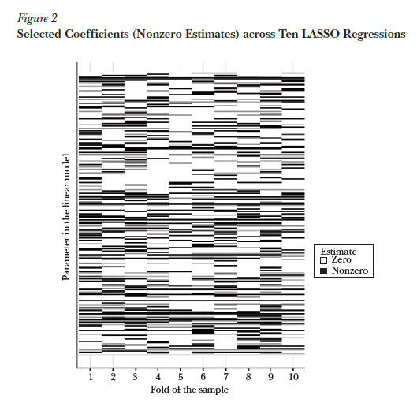
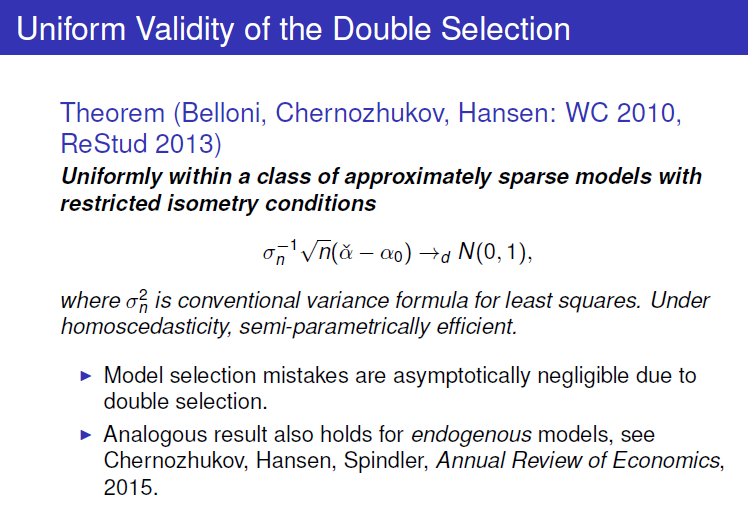
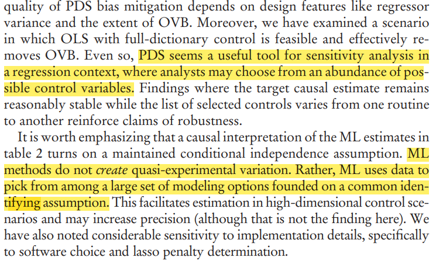
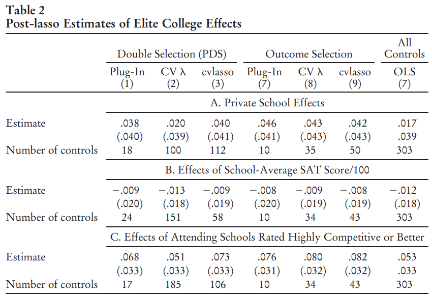
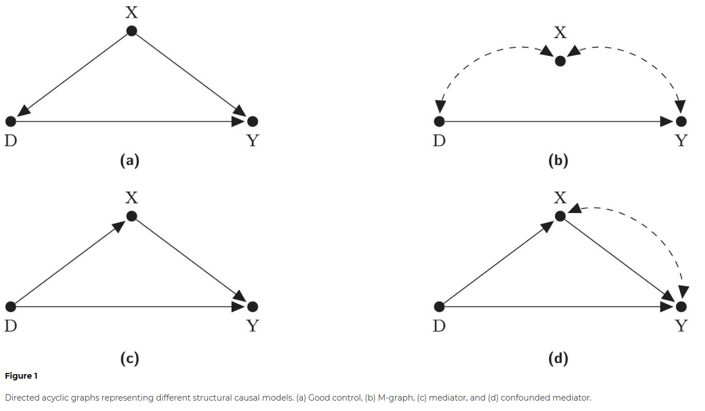
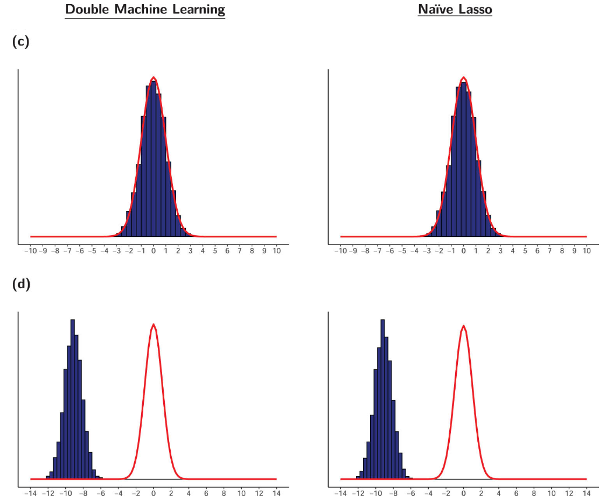
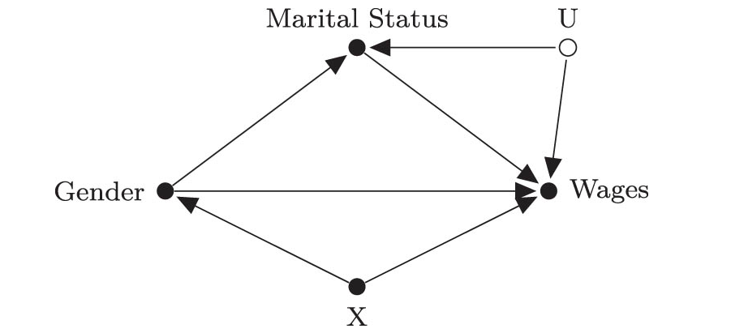
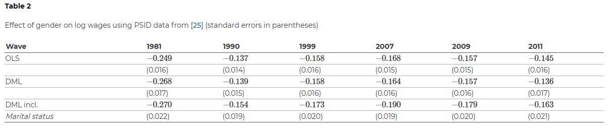

# Replicating this presentation

Use the [pacman](https://cran.r-project.org/web/packages/pacman/vignettes/Introduction_to_pacman.html) package to install and load packages:

```{r packages, message=FALSE, warning=FALSE}

if (!require("pacman"))
  install.packages("pacman")

pacman::p_load(
  tidyverse,
  tidymodels,
  hdm,
  ggdag,
  knitr,
  xaringan,
)
```

```{r setup, include=FALSE}
options(htmltools.dir.version = FALSE)

knitr::opts_chunk$set(eval = TRUE,
                      echo = TRUE,
                      warning = FALSE,
                      message = FALSE,
                      cache = FALSE)

htmltools::tagList(rmarkdown::html_dependency_font_awesome())
```

```{r plots_and_figures, include=FALSE}

ggplot2::theme_set(theme_light(15))

```


---

# Outline

- [Lasso and Variable Selection](#sel)

- [High Dimensional Confoundedness](#ate)

- [Empirical Illustration using `hdm`](#hdm)


---
class: title-slide-section-blue, center, middle
name: sel

# Lasso and Variable Selection


---
# Key Lasso Theory Resources

.pull-left[
- [_Statistical Learning with Sparsity - The Lasso and Generalizations_](https://web.stanford.edu/~hastie/StatLearnSparsity/)  (Hastie, Tibshirani, and Wainwright),
__Chapter 11: Theoretical Results for the Lasso.__
(PDF available online)

- [_Statistics for High-Dimensional Data - Methods, Theory and Applications_](https://www.springer.com/gp/book/9783642201912) (Buhlmann and van de Geer), __Chapter 7: Variable Selection with the Lasso.__

- [_High Dimensional Statistics - A Non-Asymptotic Viewpoint_](https://www.cambridge.org/core/books/highdimensional-statistics/8A91ECEEC38F46DAB53E9FF8757C7A4E) (Wainwright), __Chapter 7: Sparse Linear Models in High Dimensions__
]
.pull-right[

```{r, echo=FALSE, out.width = "100%", fig.align='center'}
knitr::include_graphics("figs/sparsebooks3.png")
```
]

---
# Guidance vs. Guarantees: Fundamental Differences

- We've primarily relied on *guidance* for our work:
  - Selection of folds in CV
  - Size determination of the holdout set
  - Tuning parameter(s) adjustment
  - Loss function selection
  - Function class selection

- But in causal inference, *guarantees* become vital:
  - Selecting variables
  - Deriving confidence intervals and $p$-values

- To attain these guarantees, we generally need:

  - Assumptions regarding a "true" model
  - Asymptotic principles, such as $n\rightarrow\infty$, $k\rightarrow ?$


---
# Key Notations in Lasso Literature

Assume $\boldsymbol{\beta}$ is a $k\times 1$ vector with a typical element as $\beta_i$.

- $\ell_0$-norm is $||\boldsymbol{\beta}||_0=\sum_{j=1}^{k}\boldsymbol{1}_{\{\beta_j\neq0\}}$, indicating the count of non-zero elements in $\boldsymbol{\beta}$.

- $\ell_1$-norm is $||\boldsymbol{\beta}||_1=\sum_{j=1}^{k}|\beta_j|$.

- $\ell_2$-norm or Euclidean norm is $||\boldsymbol{\beta}||_2=\left(\sum_{j=1}^{k}|\beta_j|^2\right)^{\frac{1}{2}}$.

- $\ell_\infty$-norm is $||\boldsymbol{\beta}||_\infty=\sup_j |\beta_j|$, signifying the maximum magnitude among $\boldsymbol{\beta}$'s entries.

- Support of $\boldsymbol{\beta}$ is $S\equiv\mathrm{supp}(\boldsymbol{\beta})= \{\beta_j\neq 0 , j=1,\dots,j\}$, the subset of non-zero coefficients.

- Size of the support $s=|S|$ is the count of non-zero elements in $\boldsymbol{\beta}$, namely $s=||\boldsymbol{\beta}||_0$


---

# Understanding the Basic Setup of Lasso

The linear regression model is given as:

$$Y_{i}=\alpha + X_{i}^{\prime}\boldsymbol{\beta}^{0}+\varepsilon_{i}, \quad i=1,\dots,n,$$

$$\mathbb{E}\left[\varepsilon_{i}{X}_i\right]=0,\quad \alpha\in\mathbb{R},\quad \boldsymbol{\beta}^0\in\mathbb{R}^k.$$

Under the **_exact sparsity_** assumption, we include only a subset of variables of size $s\ll k$ in the model, where $s \equiv\|\boldsymbol{\beta}\|_{0}$ represents the sparsity index.

$$\underbrace{\mathbf{X}_{S}=\left(X_{(1)}, \ldots, X_{\left(s\right)}\right)}_{\text{Sparse Variables}}, \quad \underbrace{\mathbf{X}_{S^c}=\left(X_{\left(s+1\right)}, \ldots, X_{\left(k\right)}\right)}_{\text{Non-Sparse Variables}}$$

Here, $S$ is the subset of active predictors, $\mathbf{X}_S \in \mathbb{R}^{n\times s}$ corresponds to the subset of covariates in the sparse set, and $\mathbf{X}_{S^C} \in \mathbb{R}^{n\times k-s}$ refers to the subset of "irrelevant" non-sparse variables.


---

# Lasso: The Optimization

The Lasso (Least Absolute Shrinkage and Selection Operator), introduced by Tibshirani (1996), poses the following optimization problem:

$$\underset{\beta_{0}, \beta}{\operatorname{min}} \sum_{i=1}^{N}\left(y_{i}-\beta_{0}-\sum_{j=1}^{p} x_{i j} \beta_{j}\right)^{2}+\lambda \lVert\boldsymbol{\beta}\rVert_1$$

In this setup, Lasso places a "budget constraint" on the sum of *absolute* values of $\beta$'s.

Differing from ridge, the Lasso penalty is linear (shifting from 1 to 2 bears the same weight as moving from 101 to 102).

A major strength of Lasso lies in its ability to perform model selection - it zeroes out most of the $\beta$'s in the model, making the solution *sparse*.

Any penalty involving the $\ell_1$ norm will achieve this.


---

# Evaluating the Lasso

Suppose $\beta^0$ is the true vector of coefficients and $\widehat{\beta}$ represents the Lasso estimator. We can evaluate Lasso's effectiveness in several ways:

I. Prediction Quality

$$\text{Loss}_{\text{ pred }}\left(\widehat{\boldsymbol{\beta}} ; \boldsymbol{\beta}^{0}\right)=\frac{1}{N}\left\|(\widehat{\boldsymbol{\beta}}- \boldsymbol{\beta}^{0})\mathbf{X}^{}\right\|_{2}^{2}=\frac{1}{N}\sum_{j=1}^k\left[(\hat{\beta}_j-\beta^0_j)\mathbf{X}_{(j)}\right]^2$$

II. Parameter Consistency

$$\text{Loss}_{\text{param}}\left(\widehat{\boldsymbol{\beta}} ; \boldsymbol{\beta}^{0}\right)=\left\|\widehat{\boldsymbol{\beta}}-\boldsymbol{\beta}^{0}\right\|_{2}^{2}=\sum_{j=1}^k(\hat{\beta}-\beta^0)^2$$

III. Support Recovery (Sparsistency)

For example, score `+1` if $\mathrm{sign}(\beta^0)=\mathrm{sign}(\beta_j)$ for all $j=1,\dots,k$, and `0` otherwise.


---
# Leveraging Lasso for Variable Selection

- Variable selection consistency is crucial for causal inference, considering omitted variable bias.

- Lasso frequently serves as a tool for variable selection.

- The successful selection of the "true" support by Lasso depends heavily on strong assumptions about:
    - Distinguishing between relevant and irrelevant variables.
    - Identifying $\boldsymbol{\beta}$.
  


---

# Critical Assumption #1: Distinguishable Sparse Betas

**_Lower Eigenvalue:_** The minimum eigenvalue, $\lambda_{\min }$, of the sub-matrix $\mathbf{X}_S$, should be bounded away from zero.

$$\lambda_{\min }\left(\mathbf{X}_{S}^{\prime} \mathbf{X}^{}_{S} / N\right) \geq C_{\min }>0$$

Linear dependence between the columns of $\mathbf{X}_s$ makes it impossible to identify the true $\boldsymbol{\beta}$, even if we *knew* which variables are included in $\mathbf{X}_S$.

**NOTE:** The high-dimensional lower eigenvalue condition replaces the low-dimensional rank condition (i.e., that $\mathbf{X}^\prime\mathbf{X}$ is invertible).


---
# Critical assumption #2: Distinguishable active predictors

_Irrepresentability condition_ (Zou ,2006; Zhao and Yu, 2006): There must exist some $\eta>0$ such that  

$$\max _{j \in S^{c}}\left\|\left(\mathbf{X}_{S}^{\prime} \mathbf{X}_{S}\right)^{-1} \mathbf{X}_{S}^{\prime} \mathbf{x}_{j}\right\|_{1} \leq 1-\eta$$


__INTUITION__: What's inside $\left\|\cdot\right\|_{1}$ is like regressing $\mathbf{x}_{j}$ on the variables in $\mathbf{X}_s$ .

- When $\eta=1$, the sparse and non-sparse variables are orthogonal to each other.

- When $\eta=0$, we can perfectly reconstruct (some elements of) $\mathbf{X}_S$ using $\mathbf{X}_{S^C}$.


Thus, the irrepresentability condition roughly states that we can distinguish the sparse variables from the non-sparse ones.


---

```{r, echo=FALSE, out.width = "55%", fig.align='center'}

```

Source: [Mullainathan and Spiess (JEP 2017)](https://www.aeaweb.org/articles/pdf/doi/10.1257/jep.31.2.87).


---
# Setting the Optimal Tuning Parameter

- Throughout this course, we have frequently chosen $\lambda$ empirically, often by cross-validation, based on its predictive performance.

- In causal analysis, however, the end goal is inference, not prediction. These two objectives often conflict (bias vs. variance).

- Ideally, the choice of $\lambda$ should provide assurances about the model's performance.

- Generally, for satisfying sparsistency, we set $\lambda$ such that it selects non-zero $\beta$'s with a high probability.


---
class: title-slide-section-blue, center, middle
name: ate

# High Dimensional Confoundedness


---
# "Naive" Implementation of the Lasso

Run `glmnet` 

```r
glmnet(Y ~ DX)

```
where `DX` is the feature matrix which includes both the treatment $D$ and the features vector $X$. The estimated coefficients are:

$$\left(\widehat{\alpha},\widehat{\tau}, \widehat{\boldsymbol{\beta}}^{\prime}\right)^{\prime}=\underset{\alpha, \tau \in \mathbb{R}, \boldsymbol{\beta} \in \mathbb{R}^{k+1}}{\arg \min } \sum_{i=1}^{n}\left(Y_{i}-\alpha-\tau D_{i}-\boldsymbol{\beta}^{\prime} X_{i}\right)^{2}+\lambda\left(|\tau|+\sum_{j=1}^{k}\left|\beta_{j}\right|\right)$$

**ISSUES:**

1. Both $\widehat\tau$ and $\widehat{\boldsymbol{\beta}}$ experience shrinkage, thus biased towards zero.
2. Lasso might eliminate $D_i$, i.e., shrink $\widehat\tau$ to zero. The same can happen to relevant confounding factors.
3. The choice of $\lambda$ is a challenge.

---
# Moving Towards a Solution

To avoid eliminating $D_i$, we can adjust the Lasso regression:

$$\left(\widehat{\alpha}, \widehat{\tau}, \widehat{\boldsymbol{\beta}}^{\prime}\right)^{\prime}=\underset{\alpha,\tau \in \mathbb{R}, \boldsymbol{\beta} \in \mathbb{R}^{k}}{\arg \min } \sum_{i=1}^{n}\left(Y_{i}-\alpha-\tau D_{i}-\boldsymbol{\beta}^{\prime} X_{i}\right)^{2}+\lambda\left(\sum_{j=1}^{k}\left|\beta_{j}\right|\right)$$

We can then _debias_ the results using the "Post-Lasso" method, i.e., use the Lasso for variable selection, then run OLS with the selected variables.

**ISSUES:** The Lasso might eliminate features that are correlated with $D_i$ because they are not good predictors of $Y_i$, leading to _omitted variable bias_. 


---
# Problem Solved?


```{r, echo=FALSE, out.width = "55%", fig.align='center'}
knitr::include_graphics("figs/naive_Lasso.png")
```

Source: [https://stuff.mit.edu/~vchern/papers/Chernozhukov-Saloniki.pdf](https://stuff.mit.edu/~vchern/papers/Chernozhukov-Saloniki.pdf)


---

# Solution: Double-selection Lasso (Belloni, et al., REStud 2013)

**Step 1:** Perform two Lasso regressions: $Y_i$ on ${X}_i$ and $D_i$ on ${X}_i$:

$$\begin{aligned} \widehat{\gamma} &=\underset{\boldsymbol{\gamma} \in \mathbb{R}^{p+1}}{\arg \min } \sum_{i=1}^{n}\left(Y_{i}-\boldsymbol{\gamma}^{\prime} X_{i}\right)^{2}+\lambda_{\gamma}\left(\sum_{j=2}^{p}\left|\gamma_{j}\right|\right) \\ \widehat{\delta} &=\underset{\boldsymbol{\delta} \in \mathbb{R}^{q+1}}{\arg \min } \sum_{i=1}^{n}\left(D_{i}-\boldsymbol{\delta}^{\prime} X_{i}\right)^{2}+\lambda_{\delta}\left(\sum_{j=2}^{q}\left|\delta_{j}\right|\right) \end{aligned}$$

**Step 2:** Refit the model using OLS, but only include the $\mathbf{X}$'s that were significant predictors of both $Y_i$ and $D_i$. 

**Step 3:** Proceed with the inference using standard confidence intervals.

> The tuning parameter $\lambda$ is set in a way that ensures non-sparse coefficients are correctly selected with high probability.

---
# Does it Work?


```{r, echo=FALSE, out.width = "55%", fig.align='center'}
knitr::include_graphics("figs/double_Lasso.png")
```

Source: [https://stuff.mit.edu/~vchern/papers/Chernozhukov-Saloniki.pdf](https://stuff.mit.edu/~vchern/papers/Chernozhukov-Saloniki.pdf)

---
# Statistical Inference


```{r, echo=FALSE, out.width = "55%", fig.align='center'}

```

Source: [https://stuff.mit.edu/~vchern/papers/Chernozhukov-Saloniki.pdf](https://stuff.mit.edu/~vchern/papers/Chernozhukov-Saloniki.pdf)

---
# Intuition: Partialling-out regression


Consider two methods for estimating the effect of $X_{1i}$ (a scalar) on $Y_i$, while adjusting for $X_{2i}$:

__Alternative 1:__ Run

$$Y_i = \alpha + \beta X_{1i} + \gamma X_{2i} + \varepsilon_i$$

__Alternative 2:__ First, run $Y_i$ on $X_{2i}$ and $X_{1i}$ on $X_{2i}$ and keep the residuals, i.e., run

$$Y_i = \gamma_0 + \gamma_1 X_{2i} + u^Y_i,\quad\text{and}\quad X_{1i} = \delta_0 + \delta_1 X_{2i} + u^{X_{1}}_i,$$
and keep $\widehat{u}^Y_i$ and $\widehat{u}^{X_{1}}_i$. Next, run

$$\widehat{u}^Y_i = \beta^*\widehat{u}^{X_{1}}_i + v_i.$$

According to the [Frisch-Waugh-Lovell (FWV) Theorem](https://en.wikipedia.org/wiki/Frisch%E2%80%93Waugh%E2%80%93Lovell_theorem), $\widehat\beta = \widehat{\beta}^*.$

---
# Guarantees of Double-selection Lasso (VERY Wonkish)

__Approximate Sparsity__ Consider the following regression model:

$$Y_{i}=f\left({W}_{i}\right)+\varepsilon_{i}={X}_{i}^{\prime} \boldsymbol{\beta}^{0}+r_{i}+\varepsilon_{i}, \quad 1,\dots,n$$
where $r_i$ is the approximation error. 

Under _approximate sparsity_, it is assumed that $f\left({W}_{i}\right)$ can be approximated sufficiently well (up to $r_i$) by ${X}_{i}^{\prime} \boldsymbol{\beta}^{0}$, while using only a small number of non-zero coefficients.   

__Restricted Sparse Eigenvalue Condition (RSEC)__ This condition puts bounds on the number of variables outside the support the Lasso can select. Relevant for the post-lasso stage. 


__Regularization Event__ The tuning parameter $\lambda$ is to a value that it selects to correct model with probability of at least $p$, where $p$ is set by the user. Further assumptions regarding the quantile function of the maximal value of the gradient of the objective function at $\boldsymbol{\beta}^0$, and the error term (homoskedasticity vs. heteroskedasticity). See Belloni et al. (2012) for further details.


---

# Additional Extensions of Double-selection

1. **Other Function Classes (Double-ML):** Chernozhukov et al. (AER 2017) proposed using other function classes, such as applying random forest for $Y \sim X$ and regularized logit for $D \sim X$.

2. **Instrumental Variables:** Techniques involving instrumental variables have been developed by Belloni et al. (Ecta 2012) and Chernozhukov et al. (AER 2015). For further understanding, please refer to the problem set.

3. **Heterogeneous Treatment Effects:** Heterogeneous treatment effects have been studied by Belloni et al. (Ecta 2017). We'll explore this topic more thoroughly next week.

4. **Panel Data:** Consideration for panel data was made by Belloni et al. (JBES 2016).


---
# Evidence on the Applicability of Double-Lasso

["Machine Labor"](https://economics.mit.edu/sites/default/files/2022-11/Machine%20Labor.pdf) (Angrist and Frandsen, 2022 JLE):

- ML can be useful for regression-based causal inference using Lasso.

- Post-double-selection (PDS) Lasso offers data-driven sensitivity analysis.

- ML-based instrument selection can improve on 2SLS, but split-sample IV and limited information maximum likelihood (LIML) perform better.

- ML might not be optimal for Instrumental Variables (IV) applications in labor economics. This is due to the creation of artificial exclusion restrictions potentially resulting in inaccurate findings.

---
# More from "Labor Machine"

.pull-left[
```{r, echo=FALSE, out.width = "100%", fig.align='center'}

```
__Source__: Angrist and Frandsen (2022).
]
.pull-right[
```{r, echo=FALSE, out.width = "100%", fig.align='center'}

```

]


---
# DML: A Cautionary Tale

.pull-left[
[Hünermund, Louw, and Caspi (2023 JCI)](https://www.degruyter.com/document/doi/10.1515/jci-2022-0078/html):

- DML is highly sensitive to a few "bad controls" in the covariate space, leading to potential bias.

- This bias varies depending on the theoretical causal model, raising questions about the practicality of data-driven control variable selection.
]
.pull-right[
```{r, echo=FALSE, out.width = "100%", fig.align='center'}

```
]


---
# Simulation Results

.pull-left[
```{r, echo=FALSE, out.width = "100%", fig.align='center'}
knitr::include_graphics("figs/dmlct-figs1.png")
```
]
.pull-right[
```{r, echo=FALSE, out.width = "100%", fig.align='center'}

```
]


---
# Empirical Relevance

```{r, echo=FALSE, out.width = "50%", fig.align='center'}

```


```{r, echo=FALSE, out.width = "100%", fig.align='center'}

```


---
class: title-slide-section-blue, center, middle
name: hdm

#Empirical Illustration using `hdm`

---
# Introducing the `hdm` R Package

["High-Dimensional Metrics"](https://journal.r-project.org/archive/2016/RJ-2016-040/RJ-2016-040.pdf) (`hdm`) by Victor Chernozhukov, Chris Hansen, and Martin Spindler is an R package for estimation and quantification of uncertainty in high-dimensional approximately sparse models. 

[*] A Stata module named [`Lassopack`](https://stataLasso.github.io/docs/Lassopack/) offers a comprehensive set of programs for regularized regression in high-dimensional contexts..
]


---
# Illustration: Testing for Growth Convergence

The standard empirical model for growth convergence is represented by the equation:

$$Y_{i,T}=\alpha_{0}+\alpha_{1} Y_{i,0}+\sum_{j=1}^{k} \beta_{j} X_{i j}+\varepsilon_{i},\quad i=1,\dots,n,$$

where 

- $Y_{i,T}$ national growth rates in GDP per capita for the periods 1965-1975 and 1975-1985.

- $Y_{i,0}$ is the log of the initial level of GDP at the beginning of the specified decade.

- $X_{ij}$ covariates which might influence growth.


The growth convergence hypothesis implies that $\alpha_1<0$.

---

# Growth Data

To test the **growth convergence hypothesis**, we will employ the Barro and Lee (1994) dataset.

```{r}
data("GrowthData")
```


The data features macroeconomic information for a substantial group of countries over various decades. Specifically,

- $n$ equals 90 countries
- $k$ equals 60 country features

While these numbers may not seem large, the quantity of covariates is substantial compared to the sample size. Hence, **variable selection** is crucial!

---
# Let's Have a Look

```{r}
GrowthData %>%
  as_tibble %>%
  head(2)
```


---
# Data Processing

Rename the response and "treatment" variables:

```{r}
df <- 
  GrowthData %>% 
  rename(YT = Outcome, Y0 = gdpsh465)
```

Transform the data to vectors and matrices (to be used in the `rlassoEffect()` function)

```{r}
YT <- df %>% select(YT) %>% pull()

Y0 <- df %>% select(Y0) %>% pull()

X <- df %>%
  select(-c("Y0", "YT")) %>%
  as.matrix()

Y0_X <- df %>%
  select(-YT) %>%
  as.matrix()

```


---
# Estimation of the Convergence Parameter $\alpha_1$

__Method 1:__ OLS 

```{r}
ols <- lm(YT ~ ., data = df)
```

__Method 2:__ Naive (rigorous) Lasso

```{r}
naive_Lasso <- rlasso(x = Y0_X, y = YT)
```

Does the Lasso drop `Y0`?

```{r}
naive_Lasso$beta[2]
```

Unfortunately, yes...

---
# Estimation of the Convergence Parameter $\alpha_1$

__Method 3:__ Partialling-out Lasso

```{r}
part_Lasso <- 
  rlassoEffect(
    x = X, y = YT, d = Y0,
    method = "partialling out"
  )
```

__Method 4:__ Double-selection Lasso

```{r}
double_Lasso <- 
  rlassoEffect(
    x = X, y = YT, d = Y0,
    method = "double selection"
  )
```


---

# Tidying the Results

```{r}
# OLS
ols_tbl <- tidy(ols) %>% 
  filter(term == "Y0") %>% 
  mutate(method = "OLS") %>% 
  select(method, estimate, std.error)

# Naive Lasso
naive_Lasso_tbl <- tibble(method = "Naive Lasso",
                              estimate = NA,
                              std.error = NA)
# Partialling-out Lasso
results_part_Lasso <- summary(part_Lasso)[[1]][1, 1:2]
part_Lasso_tbl     <- tibble(method = "Partialling-out Lasso",
                          estimate = results_part_Lasso[1],
                          std.error = results_part_Lasso[2])
# Double-selection Lasso
results_double_Lasso <- summary(double_Lasso)[[1]][1, 1:2]
double_Lasso_tbl <- tibble(method = "Double-selection Lasso",
                           estimate = results_double_Lasso[1],
                           std.error = results_double_Lasso[2])
```

---
# Summary of the Convergence Test

```{r}
bind_rows(ols_tbl, naive_Lasso_tbl, part_Lasso_tbl, double_Lasso_tbl) %>% 
  kable(digits = 3, format = "html")
```


The use of double-selection and partialling-out methods lead to significantly **more precise estimates** and lend support to the **conditional convergence hypothesis**.

---
# An Advanced R Package: DoubleML

.pull-left[
- The Python and R packages [{DoubleML}](https://docs.doubleml.org/stable/index.html) offer a modern implementation of the double / debiased machine learning framework. 

- For more details, visit the [Getting Started](https://docs.doubleml.org/stable/intro/intro.html) and [Examples](https://docs.doubleml.org/stable/examples/index.html) sections.

- The package is constructed on the [{mlr3}](https://github.com/mlr-org/mlr3) ecosystem.
]

.pull-right[
```{r, echo=FALSE, out.width = "80%", fig.align='center'}
knitr::include_graphics("figs/dml.png")
```
]

---
class: .title-slide-final, center, inverse, middle

# `slides %>% end()`

[<i class="fa fa-github"></i> Source code](https://github.com/ml4econ/lecture-notes-2023/tree/master/09-lasso-ate)  


---
# Selected References

Ahrens, A., Hansen, C. B., & Schaffer, M. E. (2019). lassopack: Model selection and prediction with regularized regression in Stata.

Angrist, Joshua D, and Alan B Krueger. 1991. "Does Compulsory School Attendance Affect Schooling and Earnings?" _The Quarterly Journal of Economics_, 106(4): 979–1014.

Angrist, J. D., & Frandsen, B. (2022). Machine labor. _Journal of Labor Economics_, 40(S1), S97-S140.

Belloni, A., D. Chen, V. Chernozhukov, and C. Hansen. 2012. Sparse Models and Methods for Optimal Instruments With an Application to Eminent Domain. _Econometrica_ 80(6): 2369–2429. 

Belloni, A., & Chernozhukov, V. (2013). Least squares after model selection in high-dimensional sparse models. _Bernoulli_, 19(2), 521–547.

Belloni, A., Chernozhukov, V., & Hansen, C. (2013). Inference on treatment effects after selection among high-dimensional controls. _Review of Economic Studies_, 81(2), 608–650.

---
# Selected References

Belloni, A., Chernozhukov, V., & Hansen, C. (2014). High-Dimensional Methods and Inference on Structural and Treatment Effects. _Journal of Economic Perspectives_, 28(2), 29–50.

Chernozhukov, V., Hansen, C., & Spindler, M. (2015). Post-selection and post-regularization inference in linear models with many controls and instruments. _American Economic Review_, 105(5), 486–490.

Chernozhukov, V., Hansen, C., & Spindler, M. (2016). hdm: High-Dimensional Metrics. _The R Journal_, 8(2), 185–199.

Chernozhukov, V., Chetverikov, D., Demirer, M., Duflo, E., Hansen, C., & Newey, W. (2017). Double/debiased/Neyman machine learning of treatment effects. _American Economic Review_, 107(5), 261–265.

---
# Selected References

Dale, Stacy Berg, and Alan B Krueger. 2002. "Estimating the Payoff to Attending a More Selective College: An Application of Selection on Observables and Unobservables." _The Quarterly Journal of
Economics_, 117(4): 1491–1527.

Hünermund, P., Louw, B., & Caspi, I. (2023). Double machi_ne learning and automated confounder selection: A cautionary tale. _Journal of Causal Inference_, 11(1), 20220078.

Mullainathan, S. & Spiess, J., 2017. Machine Learning: An Applied Econometric Approach. _Journal of Economic Perspectives_, 31(2), pp.87–106.

Van de Geer, S. A., & Bühlmann, P. (2009). On the conditions used to prove oracle results for the lasso. _Electronic Journal of Statistics_, 3, 1360–1392.

Zhao, P., & Yu, B. (2006). On Model Selection Consistency of Lasso. _Journal of Machine Learning Research_, 7, 2541–2563.


