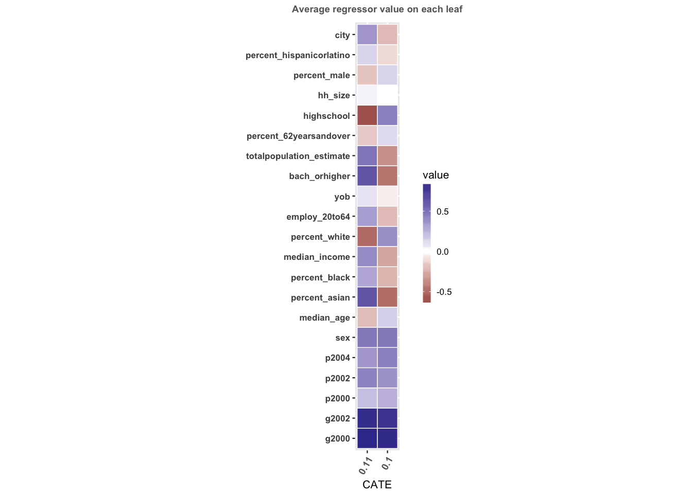

# Replicating this Presentation

Leverage the [pacman](https://cran.r-project.org/web/packages/pacman/vignettes/Introduction_to_pacman.html) package for installing and loading necessary packages:

```{r packages, message=FALSE, warning=FALSE}

if (!require("pacman"))
  install.packages("pacman")

pacman::p_load(
  tidyverse,
  tidymodels,
  causalTree,
  experimentdatar,
  rpart.plot,
  broom,
  knitr,
  xaringan
)
```

```{r setup, include=FALSE}
options(htmltools.dir.version = FALSE)

knitr::opts_chunk$set(
  eval = TRUE,
  echo = TRUE,
  warning = FALSE,
  message = FALSE,
  cache = FALSE
)

htmltools::tagList(rmarkdown::html_dependency_font_awesome())
```

```{r plots_and_figures, include=FALSE}
ggplot2::theme_set(theme_light(15))
```

---

# Outline

- [Heterogenous Treatment Effects (HTE)](#cate)

- [Challenges in Estimating HTE](#challenges)

- [Introducing Causal Trees (and Forests)](#trees)

- [Empirical Illustration](#causalTree)


---
class: title-slide-section-blue, center, middle
name: projects

# Heterogeneous Treatment Effects


---
# Treatment and Potential Outcomes: Rubin (1974, 1977)

- Treatment Definition
$$D_i=\begin{cases}
    1, & \text{if unit } i \text{received the treatment} \\
    0, & \text{otherwise.}
\end{cases}$$
- Potential Outcomes
$$\begin{matrix}
    Y_{i0} & \text{denotes the potential outcome for unit } i \text{ without the treatment (} D_i = 0)\\
    Y_{i1} & \text{denotes the potential outcome for unit } i \text{ with the treatment (} D_i = 1)
\end{matrix}$$

---
#  Treatment and Potential Outcomes: Rubin (1974, 1977) Cont.
- Observed Outcome: Under the Stable Unit Treatment Value Assumption (SUTVA), we calculate the outcome for unit $i$ as
$$Y_i = Y_{1i}D_i + Y_{0i}(1-D_i)$$
- Individual Treatment Effect: We quantify this as the difference between unit $i$'s potential outcomes:
$$\tau_i = Y_{1i} - Y_{0i}$$

>**The Fundamental Problem of Causal Inference (Holland, 1986)**: We cannot simultaneously observe both $Y_{1i}$ and $Y_{0i}$, and as a result, $\tau_i$ is unobservable.


---
# Assumption of Random Treatment Assignment

In this discussion, we operate under the assumption that treatments are randomly assigned. This implies that $D_i$ is _independent_ of potential outcomes, stated as:

$$\{Y_{1i}, Y_{0i}\}  \perp D_i$$

Remember, randomized control trials (RCTs) allow us to calculate the Average Treatment Effect (ATE) using the average difference in outcomes based on treatment status:

$$\begin{aligned} \text{ATE} = \mathbb{E}\left[Y_{i} | D_{i}=1\right]-\mathbb{E}\left[Y_{i} | D_{i}=0\right]
\end{aligned}$$

and its corresponding sample estimate:

$$\widehat{\tau}=\frac{1}{n_T}\sum_{i\in Treatment} Y_i - \frac{1}{n_C}\sum_{i\in Control} Y_i$$

In essence, the difference in average outcomes between the treatment and control groups provides an unbiased estimate.


---
# The Importance of Understanding HTE

- There are often reasons to suspect that a treatment may impact individuals differently, for instance,

  - Younger subjects might have a better response to a certain medication.
  - Short-term unemployed individuals may benefit more from job-training programs.

- Consequently, gaining insights into treatment effect heterogeneity allows for more effective treatment allocation:
  - Treatments can be tailored and targeted towards those who stand to gain the most.

  


---
# Treatment Effect Heterogeneity

Let's recall the definition of Average Treatment Effect (ATE):

$$\tau= \mathbb{E}[Y_{i1}-Y_{i0}]$$

We define the Conditional Average Treatment Effect (CATE) as:

$$\tau(x) = \mathbb{E}[Y_{i1}-Y_{i0} | X_i = x]$$
where $x$ denotes a specific value of $X_i$ or a range of values (representing a subspace of the feature space).


---
class: title-slide-section-blue, center, middle
name: challenge

# Challenges in Estimating HTE

---

# Moving the Goalpost

Our primary interest lies in determining "personalized" treatment effects.

We can consider Conditional Average Treatment Effects (CATE) as a balance between ATE and personalized treatment effects.

CATEs represent ATEs for specific subgroups of individuals. We classify these subgroups based on the $X_i$'s. This can be formally expressed as:

$$\text{CATE} = \tau(x) = \mathbb{E}[Y_{1i}-Y_{0i}|X_i = x, x\in \mathbb{X}]$$

Here, $x$ denotes a partition of the feature space $\mathbb{X}$.

>For instance, $x$ might represent a subgroup consisting of individuals under 18 years old who weigh more than 75 kg.


---
# Striking a Balance: The Bias-Variance Trade-off in HTEs

In an ideal scenario, we want to uncover "personalized" treatment effects, meaning the effect of treatment on an individual with a specific set of features $X_i=x$. 

Generally, as we move towards more personalized estimations, bias decreases:

$$Bias(\widehat\tau) > Bias(\widehat\tau(x)) > Bias(\widehat\tau_i)$$

However, with increased personalization, the noise in our estimate rises:

$$Var(\widehat\tau) < Var(\widehat\tau(x)) < Var(\widehat\tau_i)$$

The key is to find the sweet spot between reducing bias and managing variance for meaningful insights.


---
# Estimating CATE Using Linear Regression

The most prevalent approach is to estimate the _best linear projection_ (BLP) for $\mu = \mathbb{E}[Y_i|X_i=x]$, incorporating interaction terms between the treatment and the set of features.

As an example, for a binary treatment $D_i$ and a single feature $X_i$, we estimate the following regression via Ordinary Least Squares (OLS):

$$Y_i = \alpha + \tau D_i + \beta X_i + \gamma D_iX_i + u_i,$$

Here, the coefficient $\gamma$ denotes the interaction effect and reflects the difference between ATE and the effect of $D_i$ among individuals with $X_i=x$.

>__NOTE:__ The parameter $\gamma$ holds a causal interpretation only when $X_i$ is randomly assigned.


---
# Limitations of the Best Linear Projection (BLP) Approach

1. This method becomes unmanageable when the quantity of attributes and interaction terms significantly outweighs the number of observations.

2. While Lasso can assist when $k\gg n$, it may introduce omitted variable bias. For example, Lasso might eliminate some of the main effects.

3. Managing and keeping track of numerous variables and their interactions (bookkeeping) can become cumbersome.


---
class: title-slide-section-blue, center, middle
name: trees

# Introducing Causal Trees (and Forests)


---
# Notation Summary: Data and Observations

.pull-left[
###Data
- $Y_i$: observed outcome for individual $i$.
- $X_i$: attribute vector for individual $i$.
- $D_i$: binary treatment indicator $\{0,1\}$.

###Sample
- $\mathcal{S}$: the full sample.
- $\mathcal{S}^{tr}$: training sample.
- $\mathcal{S}^{te}$: test sample.
- $\mathcal{S}^{est}$: estimation sample.
- $\mathcal{S}_{treat}$: treatment group.
- $\mathcal{S}_{control}$: control group.
]

.pull-right[
###Observations
- $N$: total number of observations.
- $N^{tr}$: size of the training sample.
- $N^{te}$: size of the test sample.
- $N^{est}$: size of the estimation sample.
]


---
# Notation Summary: Trees and CATE

.pull-left[
###Tree
- $\mathbb{X}$: attribute space.
- $\Pi$: a partitioned tree.
- ${\#(\Pi)}$: number of partitions.
- $\ell_j$: a leaf of $\Pi$, such that $\cup_{j=1}^{\#(\Pi)} \ell_{j}=\mathbb{X}$.
- $\ell(x;\Pi)$: a leaf such that $x\in\ell$.
]

.pull-right[
###Treatment
- $\tau(\ell_j)$: treatment effect in leaf $\ell_j$.
- $p$: marginal treatment probability, represented as $P(D_i = 1)$.
]


---
# Hypothetical Scenario: Observable $\tau_i$

Let's imagine we have data on $\tau_i$ and $X_i$ for $i=1,\dots,N$.

Our goal is to predict $\tau_i$ for an individual with $X_i$ equal to some $x$, in an out-of-sample scenario.

A simple approach could be to fit a regression tree to the data. Splits would be based on in-sample fit, expressed as:

$$\frac{1}{N}\sum_{i=1}^N(\tau_i-\widehat\tau(X_i|\mathcal{S}^{tr},\Pi))^2$$

We would use cross-validation for regularization (also known as pruning).


---
# Causal tree (Athey and Imbens, PNAS 2016)

__Goal:__ Estimate Conditional Average Treatment Effects (CATE) $\tau(x)$.

__Basic Idea:__ Use a regression tree to partition the attribute space $\mathbb{X}$.

__Challenges:__
1. Traditional trees split leaves based on $Y_i$. However, we are interested in $\tau_i$, which is unobserved.
2. How to determine the regularization criteria?
3. How to form confidence intervals?

__Solutions:__
1. Split the tree based on the heterogeneity and accuracy of $\tau(x)$.
2. Regulate based on treatment effect heterogeneity and accuracy within leaves.
3. Implement sample splitting: Build the tree on one sample and estimate CATE on a different, independent sample.

  
---
# The Naive Approach

We could use an off-the-shelf CART algorithm to:

1. Estimate two separate trees to predict outcomes $Y_i$, one each for treated and control subsamples.
2. Estimate a single tree for $Y_i$, focusing on splits in $D_i$.

>__Problem:__ The naive approaches (tree construction and cross-validation) are optimized for outcome heterogeneity, not treatment heterogeneity. They implicitly rely on the assumption that treatment is highly correlated with the $X_i$'s.


---
# Approach #1: Transformed Outcome Trees (TOT)

Suppose we have an RCT with a 50% probability of receiving the treatment. Define

$$Y_{i}^{*}=\left\{\begin{array}{cl}{2 Y_{i}} & {\text { if } D_{i}=1}, \\ {-2 Y_{i}} & {\text { if } D_{i}=0}.\end{array}\right.$$

In this case, $Y_i^*$ becomes an unbiased estimate for individual $i$'s $\tau_i$.

__Proof:__ Given that we're in a 50-50 RCT,

$$\mathbb{E}[Y_i]=\frac{1}{2}\mathbb{E}[Y_{1i}] + \frac{1}{2}\mathbb{E}[Y_{0i}]$$

The expectation is with respect to the _probability of being treated_. Similarly, 

$$\begin{aligned}
\mathbb{E}[Y_i^*] &=2\left(\frac{1}{2}\mathbb{E}[Y_{1i}] - \frac{1}{2}\mathbb{E}[Y_{0i}]\right) \\ 
&=\mathbb{E}[\tau_i]. \\ 
\end{aligned}$$


---
# Non 50-50 Assignment

More generally, if the probability of treatment assignment is denoted by $p$, then

$$Y_{i}^{*}=\frac{D_{i}-p}{p(1-p)} Y_{i}=\left\{\begin{array}{cc}{\frac{1}{p} Y_{i}} & {\text { if }\: D_{i}=1} \\ {-\frac{1}{1-p} Y_{i}} & {\text { if }\: D_{i}=0}\end{array}\right.$$

In observational studies, $p$ can be estimated based on the $X$'s, i.e., use $\widehat{p}(X)$ instead of setting a constant $p$ for all $i$.

Once $Y_i^*$ is defined, we can proceed with standard tree methods for prediction:
1. Use a conventional algorithm (e.g., `rpart`) to fit a tree to predict $Y_i^*$.
2. Use the mean of $Y_i^*$ within each leaf as the estimate for $\tau(x)$.


---
# Problems with the TOT Approach

__PROBLEM:__ The Transformed Outcome Trees (TOT) approach estimates CATE as the average $Y_i^*$ within each leaf, and not as the difference in average outcome between the treatment and control groups.

__EXAMPLE:__ Consider a leaf $\ell$ with 7 treated and 10 untreated. In this case, $\text{CATE}(\ell)$ will be the average of $Y_i^*$, for $i=1,\dots,17$. 

Ideally, what we want is to calculate the difference between the average of $Y_i^*$ in the Treatment group and the average of $Y_i^*$ in the Control group.

(NOTE: As we will discuss later, the `causalTree` package estimates $\widehat\tau$ within each leaf instead of $\widehat{Y}^*$.)


---
# An Aside: Sample Splitting and Honest Estimation

__Sample Splitting:__ This involves dividing the data in half, computing the sequence of models on one half, and then evaluating their significance on the other half. 

_COST:_ This approach can lead to a significant loss of power, unless the sample size is large.

_BENEFIT:_ It provides valid inference due to independent subsamples.

In the context of causal trees, sample splitting involves constructing a tree using the training sample $\mathcal{S}^{tr}$ and estimating the effect using the estimation sample $\mathcal{S}^{est}$.


---
# Approach #2: Causal Tree (CT)

__Solution:__ We define $\widehat\tau_i$ as the Average Treatment Effect (ATE) within the leaf.

Athey and Imbens propose two splitting rules: 

1. Adaptive Causal Tree (__CT-A__):

$$-\widehat{\mathrm{MSE}}_{\tau}\left(\mathcal{S}^{\mathrm{tr}}, \mathcal{S}^{\mathrm{tr}}, \Pi\right)=\underbrace{\frac{1}{N^{\mathrm{tr}}} \sum_{i \in \mathcal{S}^{\mathrm{tr}}} \hat{\tau}^{2}\left(X_{i} | \mathcal{S}^{\mathrm{tr}}, \Pi\right)}_{\text { Variance of treatment }}$$

In other words: perform a split if it _increases_ the heterogeneity of the treatment effect within the sample.


---
# Approach #2: Causal tree (CT)

2. Honest causal tree (__CT-H__) which uses sample splitting:

$$\begin{aligned}
& \widehat{\operatorname{EMSE}}_\tau\left(\mathcal{S}^{\text {tr }}, \Pi\right) \equiv \frac{1}{N^{\operatorname{tr}}} \sum_{i \in \mathcal{S}^{\text {tr }}} \hat{\tau}^2\left(X_i ; \mathcal{S}^{\text {tr }}, \Pi\right) \\
& -\frac{2}{N^{\text {tr }}} \cdot \sum_{\ell \in \Pi}\left(\frac{S_{\mathcal{S}_{\text {treat }}^{\text {tr }}}^2(\ell)}{p}+\frac{S_{\mathcal{S}_{\text {control }}^{\text {tr }}}^2(\ell)}{1-p}\right) .
\end{aligned}$$
where $S_{\mathcal{S}_{\mathrm{control}}^{tr}}^{2}(\ell)$ is the within-leaf variance on outcome $Y$ for $\mathcal{S}_{\mathrm{control}}^{tr}$ control group in leaf $\ell$, and $S_{\mathcal{S}_{\mathrm{treat}}^{tr}}^{2}(\ell)$  is the counter part for $\mathcal{S}^{tr}_{\mathrm{treat}}$ treatment group.

__In words:__ perform split if it _increases_ treatment effect heterogeneity _and_ reduces the uncertainty about the estimated effect.  


---
# Additional Splitting Rules

Athey and Imbens (2016) propose two additional splitting rules:

1. Fit-Based Trees: The split is based on the goodness-of-fit of the _outcome_, where fitting takes into account the binary treatment indicator $D_i$.

2. Squared T-Statistic Trees: The split is performed according to the largest value of the square of the t-statistic for testing the null hypothesis that the average treatment effect is the same in the two potential leaves.

Please refer to the Athey and Imbens (2016) paper for more details.


---
# Enhancing Causal Trees: Cross-Validation and Pruning

- Cross-validation in causal trees utilizes the *out-of-sample* version of the *goodness-of-fit* rule. This rule is essential for tree construction.

- Specifically, we split the training sample into two sets:
  - A **training set**, denoted as $\mathcal{S}^{tr,tr}$.
  - A **validation set**, denoted as $\mathcal{S}^{tr,cv}$.

- The tree's construction is based on the training set, $\mathcal{S}^{tr,tr}$, and its validation uses the set $\mathcal{S}^{tr,cv}$.

- Based on validation performance, we can **prune** the tree. This step simplifies the model, enhances interpretability, and potentially improves prediction performance.


---
# Summarizing the Causal Tree Algorithm

1. Randomly split the sample $\mathcal{S}$ into two halves, forming:
   - A **training sample**, $\mathcal{S^{tr}}$
   - An **estimation sample**, $\mathcal{S^{est}}$

2. Using only $\mathcal{S^{tr}}$, construct a tree. Each split follows a criteria aiming to maximize:
   - The _variability_ of treatment effect estimates across the resulting subgroups, thereby increasing treatment heterogeneity.
   - The _accuracy_ of these estimates, thus reducing estimate variance.

3. Using only $\mathcal{S^{est}}$, calculate $\tau(x\in\ell)$ within each terminal leaf, $\ell$.


---
# Implementing Causal Trees: Key Considerations

- The [`{causalTree}`](https://github.com/susanathey/causalTree) package (by Athey) provides a convenient implementation of the causal tree algorithm.

- Users must select:
  - `minsize`: This defines the minimum number of treatment and control observations in each leaf.
  - `bucketNum` and `bucketMax`: These parameters ensure that we add both treatment and control observations when shifting from one split point to the next. This approach contributes to a smoother estimate of the *goodness of fit* function as a function of the split point.

  

---
# Causal Forests (Wager and Athey, JASA 2018)

Causal Forests tackle the issue of noise in individual causal trees. They can reduce variance through forest creation. Here's an overview of the **causal forest** algorithm:

1. Draw a subsample $b$ without replacement from the $N$ observations in the dataset.
2. Split $b$ randomly in half to form: A training sample, $\mathcal{S^{tr}_b}$ and an estimation sample, $\mathcal{S^{est}_b}$
3. Using only $\mathcal{S^{tr}_b}$, grow a tree $\Pi_b$. Each split follows criteria aiming to maximize:
   - The _variability_ of treatment effect estimates across the resulting subgroups (increasing treatment heterogeneity)
   - The _accuracy_ of these estimates (minimizing estimate variance)
4. Use $\mathcal{S^{est}_b}$ only to calculate $\widehat\tau_b(x\in\ell)$ within each terminal leaf.
5. Return to the full sample $N$ and assign for each $i$, based on where it is located in $\Pi_b$.
6. Repeat steps 1-5 $B$ times.
7. Define subject $i$'s Conditional Average Treatment Effect (CATE) as $B^{-1}\sum_{j=1}^{B}\widehat\tau_b$.


---
# Implementing Causal Forests: Key Considerations

- The [`{grf}`](https://github.com/grf-labs/grf) package (Tibshirani, Athey, and Wager) offers a handy implementation of the causal forest algorithm.

- Users must select:
  - The number of trees.
  - The subsample size.
  - The minimum number of treatment and control observations in each leaf.
  - The number of variables considered at each split (`mtry`).

- For an excellent practical application of causal forests, refer to [Davis and Heller (2017)](https://www.aeaweb.org/articles?id=10.1257/aer.p20171000). They applied causal forests to an RCT that evaluated the impact of a summer jobs program on disadvantaged youth in Chicago.

---
class: title-slide-section-blue, center, middle
name: causalTree

# Empirical Illustration


---
# `{experimentdatar}` 

A description from the [`{experimentdatar}`](https://github.com/itamarcaspi/experimentdatar) GitHub repository:

> _"The [`experimentdatar`](https://github.com/itamarcaspi/experimentdatar) data package contains publicly available datasets that were used in Susan Athey and Guido Imbens’ course “Machine Learning and Econometrics” (AEA continuing Education, 2018). The datasets are conveniently packed for R users."_

You can install the _development_ version from GitHub

```{r, eval = FALSE}
install.packages("devtools")
devtools::install_github("itamarcaspi/experimentdatar")
```


---
# The `social` dataset

The data is from Gerber, Green, and Larimer (2008)'s paper ["Social Pressure and Voter Turnout: Evidence from a Large-Scale Field Experiment"](http://isps.yale.edu/sites/default/files/publication/2012/12/ISPS08-001.pdf).

For this illustration, we will make use of the `social` dataset
```{r}
data(social)
```

The following command will open a link to Gerber, Green, and Larimer (2008)'s paper
```{r, eval=FALSE}
dataDetails("social")
```


---
# Design of the Voter Experiment

A substantial sample of voters underwent _random assignment_ into two groups:

- **Treatment group** $(D_i=1)$: This group received a message stating that, post-election, the recent voting record of everyone in their household would be shared with their neighbors.
- **Control group** $(D_i=0)$: This group did not receive any message.

The goal of this study is to investigate a potential "social pressure" effect on voter turnout.


---
# The treatment and control messages

```{r, echo=FALSE, out.width = "120%", fig.align='center'}
include_graphics("figs/vote_mail.png")
```

---
# `social`: Outcome, treatment and attributes

.pull-left[
- __`outcome_voted`__: Dummy where $1$ indicates voted in the August 2006
- __`treat_neighbors`__: Dummy where $1$ indicates _Neighbors mailing_ treatment
- `sex`: male / female
- `yob`: Year of birth
- `g2000`: voted in the 2000 general
- `g2002`: voted in the 2002 general
- `p2000`: voted in the 2000 primary
- `p2002`: voted in the 2002 primary
- `p2004`: voted in the 2004 primary
- `city`: City index
- `hh_size`: Household size
- `totalpopulation_estimate`: City population
- `percent_male`: $\%$ males in household
]

.pull-right[

- `median_age`: Median age in household
- `median_income`: Median income in household
- `percent_62yearsandover`: $\%$ of subjects of age higher than 62 yo
- `percent_white`: $\%$ white in household
- `percent_black`: $\%$ black in household
- `percent_asian`: $\%$ Asian in household
- `percent_hispanicorlatino`: $\%$ Hispanic or Latino in household
- `employ_20to64`: $\%$ of employed subjects of age 20 to 64 yo 
- `highschool`: $\%$ having only high school degree
- `bach_orhigher`: $\%$ having bachelor degree or higher
]


---
# Data Preprocessing

First, we define the outcome, treatment and other covariates
```{r}
Y <- "outcome_voted"

D <- "treat_neighbors"

X <- c("yob", "city", "hh_size",
       "totalpopulation_estimate",
       "percent_male", "median_age",
       "percent_62yearsandover",
       "percent_white", "percent_black",
       "percent_asian", "median_income",
       "employ_20to64", "highschool",
       "bach_orhigher", "percent_hispanicorlatino",
       "sex","g2000", "g2002", "p2000",
       "p2002", "p2004")

```


__NOTE:__ The `social` dataset includes a much more diverse set of features, as well as additional treatments.

---
# Data wrangling

Rename the outcome and treatment variables
```{r}
df <- social %>% 
  select(Y, D, X) %>% 
  rename(Y = outcome_voted, D = treat_neighbors)
```

For efficiency, we'll use only a subset of the sample:
```{r}
set.seed(1203)

df_smpl <- df %>%
  sample_n(50000)
```


---
# Data Splitting: Training, Estimation, and Test Sets

Before we begin, we need to split our sample into **training** and **estimation** sets. The training set will be used to construct the tree, while the estimation set will enable honest estimation of $\tau(x)$:


```{r}
split    <- initial_split(df_smpl, prop = 0.5)

df_train <- training(split) 
df_estim <- testing(split)
```

---
# The `causalTree` Package

A description from the [`{causalTree}`]((https://github.com/susanathey/causalTree) GitHub repository

>_"The `causalTree` function builds a regression model and returns an `rpart` object, which is the object derived from `rpart` package, implementing many ideas in the CART (Classification and Regression Trees), written by Breiman, Friedman, Olshen and Stone. Like `rpart`, `causalTree` builds a binary regression tree model in two stages, but focuses on estimating heterogeneous causal effect."_

To install the package, run the following commands:
```{r, eval = FALSE}
install.packages("devtools")
devtools::install_github("susanathey/causalTree")
```


---
# Estimating the Causal Tree

Now, we proceed to estimate the tree using the **CT-H** (Honest Causal Tree) approach:
```{r}
tree <- honest.causalTree(
  formula = "I(Y) ~ . - D",
  
  data      = df_train,
  treatment = df_train$D,
  
  est_data      = df_estim,
  est_treatment = df_estim$D,
  
  split.Rule   = "CT",
  split.Honest = TRUE,
  
  cv.option = "CT",  
  cv.Honest = TRUE,
  
  minsize = 100,
  HonestSampleSize = nrow(df_estim),
  cp=0
)
```

---
# Tree Pruning Based on (Honest) Cross-Validation

First, extract a table of cross-validated values by tuning parameter:
```{r}
cptable <- as.data.frame(tree$cptable)
```

Then, obtain the optimal $cp$ to prune the tree:
```{r}
min_cp      <- which.min(cptable$xerror)
optim_cp_ct <- cptable[min_cp, "CP"]
```

Finally, prune the tree at the optimal $cp$:
```{r}
pruned_tree <- prune(tree = tree, cp = optim_cp_ct)
```


---
# The Estimated Tree

```{r, echo=FALSE, out.width = "50%", fig.align='center'}
rpart.plot(
  tree,
  type = 3,
  clip.right.labs = TRUE,
  branch = .3
)
```

---
# Pruned Tree

```{r, echo=FALSE, out.width = "60%", fig.align='center'}
rpart.plot(
  pruned_tree,
  type = 3,
  clip.right.labs = TRUE,
  branch = .3
)
```


---
# Assigning Each Observation to a Specific Leaf

First, form a tibble that holds both the training and estimation samples:
```{r}
df_all <- tibble(
  sample = c("training", "estimation"),
  data   = list(df_train, df_estim)
)

```

Then, assign each observation in the training and estimation sets to a leaf based on `tree`:
```{r}
df_all_leaf <- df_all %>% 
  mutate(leaf = map(data, ~ predict(pruned_tree,
                        newdata = .x,
                        type = "vector"))) %>% 
  mutate(leaf = map(leaf, ~ round(.x, 3))) %>%
  mutate(leaf = map(leaf, ~ as.factor(.x))) %>%
  mutate(leaf = map(leaf, ~ enframe(.x, name = NULL, value = "leaf"))) %>% 
  mutate(data = map2(data, leaf, ~ bind_cols(.x, .y)))
```

---
# Estimating CATE Using the Causal Tree

Employ the `lm()` function with interaction terms, for instance:

```
lm(Y ~ leaf + D * leaf - D - 1)
```

This allows estimation of the average treatment effect within each leaf and provides confidence intervals.
```{r}
df_all_lm  <- 
  df_all_leaf %>% 
  mutate(model = map(data, ~ lm(Y ~ leaf + D * leaf 
                                - D - 1, data = .x))) %>% 
  mutate(tidy = map(model, broom::tidy, conf.int = TRUE)) %>% 
  unnest(tidy)
```


---
# Visualizing Coefficients and Confidence Intervals

```{r coefs, echo=FALSE, out.width = "50%", fig.align='center'}
df_all_lm %>% 
  filter(str_detect(term, pattern = ":D")) %>%  # keep only interaction terms
  ggplot(aes(x = term,
             y = estimate, 
             ymin = conf.low,
             ymax = conf.high
            )
  ) +
  geom_hline(yintercept = 0, color = "red") +
  geom_pointrange(position = position_dodge(width = 1), size = 0.8) +
  labs(
    x = "",
    y = "CATE and confidence interval"
  ) +
  facet_grid(. ~ sample) +
  coord_flip()
```


---
# Interpreting Causal Trees

```{r, echo=FALSE, out.width = "60%", fig.align='center'}

```

Source: [https://drive.google.com/open?id=1FuF4_q4HCzbU_ImFoLW4r4Gop6A0YsO_](https://drive.google.com/open?id=1FuF4_q4HCzbU_ImFoLW4r4Gop6A0YsO_)

---
class: .title-slide-final, center, inverse, middle

# `slides %>% end()`

[<i class="fa fa-github"></i> Source code](https://github.com/ml4econ/lecture-notes-2021/tree/master/10-trees-cate)  


---
# Selected References

- Athey, S., & Imbens, G. (2016). Recursive partitioning for heterogeneous causal effects. _Proceedings of the National Academy of Sciences_, 113(27), 7353-7360.

- Athey, S., Imbens, G. W., Kong, Y., & Ramachandra, V. (2016). An Introduction to Recursive Partitioning for Heterogeneous Causal Effects Estimation Using `causalTree` package. 1–15.

- Davis, J.M. V & Heller, S.B., 2017. Using Causal Forests to Predict Treatment Heterogeneity: An Application to Summer Jobs. _American Economic Review: Papers & Proceedings_, 107(5), pp.546–550.

- Lundberg, I., 2017. Causal forests: A tutorial in high-dimensional causal inference. [Available here](https://scholar.princeton.edu/sites/default/files/bstewart/files/lundberg_methods_tutorial_reading_group_version.pdf).

- Wager, S., & Athey, S. (2018). Estimation and Inference of Heterogeneous Treatment Effects using Random Forests. _Journal of the American Statistical Association_, 113(523), 1228–1242.
