# Packages


```{r packages, echo=TRUE, message=FALSE, warning=FALSE}

if (!require("pacman"))  install.packages("pacman")

pacman::p_load(
  quanteda,
  textdata,
  tidytext,
  tidyverse,
  knitr,
  xaringan,
  RefManageR
)
```

The [`quanteda`](http://quanteda.io/) package is a Swiss army knife for handling text with R. More on that later.

```{r setup, include=FALSE}
options(htmltools.dir.version = FALSE)

knitr::opts_chunk$set(eval = TRUE,
                      echo = TRUE,
                      warning = FALSE,
                      message = FALSE,
                      cache = FALSE)

htmltools::tagList(rmarkdown::html_dependency_font_awesome())
```

```{r plots_and_figures, include=FALSE}

ggplot2::theme_set(theme_light(15))

```

```{r, references, echo=FALSE, cache=FALSE}
BibOptions(check.entries = FALSE, 
           bib.style = "numeric", 
           cite.style = "authoryear", 
           style = "markdown",
           hyperlink = FALSE, 
           dashed = FALSE)
bib <- ReadBib("refs/refs.bib", check = FALSE)
```


---

# Outline

- [Representing Text as Data](#data)

- [Text Regressions](#reg)

- [Dictionary-based Methods](#dict)

- [Topic Modeling](#lda)


---
class: title-slide-section-blue, center, middle
name: data

# Representing Text as Data


---
# Getting Started with Text Analysis

- For an insightful introduction to text analysis, featuring numerous real-world examples from the social sciences, consider reading __"Text as Data"__ by Gentzkow, Kelly, and Taddy (JEL 2019).

- Comprehensive lecture notes provided by [Maximilian Kasy](https://maxkasy.github.io/home/files/teaching/TopicsEconometrics2019/TextAsData-Slides.pdf) from Harvard and [Matt Taddy](https://github.com/TaddyLab/MBAcourse/blob/master/lectures/text.pdf) from Chicago and Amazon also serve as valuable resources.

---

# Essential Terminology for Text Analysis

Let's define some basic terms:

- _Corpus_: This refers to a collection of $D$ documents. These documents can be emails, tweets, speeches, articles, etc.

- _Vocabulary_: This is a comprehensive list of unique words appearing in the corpus.

- $\mathbf{X}$: This is a numerical array representation of text. Here, rows represent documents indexed as $i=1,\dots,D$ and columns correspond to words indexed as $j=1,\dots,N$.

- ${Y}$: This is a vector of predicted outcomes (e.g., spam/ham, trump/not trump, etc.), with one outcome allocated per document.

- ${F}$: This stands for a low-dimensional representation of $\mathbf{X}$.


---

# Document Term Matrix (DTM)

In many applications, raw text transforms into a numerical array $\mathbf{X}$. 

Here, the elements of the array, ${X}_{ij}$, represent counts of words or, more generally, _tokens_. We will discuss this in more detail later.

---

# An Example: Distinguishing Spam from Ham

Consider the task of spam detection:

```{r, echo=FALSE, out.width = "100%", fig.align='center'}
include_graphics("figs/spam.png")
```

In this scenario:

- Documents refer to individual emails.
- Vocabulary comprises words that appear in _every single_ email.

__NOTE__: Clearly, spam detection constitutes a supervised learning task where $Y_i=\{\text{spam, ham}\}$.


---

# Converting a Corpus to a DTM

Let's take a look at a corpus with two documents $(D=2)$:

```{r}
txt <- c(doc1 = "Shipment of gold damaged in a fire.",
         doc2 = "Delivery of silver, arrived in 2 silver trucks")

txt %>% quanteda::dfm() # transform text into a document term matrix
```

This example originates from the [quanteda's getting started examples](https://quanteda.io/index.html).


---

# Do All Words Matter? ¯\\\_(ツ)_/¯

We can considerably reduce the dimension of $\mathbf{X}$ by:

- Excluding highly common ("stop words") and rare words.
- Eliminating numbers and punctuation.
- Implementing stemming, i.e., replacing words with their roots (use _economi_ instead of _economics, economists, economy_).
- Converting all text to lower case.

__WARNING:__ Be judicious when using text preprocessing steps. These steps should be tailored to the specific application.

---

# Demonstrating Common Preprocessing Steps

In the following example, we remove stop words, punctuation, numbers, and implement word stemming:

```{r}
txt <- c(doc1 = "Shipment of gold damaged in a fire.",
         doc2 = "Delivery of silver, arrived in 2 silver trucks")

txt %>% dfm(remove = stopwords("english"),
            remove_punct = TRUE,
            remove_numbers = TRUE,
            stem = TRUE)
```

Please note, the number of features has been reduced from 14 to 8.

---

# Introduction to $n$-grams

- In certain scenarios, multiword expressions such as "not guilty" or "labor market" might be significant. 

- We can define tokens (the fundamental units of text) as $n$-grams, which are sequences of $n$ words from a given text sample.

__NOTE__: Using $n$-grams with $n$>2 typically becomes impractical as the column dimension of $\mathbf{X}$ grows exponentially with the order $n$.

---

# DTM with Bigrams

In this example, our sample text includes just two "documents". Here, we define tokens as _bigrams_ (sequences of two words):

```{r}
txt %>% 
  tokens(remove_punct = TRUE, remove_numbers = TRUE) %>%
  tokens_ngrams() %>% 
  dfm()
```


---

# The Text Mining Playbook for Social Sciences

Follow these steps for effective text mining:

1. Collect text and create a corpus.

2. Represent the corpus as a DTM $\mathbf{X}$.

3. Next, choose one of the following steps:

  - Employ $\mathbf{X}$ to predict an outcome $Y$ using high-dimensional methods (e.g., lasso, Ridge, etc.). In some scenarios, proceed with $\hat{Y}$ for subsequent analysis.
    - Use dimensionality reduction techniques (like dictionary, PCA, LDA, etc.) on $\mathbf{X}$ and proceed with the resulting $\mathbf{F}$ for further analysis.

> "_Text information is usually best as part of a larger system.
Use text data to fill in the cracks around what you know.
Don’t ignore good variables with stronger signal than text!_" (Matt Taddy)


---
class: title-slide-section-blue, center, middle
name: reg

# Text Regression


---

# Familiar Territory: High Dimensionality Problem

Our aim is to predict a certain $Y$ using $\mathbf{X}$. Evidently, dealing with text data introduces the high-dimensionality issue, where $\mathbf{X}$ has $M \times N$ elements.

Traditional methods like OLS fall short in this case $\Rightarrow$ thus the need for machine learning approaches.

Penalized linear/non-linear regression methods (like Lasso, Ridge, etc.) are typically suitable. Other methods such as random forest may also work.

__EXAMPLE__: Consider Lasso text regression `glmnet(Y, X)` where:

$$\hat{\beta}=\underset{\beta\in \mathbb{R}^N}{\operatorname{argmin}} \sum_{i=1}^N\left(Y_{i}-X_{i} \beta\right)^{2}+\lambda \lVert\boldsymbol{\beta}\rVert_1$$

This method easily extends to binary / categorical $Y$, e.g., `glmnet(X, Y, family = "binomial")`

---

# Practical Guidelines for Using Penalized Text Regression

- DTM entries usually count the number of times word $i$ appears in document $d$, which provides an "intuitive" interpretation for regression coefficients.

- Depending on the application, different transformations for $\mathbf{X}$ might be more suitable, such as:
  - Normalizing each row by document length.
  - Using a binary inclusion dummy instead of count.

- However, refrain from attributing a causal interpretation to the Lasso's coefficients (remember the **irrepresentability** condition).


---
class: title-slide-section-blue, center, middle
name: dict

# Dictionary-based Methods


---

# Dimensionality Reduction Using Dictionaries

- Dictionary-based methods offer a low-dimensional representation of high-dimensional text data.

- This is, by far, the most frequently employed method in social science literature that utilizes text (Gentzkow et al., forthcoming).

- Essentially, consider $F$ as an unobserved characteristic of the text that we're trying to estimate. Dictionary-based methods provide a mapping from $\mathbf{X}$ onto a lower-dimensional $F$:

$$g: \mathbf{X}\rightarrow F$$

---

# Example: Sentiment Analysis

- A common example of dictionary-based methods is sentiment analysis.

- The latent factor we aim to estimate is the writer's attitude towards the discussed topic.

- The prevalent approach relies on predefined dictionaries that classify words according to predetermined sentiment classes, such as "positive", "negative", and "neutral".

- The sentiment _score_ of each document is typically a function of the relative frequencies of positive, negative, neutral, etc., words.

__REMARK__: Sentiment analysis can also be supervised. For instance, available labeled movie reviews (rated 1-5 stars) can be used to train a model, and its predictions can then be used to classify unlabeled reviews.

---

# Example: Loughran and McDonald Financial Sentiment Dictionary

Below is a random list of words from the Loughran and McDonald (2011) financial sentiment dictionary, which includes positive, negative, litigious, uncertain, and constraining sentiments:

```{r}
library(tidytext)
sample_n(get_sentiments("loughran"),8)
```


---
# Application: Bank of Israel Communication


```{r, echo=FALSE, out.width = "70%", fig.align='center'}

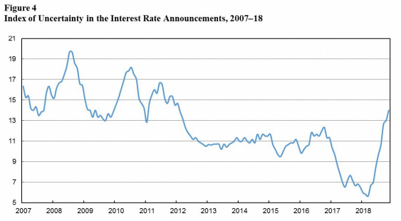

```

Source: [Benchimol and Caspi (2019)](https://www.boi.org.il/en/NewsAndPublications/PressReleases/Documents/Measuring%20Communication%20Quality%20in%20the%20Interest%20Rate%20Announcements.pdf)
---
class: title-slide-section-blue, center, middle
name: lda

# Topic Modeling


---

# Topic Models

- Topic models enhance unsupervised learning methods for text data.

- They classify documents and words into latent topics, often serving as a precursor to more conventional empirical methods.

- The cornerstone of topic modeling is the Latent Dirichlet Allocation model (Blei, Ng, and Jordan, 2003), commonly referred to as LDA.


---

# Intuition Behind LDA

```{r, echo=FALSE, out.width = "55%", fig.align='center'}

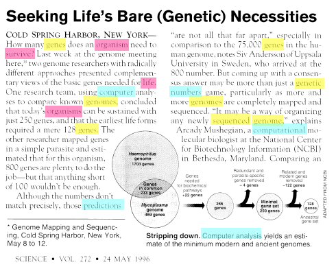

```


---

# The Intuition Behind LDA

```{r, echo=FALSE, out.width = "65%", fig.align='center'}
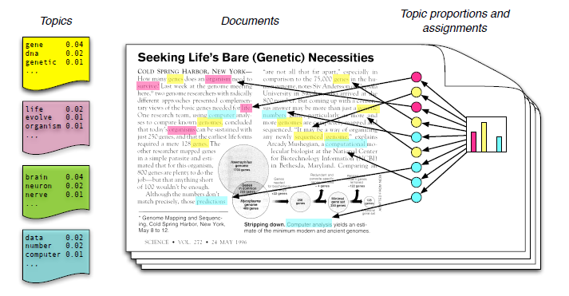
```

- A topic is a distribution across _all_ the words within a _fixed_ vocabulary.
- A word can have non-zero probabilities in multiple topics (e.g., "bank").
- Each document is a mixture of different topics.
- Each word is selected from one of these topics.

---

# Intuition Behind LDA

```{r, echo=FALSE, out.width = "65%", fig.align='center'}

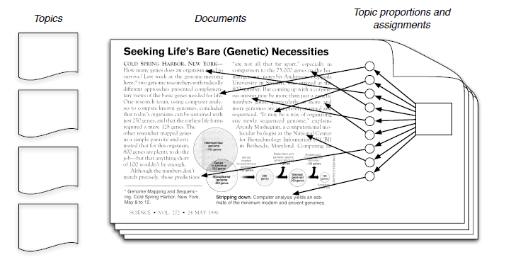

```

__QUESTION:__ How realistic is the LDA setup? Does it matter? What's our goal here anyway?


---

# Notation

- A _vocabulary_ comprises of words represented by the vector $\{1,\dots,V\}$.

- Each _word_ is represented by a unit vector $\boldsymbol{\delta}_v=(0,\dots,v,\dots,0)'$.

- A _document_ is a sequence of $N$ words denoted by $\mathbf{w}=(w_1,\dots,w_N)$.

- A _corpus_ is a collection of $M$ documents denoted by $\mathcal{D}=(\mathbf{w}_1,\dots,\mathbf{w}_M)$.


---

# Prerequisite: The Beta Distribution

.pull-left[

The probability density function (PDF) for the Beta distribution, denoted as $B(\alpha,\beta)$, is given by:

$$p(\theta|\alpha,\beta)\propto \theta^{\alpha-1}(1-\theta)^{\beta-1}$$

This function holds for $\theta\in[0,1]$ and $\alpha,\beta>0$.

Due to its properties, the Beta distribution is useful as a prior for probabilities.

]
.pull-right[
```{r, echo=FALSE, out.width = "100%", fig.align='center'}

knitr::include_graphics("https://upload.wikimedia.org/wikipedia/commons/thumb/f/f3/Beta_distribution_pdf.svg/325px-Beta_distribution_pdf.svg.png")

```
]


---

# The Dirichlet Distribution

The Dirichlet distribution, denoted as $\text{Dir}(\boldsymbol{\alpha})$, is a multivariate generalization of the Beta distribution.

Let $\mathbf{\theta}=(\theta_1, \theta_2,\dots,\theta_K)\sim\text{Dir}(\boldsymbol{\alpha})$.

The probability density function (PDF) for a $K$-dimensional Dirichlet distribution is

$$p(\boldsymbol{\theta}|\boldsymbol{\alpha})\propto \prod_{i=1}^{K} \theta_{i}^{\alpha_{i}-1}$$

Here, $K\geq2$ is the number of categories, $\alpha_i>0$ and $\theta_{i}\in(0,1)$ for all $i$ and $\sum_{i=1}^{K} \theta_{i}=1$.

__Remark:__ The parameter $\boldsymbol{\alpha}$ controls the sparsity of $\boldsymbol{\theta}$.

__Bottom Line:__ Vectors drawn from a Dirichlet distribution represent probabilities.

---
# Visualizing the Dirichlet Distribution

.pull-left[

__On the right:__

The change in the density function $(K = 3)$ as the vector $\boldsymbol{\alpha}$ changes from $\boldsymbol{\alpha} = (0.3, 0.3, 0.3)$ to $(2.0, 2.0, 2.0)$, while keeping $\alpha_1=\alpha_2=\alpha_3$.

__Remark:__ Placing $\boldsymbol{\alpha}=(1,1,1)$ results in a uniform distribution over the simplex.
]
.pull-right[
<p><a href="https://commons.wikimedia.org/wiki/File:LogDirichletDensity-alpha_0.3_to_alpha_2.0.gif#/media/File:LogDirichletDensity-alpha_0.3_to_alpha_2.0.gif"></a><br>By <a href="https://en.wikipedia.org/wiki/en:File:LogDirichletDensity-alpha_0.1_to_alpha_1.9.gif" class="extiw" title="w:en:File:LogDirichletDensity-alpha 0.1 to alpha 1.9.gif">Initial version</a> by <a href="//commons.wikimedia.org/w/index.php?title=Panos_Ipeirotis&amp;action=edit&amp;redlink=1" class="new" title="Panos Ipeirotis (page does not exist)">Panos Ipeirotis</a>, later modified by <a href="//commons.wikimedia.org/w/index.php?title=User:Love_Sun_and_Dreams&amp;action=edit&amp;redlink=1" class="new" title="User:Love Sun and Dreams (page does not exist)">Love Sun and Dreams</a> - <a class="external autonumber" href="http://en.wikipedia.org/wiki/File:LogDirichletDensity-alpha_0.3_to_alpha_2.0.gif">[1]</a>, <a href="https://creativecommons.org/licenses/by/3.0" title="Creative Commons Attribution 3.0">CC BY 3.0</a>, <a href="https://commons.wikimedia.org/w/index.php?curid=10073606">Link</a></p>
]


---

# The Data Generating Process Behind LDA

__Assumption:__ The number of topics $K$ and the size of the vocabulary $V$ are fixed.

The Data Generating Process (DGP):

For each document $d=1,\dots,\mathcal{D}$:

1. Choose topic proportions $\theta_d\sim\text{Dir}(\boldsymbol{\alpha})$.

2. For each word $n=1,\dots,N$:

  2.1. Choose a topic assignment $Z_{dn}\sim\text{Mult}(\theta_d)$.
  
  2.2. Choose a word $W_{dn}\sim\text{Mult}(\beta_{z_{dn}})$.

__Remark:__ Note the "factor model" aspects of LDA, where topics act as factors and word probabilities act as loadings, both affecting the probability of selecting a word.

---

# Aside: Plate Notation

```{r, echo=FALSE, out.width = "45%", fig.align='center'}
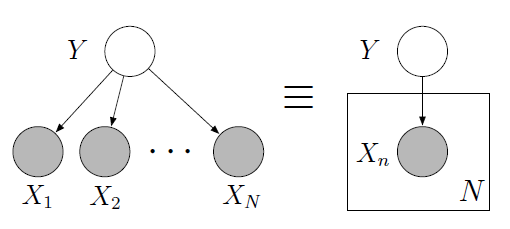
```

- Each _node_ represents a random variable.
- _Shaded_ nodes indicate observables.
- _Edges_ represent dependencies.
- _Plates_ indicate replicated structures.

The depicted graph corresponds to the following expression:

$$p\left(y, x_{1}, \ldots, x_{N}\right)=p(y) \prod_{n=1}^{N} p\left(x_{n} | y\right)$$

---

# LDA in plate notation

```{r, echo=FALSE, out.width = "70%", fig.align='center'}

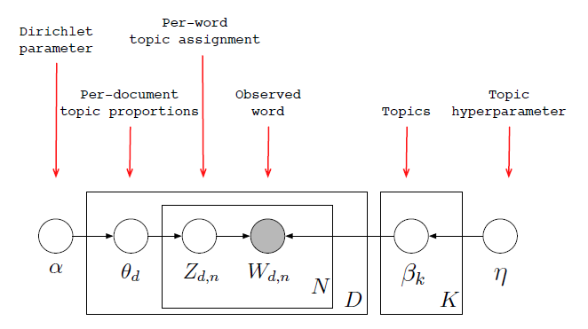

```

_Source_: [http://videolectures.net/mlss09uk_blei_tm/#](http://videolectures.net/mlss09uk_blei_tm/#).

---

# Aside: Conjugate Priors

The Dirichlet distribution serves as a conjugate prior for the Multinomial distribution.

Let $n(Z_{i})$ denote the count of topic $i$.

$$\boldsymbol{\theta}|Z_{1,\dots,N}\sim \text{Dir}(\boldsymbol{\alpha}+n(Z_{1,\dots,N}))$$

In other words, as the number of times we observe topic $i$ increases, our posterior distribution becomes more concentrated around the $i^{\text{th}}$ component of $\boldsymbol{\theta}$.

---

# Extension #1: Correlated Topic Models (Lafferty and Blei, 2005)

- LDA assumes that topics independently co-occur in documents.

- However, this assumption is clearly incorrect.

- For instance, a document about _economics_ is more likely to also discuss _politics_ than it is to talk about _cooking_.

- Lafferty and Blei address this issue by relaxing the independence assumption and drawing topic proportions from a logistic normal distribution, allowing for correlations between topic proportions:

```{r, echo=FALSE, out.width = "50%", fig.align='center'}
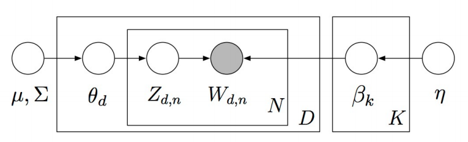
```
Here, $\mu$ and $\Sigma$ represent priors for the logistic normal distribution.


---

# Extension #2: Dynamic LDA (Blei and Lafferty, 2006)

.pull-left[
Dynamic LDA takes into account the ordering of documents and provides a more detailed posterior topical structure compared to traditional LDA.

In dynamic topic modeling, a topic is a _sequence_ of distributions over words. Topics evolve systematically over time. Specifically, the parameter vector for topic $k$ in period $t$ evolves with Gaussian noise:

$$\beta_{t, k} | \beta_{t-1, k} \sim \mathcal{N}\left(\beta_{t-1, k}, \sigma^{2} I\right).$$
]
.pull-right[
```{r, echo=FALSE, out.width = "100%", fig.align='center'}

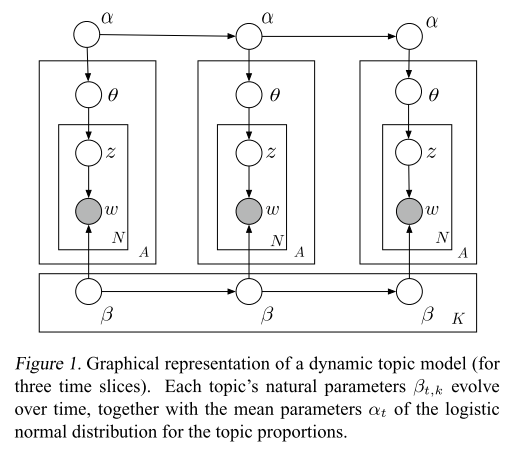

```
]


---

# Dynamic LDA: _Science_, 1881-1999

The posterior estimate of the frequency of several words as a function of year for two topics, "Theoretical Physics" and "Neuroscience":

```{r, echo=FALSE, out.width = "60%", fig.align='center'}
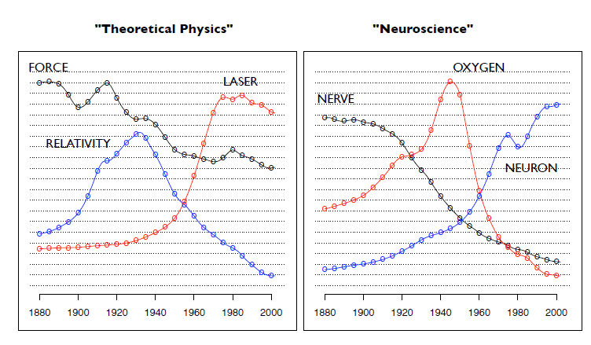
```

_Source: Blei and Lafferty (2006)._

---

# Extension #3: Supervised Topic Model (McAuliffe and Blei, 2008)

An additional connection is made between $Z_{dn}$ and an observable attribute $Y_d$ in the Supervised Topic Model:

```{r, echo=FALSE, out.width = "50%", fig.align='center'}
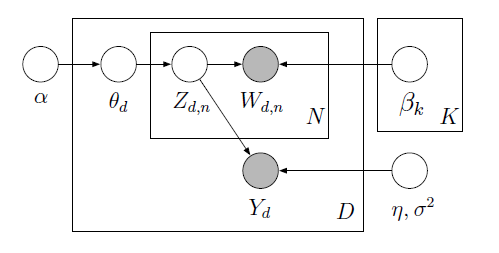
```

_Source: McAuliffe and Blei (2008)._

---

# Structural Topic Models (Roberts, Stewart, and Tingley)


About the Structural Topic Model (STM):

> _"The Structural Topic Model is a general framework for topic modeling with document-level covariate information. The covariates can improve inference and qualitative interpretability and are allowed to affect topical prevalence, topical content or both."_

In STM, topics are drawn from the following logistic normal distribution,

$$\boldsymbol{\theta}_{d} | X_{d} \gamma, \Sigma \sim \text { LogisticNormal }\left(\mu=X_{d} \gamma, \Sigma\right)$$

where $X_{d}$ is a vector of observed document covariates.


__REMARK:__ In the case of no covariates, the STM reduces to a (fast) implementation of the Correlated Topic Model (Blei and Lafferty, 2007).


---

# `stm`: R Package for Structural Topic Models 
## Roberts, Stewart, and Tingley (JSS, 2014)

About the `stm` R package:

> _"The software package implements the estimation algorithms for the model and also includes tools for every stage of a standard workflow from reading in and processing raw text through making publication quality figures."_

The package is available on CRAN and can be installed using:

```r
install.packages("stm")
```
To get started, see the [vignette](https://github.com/bstewart/stm/blob/master/inst/doc/stmVignette.pdf?raw=true) which includes several example analyses.


---

# Applying Topic Models to Measure the Effect of Transparency

Hansen, McMahon, and Prat (QJE 2017) examine the impact of increased transparency in the Federal Open Market Committee (FOMC) meetings on the level of debate.

Here are some key points:

- FOMC meetings have been recorded since the 1970s to create minutes.

- Committee members were under the impression that these tapes were erased afterward.

- In October 1993, Fed Chair Alan Greenspan discovered and revealed that the tapes had been transcribed and stored in archives all along before being erased.

- Following Greenspan's revelation, the Fed agreed to publish all past transcripts and extended this policy to include all future transcripts with a five-year time lag.

- This provides Hansen et al. with access to periods when policymakers believed their deliberations would and would not be made public.


---

# Topic Modeling of FOMC Meeting Transcripts

Data:

- The dataset consists of 149 FOMC meeting transcripts during Alan Greenspan's tenure, spanning both pre-1993 and post-1993 periods.

- The unit of observation is a member-meeting.

- The outcomes of interest include:

  - The proportion of words devoted to $K$ different topics.
  
  - The concentration of topic weights.
  
  - The frequency of data citation.


---

# Estimation

To estimate the topics, LDA (Latent Dirichlet Allocation) is employed.

The LDA output is then utilized to construct the outcomes of interest.

Difference-in-Differences regressions are applied to estimate the effects of the change in transparency on these outcomes. For instance, Hansen et al. estimate the following model:

$$y_{it}=\alpha_{i}+\gamma D(\text{Trans})_{t}+\lambda X_{t}+\varepsilon_{it}$$

Here:
- $y_{it}$ represents any of the communication measures for member $i$ at time $t$.
- $D(\text{Trans})$ is an indicator for being in the transparency regime (1 after November 1993, 0 before).
- $X_t$ is a vector of macro controls for the meeting at time $t$.

---

# Pro-cyclical Topics

```{r, echo=FALSE, out.width = "45%", fig.align='center'}

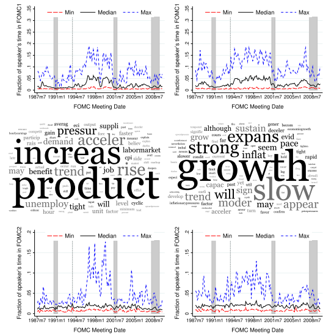

```
_Source_: Hansen, McMahon, and Prat (QJE 2017).


---

# Counter-cyclical Topics

```{r, echo=FALSE, out.width = "43%", fig.align='center'}

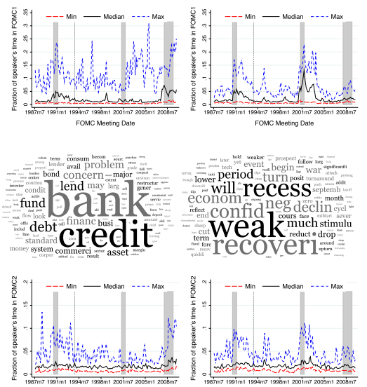

```
_Source_: Hansen, McMahon, and Prat (QJE 2017).

---

# Increased Accountability: More References to Data

```{r, echo=FALSE, out.width = "45%", fig.align='center'}

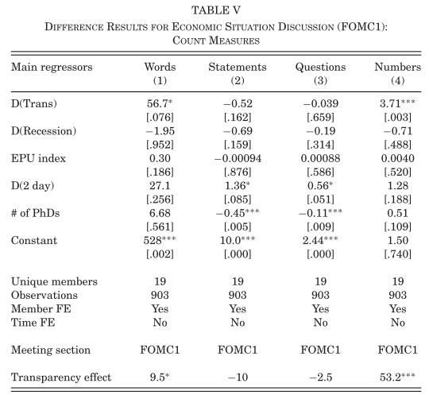

```

_Source_: Hansen, McMahon, and Prat (QJE 2017).
---

# Increased Conformity: Increased Document Similarity

```{r, echo=FALSE, out.width = "40%", fig.align='center'}

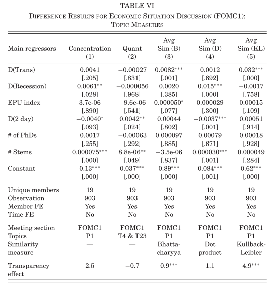

```

_Source_: Hansen, McMahon, and Prat (QJE 2017).


---
class: .title-slide-final, center, inverse, middle

# `slides %>% end()`

[<i class="fa fa-github"></i> Source code](https://github.com/ml4econ/notes-spring2019/tree/master/11-text-mining)  


---

# Selected References

- Blei, D. M., Ng, A. Y., & Jordan, M. I. (2003). Latent Dirichlet allocation. _Journal of Machine Learning Research_, 3(Jan), 993-1022.

- Blei, D. M., & Lafferty, J. D. (2006, June). Dynamic topic models. In _Proceedings of the 23rd international conference on Machine learning_ (pp. 113-120). ACM.

- Gentzkow, M., Kelly, B.T., & Taddy, M. (2019). Text as data. _Journal of Economic Literature_ 57(3), 535-574.

- Hansen, S., McMahon, M., & Prat, A. (2017). Transparency and Deliberation Within the FOMC: A Computational Linguistics Approach. _The Quarterly Journal of Economics_, 133(2), 801–870.

- Lafferty, J. D., & Blei, D. M. (2006). Correlated topic models. In _Advances in neural information processing systems_ (pp. 147-154).

- Loughran, T., & McDonald, B. (2011). When is a liability not a liability? Textual analysis, dictionaries, and 10‐Ks. _The Journal of Finance_, 66(1), 35-65.

---

# Selected References

- Roberts, M.E., Stewart, B.M., Tingley, D., Lucas, C., Leder‐Luis, J., Gadarian, S.K., Albertson, B., & Rand, D.G. (2014). Structural topic models for open‐ended survey responses. _American Journal of Political Science_, 58(4), 1064-1082.

- Roberts, M.E., Stewart, B.M., & Tingley, D. (2014). stm: R package for structural topic models. _Journal of Statistical Software_, 10(2), 1-40.
