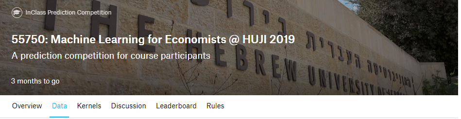
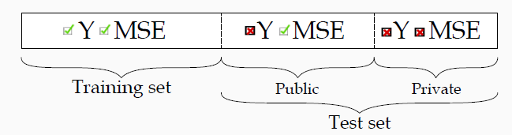

```{r setup, include=FALSE}
options(htmltools.dir.version = FALSE)

knitr::opts_chunk$set(eval = TRUE,
                      echo = TRUE,
                      warning = FALSE,
                      message = FALSE,
                      cache = FALSE)

htmltools::tagList(rmarkdown::html_dependency_font_awesome())
```
# Kaggle: A Global Hub for Data Science Competitions

.pull-left[
- **Kaggle** is a *vibrant data science community* where machine learning practitioners worldwide compete.

- Public companies and private users alike upload the datasets used in Kaggle competitions.

- A "kaggler" clinches victory by developing the most *accurate* algorithm for a specific dataset.

- Kaggle competitions serve as *platforms* for practicing ML skills and keeping abreast of state-of-the-art ML methods.
]


.pull-right[


```{r, echo=FALSE, out.width = "50%", fig.align='center'}

```
]

---
# Getting Started with Kaggle

.pull-left[
1. **Step One:** Visit [www.kaggle.com](www.kaggle.com) and sign-up.

2. **Step Two:** Navigate to the ml4econ course competition (link on Moodle)

3. **Step Three:** Thoroughly review the competition details including objectives, deadlines, data, evaluation criteria, submission rules, and so on.
]

.pull-right[
```{r, echo=FALSE, fig.align='center'}

```
]


---
# Understanding the Kaggle Competition Data Structure

.pull-left[
- *Immediate Feedback:* The Mean Squared Error (MSE) for the public test set (30%) is available immediately upon submission.
- *Delayed Feedback:* The MSE for the private test set (70%) is disclosed only after the competition closes.
- *Unpredictable Split:* The division between the public and private test sets is arbitrary and undisclosed to competitors in advance.

Remember, your *final ranking* hinges on your performance on the *private* test set.
]

.pull-right[
```{r, echo=FALSE, fig.align='center'}

```
]


---
# Mastering the Basic Kaggle Competition Workflow

1. **Acquire Domain Knowledge:** Build understanding around the problem domain.

2. **Explore the Data:** Perform an initial data analysis.

3. **Preprocessing:** Employ techniques such as standardization, creating dummy variables, determining interactions, etc.

4. **Choose a Model Class:** Decide on a model class, like Lasso, Ridge, Trees, and so forth.

5. **Tune Complexity:** Use cross-validation for optimizing model parameters.

6. **Submit Your Prediction:** Forward your model's prediction for evaluation.

7. **Document Your Workflow:** Keep a well-structured record of your process using *R Markdown*.


---
# Monitoring Your Performance

.pull-left[
- Leverage the public leaderboard to *track your performance*.  

- Your interim ranking (reflected in the "scores" column) is determined by your MSE on the public test set.  

- After the competition closes, the final ranking will hinge on the MSE on the private test set.  

- While you may submit multiple predictions, exercise caution to avoid overfitting the public test set!
]

.pull-right[
```{r, echo=FALSE, fig.align='center'}
knitr::include_graphics("figs/tracking.png")
```
]


---
# Kickstarting Your Kaggle Journey

Executing this code chunk will automatically download the essential data for our Kaggle competition. This includes train data, test data, and a sample submission file.


```{r remedy001, eval = FALSE}

library(tidyverse)

train <- read.csv("https://raw.githubusercontent.com/ml4econ/lecture-notes-2023/master/a-kaggle/data/train.csv")

test <- read.csv("https://raw.githubusercontent.com/ml4econ/lecture-notes-2023/master/a-kaggle/data/test.csv")

sample_submission <- read.csv("https://raw.githubusercontent.com/ml4econ/lecture-notes-2023/master/a-kaggle/data/sample_submission.csv")

```

__NOTE:__ By default, a new project will be created on your desktop.

---
class: .title-slide-final, center, inverse, middle

# `slides %>% end()`

[<i class="fa fa-github"></i> Source code](https://raw.githack.com/ml4econ/notes-spring2021/master/a-kaggle/a-kaggle.html)  


